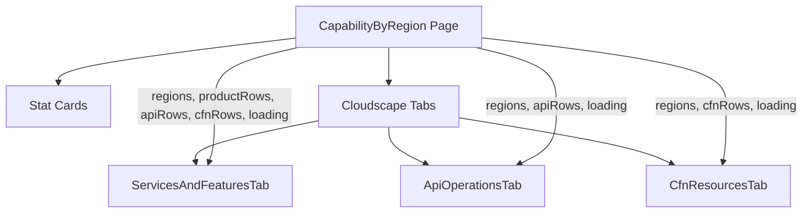

# Design Document: Developer Experience Improvements

## Overview

This feature improves the developer experience for Capability Insights for AWS through documentation, code decomposition, and in-app help. The work spans nine requirements covering architecture docs, API docs, component decomposition, test consolidation, methodology docs, contributing guides, in-app help panels, data model docs, and README updates.

The design prioritizes:

1. **Discoverability** — new contributors find documentation from the README, not by browsing `docs/`
2. **Separation of concerns** — the monolithic page component is split so each tab is independently understandable
3. **Trust** — dashboard users can understand how availability data is derived without leaving the app
4. **Consistency** — test files follow the co-location pattern already established in `source/lambda/routes/`

## Architecture

### Component Decomposition Strategy

The `capability-by-region.tsx` page (~300 lines) currently owns all three tabs' state, hooks, and rendering logic. The decomposition extracts each tab into its own component while keeping shared data loading and stat cards at the page level.



**Data flow principle**: The page fetches all data once via `useEffect` and passes it down as props. Each tab component owns its own derived state (hooks, memos, view toggles) but never re-fetches shared data.

### Help Panel Integration

The existing app uses `AppLayout.tools` for a global help panel (`HelpMenu`). For tab-specific methodology help, we use a different pattern: an info `Button` in the `AvailabilityTable` header that triggers `AppLayout`'s tools panel with context-specific content.

The Cloudscape `AppLayout` supports dynamic tools content. We'll use a context/callback pattern where tab components can set the tools panel content, and the info icon triggers it.

### Documentation Structure

```
docs/
├── ARCHITECTURE.md    # System design, data flow, Lambda topology
├── METHODOLOGY.md     # How data mappings are derived (contributor + user facing)
├── API.md             # Route table, request/response examples
├── DATA_MODEL.md      # JSON file shapes, TypeScript interfaces
└── images/            # Existing diagrams
```

## Components and Interfaces

### Tab Component Props

Each tab component receives shared data as props and owns its internal state.

```typescript
// Shared props passed from the parent page to all tabs
interface SharedTabProps {
  regions: Region[];
  loading: boolean;
}

interface ServicesAndFeaturesTabProps extends SharedTabProps {
  productRows: ProductAvailability[];
  downloadUrls: ExportUrls;
}

interface ApiOperationsTabProps extends SharedTabProps {
  apiRows: ApiAvailability[];
  downloadUrls: ExportUrls;
}

interface CfnResourcesTabProps extends SharedTabProps {
  cfnRows: CfnAvailability[];
  downloadUrls: ExportUrls;
}
```

### ServicesAndFeaturesTab

**File**: `source/website/app/components/tabs/ServicesAndFeaturesTab.tsx`

**Owns**: Nothing beyond rendering — this tab has no custom hooks or derived state.

**Renders**: `AvailabilityTable` with product rows, name cell with homepage links and type badges.

### ApiOperationsTab

**File**: `source/website/app/components/tabs/ApiOperationsTab.tsx`

**Owns**:

- `apiViewMode` state (`'api-operations' | 'terraform-aws'`)
- `useClassicApiAvailability(apiRows, regions)` hook
- `terraformFilteringFunction` memo (tree-aware search logic)
- `getResourceMissingApis` memo (missing API lookup for popovers)
- Info icon + help panel trigger for Terraform AWS methodology

**Renders**:

- `ApiViewSelector` toggle
- Conditional: standard `AvailabilityTable` (API operations) or Terraform AWS `AvailabilityTable` with custom filtering, custom availability cells, and `MissingApiPopover`

**Exposes via ref or callback** (for stat cards):

- `classicApi.rows` — needed by the parent for the stat card count when `apiViewMode === 'terraform-aws'`

To avoid lifting `classicApi.rows` into the parent (which would defeat the decomposition), the stat card for API operations will receive both `apiRows` and a `classicApiRows` prop. The parent will call `useClassicApiAvailability` at the page level since the stat card needs the row count regardless of which sub-view is active. This is acceptable because the hook is idempotent and the data is shared.

**Revised approach**: `useClassicApiAvailability` is called at the **page level** (not inside the tab) because:

1. The stat card needs `classicApi.rows.length` even when the API Operations sub-view is active
2. The hook only fetches data once (the mapping JSON) and memoizes the tree build
3. The tab receives `classicApi` as a prop

```typescript
interface ApiOperationsTabProps extends SharedTabProps {
  apiRows: ApiAvailability[];
  classicApi: UseClassicApiAvailabilityResult;
  downloadUrls: ExportUrls;
}
```

### CfnResourcesTab

**File**: `source/website/app/components/tabs/CfnResourcesTab.tsx`

**Owns**:

- `useTerraformOverlay(cfnRows)` hook (convention state, translation)
- Info icon + help panel trigger for CFN/AWSCC methodology

**Renders**:

- `ViewSelector` toggle
- `AvailabilityTable` with translated rows, Terraform Registry links for AWSCC resources

**Note**: The `useTerraformOverlay` hook is called inside the tab because:

1. The stat card for CFN resources needs `translatedCfnRows` — but the overlay's `translateRows` is a pure function of `cfnRows` + `convention`
2. The tab label also depends on `overlay.convention`

To handle the stat card and tab label, the overlay hook will also be called at the page level. The hook is lightweight (single fetch, memoized index).

**Revised approach**: `useTerraformOverlay` is called at the **page level**:

```typescript
interface CfnResourcesTabProps extends SharedTabProps {
  cfnRows: CfnAvailability[];
  overlay: UseTerraformOverlayResult;
  downloadUrls: ExportUrls;
}
```

### Help Panel Components

**Files**:

- `source/website/app/components/help/TerraformAwsHelpPanel.tsx`
- `source/website/app/components/help/CfnResourcesHelpPanel.tsx`

Each is a Cloudscape `HelpPanel` with static content explaining the methodology for that view.

**Integration pattern**: The `AvailabilityTable` component already has a `Header` with actions. The info icon will be added as an additional action button passed from the tab component. When clicked, it updates the `AppLayout` tools panel content.

Since `AppLayout` is in `AppShell` (a parent component), we need a way for tab components to set the tools content. Options:

1. **React Context** — `HelpPanelContext` provides `setToolsContent` and `setToolsOpen`
2. **Prop drilling** — pass callbacks through the page

We'll use **React Context** (`HelpPanelContext`) because:

- It avoids prop drilling through multiple layers (AppShell → Page → Tab → Table header)
- It follows the pattern Cloudscape recommends for dynamic tools panels
- It's a clean separation: the tab knows _what_ to show, the shell knows _how_ to show it

```typescript
// source/website/app/contexts/help-panel-context.tsx
interface HelpPanelContextValue {
  setToolsContent: (content: React.ReactNode) => void;
  setToolsOpen: (open: boolean) => void;
}
```

The `AppShell` component will provide this context, managing `toolsOpen` and `toolsContent` state that feeds into `AppLayout`'s `tools` and `toolsOpen` props.

### Parent Page After Decomposition

```typescript
// capability-by-region.tsx (simplified)
export default function CapabilityByRegion() {
  // Shared data loading (unchanged)
  const [regions, setRegions] = useState<Region[]>([]);
  const [productRows, setProductRows] = useState<ProductAvailability[]>([]);
  const [apiRows, setApiRows] = useState<ApiAvailability[]>([]);
  const [cfnRows, setCfnRows] = useState<CfnAvailability[]>([]);
  const [loading, setLoading] = useState(true);
  const [syncMetadata, setSyncMetadata] = useState<SyncMetadata | null>(null);

  useEffect(() => { /* fetch all data */ }, []);

  // Hooks needed for stat cards and tab labels
  const overlay = useTerraformOverlay(cfnRows);
  const classicApi = useClassicApiAvailability(apiRows, regions);
  const translatedCfnRows = overlay.translateRows(cfnRows);

  const [apiViewMode, setApiViewMode] = useState<ApiViewMode>('api-operations');

  const cfnTabLabel = overlay.convention === 'cloudformation'
    ? 'CloudFormation resources'
    : 'Terraform AWSCC resources';

  return (
    <ContentLayout header={/* ... */}>
      <SpaceBetween size="l">
        {/* Stat cards — use shared data directly */}
        <ColumnLayout columns={4} variant="text-grid">
          <AvailabilityStatCard rows={productRows} /* ... */ />
          <AvailabilityStatCard rows={apiViewMode === 'terraform-aws' ? classicApi.rows : apiRows} /* ... */ />
          <AvailabilityStatCard rows={translatedCfnRows} /* ... */ />
          {/* Regions badge */}
        </ColumnLayout>

        <Tabs tabs={[
          { id: 'products', label: 'Services and features',
            content: <ServicesAndFeaturesTab regions={regions} loading={loading} productRows={productRows} downloadUrls={...} /> },
          { id: 'apis', label: 'API operations',
            content: <ApiOperationsTab regions={regions} loading={loading} apiRows={apiRows} classicApi={classicApi}
                       apiViewMode={apiViewMode} onApiViewModeChange={setApiViewMode} downloadUrls={...} /> },
          { id: 'cfn', label: cfnTabLabel,
            content: <CfnResourcesTab regions={regions} loading={loading} cfnRows={cfnRows} overlay={overlay} downloadUrls={...} /> },
        ]} />
      </SpaceBetween>
    </ContentLayout>
  );
}
```

**Key decision**: `apiViewMode` is lifted to the parent because the stat card needs it to decide which rows to count. The tab receives it as a prop and calls `onApiViewModeChange` when the user toggles.

### Test File Moves

| Current Location                      | New Location                                 |
| ------------------------------------- | -------------------------------------------- |
| `source/lambda/analyze-route.test.ts` | `source/lambda/routes/analyze-route.test.ts` |
| `source/lambda/usage-route.test.ts`   | `source/lambda/routes/usage-route.test.ts`   |

**Import path updates**: Both test files import from relative paths. After moving into `routes/`, imports like `'./routes/analyze-route'` become `'./analyze-route'`, and imports like `'./types/api'` become `'../types/api'`.

## Data Models

### Document Content Outlines

#### docs/ARCHITECTURE.md

1. **Introduction** — purpose, audience, link to README
2. **System Overview** — high-level Mermaid diagram (S3 Access Point → DataFetch Lambda → Website Bucket → Frontend → API Lambda)
3. **Data Flow** — step-by-step: source S3 → DataFetch Lambda (merge, deduplicate, format) → Website Bucket (JSON + CSV) → Frontend (direct S3 fetch for data, API Gateway for actions)
4. **Lambda Topology** — table of all Lambdas with VPC placement rationale:
   - API Lambda (inside VPC — serves private API Gateway)
   - DataFetch Lambda (outside VPC — needs S3 access point connectivity)
   - Terraform Overlay Lambda (outside VPC — needs GitHub API access)
   - GitHub Fetch Lambda (outside VPC — needs GitHub API access)
   - IAM Policy Helper Lambda (outside VPC — needs IAM API access)
5. **Terraform Overlay Pipeline** — how CFN types are translated to Terraform naming conventions
6. **Classic API Availability Engine** — OperationAvailabilityIndex, tree construction, service attribution
7. **Infrastructure Planning** — repository analysis, capability set generation
8. **Key Source Files** — table mapping subsystem → file paths

#### docs/METHODOLOGY.md

1. **Introduction** — who this is for (contributors debugging the system, users wanting to understand the data)
2. **Terraform Classic AWS Resource Mapping**
   - Go source file parsing (regex patterns, `conn`/`client`/`svc` variables)
   - `service_package_gen.go` parsing for factory function discovery
   - `extractSdkServiceName` for SDK service identification from imports
3. **Operation-to-Service Attribution**
   - `buildAvailabilityTree` and the OperationAvailabilityIndex
   - Why we don't trust the single `sdkService` field
   - Multi-service resource handling (e.g., `aws_alb` calling ELBv2 + EC2)
4. **AWSCC Resource Mapping**
   - JSON schema `typeName` field extraction
   - Deterministic naming convention (`awscc_{service}_{resource}` ↔ `AWS::{Service}::{Resource}`)
5. **Availability Computation**
   - AND-logic: resource is "Available" only if ALL required operations are available
   - "Not Available" if any operation is missing
   - "Unknown" if no required APIs are mapped
6. **Infrastructure Planning Analysis**
   - File classification by extension
   - SDK call parsing (Go, Java, Python, TypeScript)
   - `.tf` resource block extraction
   - CloudFormation template detection
7. **Data Refresh Cadence**
   - Capability data: every 24 hours from S3 Access Point
   - Terraform overlay/classic API mapping: regenerated when DataFetch Lambda runs with overlay enabled
8. **Known Limitations**
   - Only captures `conn`/`client`/`svc` variable calls
   - Mapping may lag behind provider releases
   - Ambiguous operation names use primary service as tiebreaker
9. **Source File Reference** — table of files implementing each step

#### docs/API.md

1. **Introduction** — base URL pattern, authentication (VPC-only, no auth tokens)
2. **Error Response Format** — standard shape from `ErrorResponse` class
3. **Routes by Domain**:
   - **Sync**: `POST /syncCapabilityData`
   - **Stacks**: `GET /stacks`, `GET /stacks/:stackName/resources`
   - **Analysis**: `POST /analysis`, `GET /analysis`, `GET /capabilities`
   - **Policies**: CRUD on `/policies`, `/policies/:policyId`, refresh, preview, template
   - **Policy Parts**: `/policies/:policyId/parts`, `/policies/:policyId/parts/:partIndex`
   - **Sync Settings**: `GET /syncSettings`, `PUT /syncSettings`
   - **Data Utilities**: `/data/info`, `/data/upload`, `/data/merge/preview`, `/data/merge/commit`
   - **Infrastructure Plans**: CRUD on `/plans`, `/plans/:planId`, reprocess, capability-set, plan names
4. Each route: method, path, description, request body (if any), response shape, example

#### docs/DATA_MODEL.md

1. **Introduction** — relationship between S3 Access Point data and Website Bucket data
2. **Data Files**:
   - `regions.json` → `Region[]`
   - `products.json` → `Product[]` (services and features)
   - `apis.json` → `ApiService[]` (SDK services with operations)
   - `cfn_resources.json` → `CfnResourceType[]`
   - `terraform_overlay.json` → `TerraformOverlayData`
   - `terraform_classic_api_mapping.json` → `ClassicApiMappingData`
   - `sync-metadata.json` → `SyncMetadata`
3. **Transformations** — what DataFetch Lambda does (merge across source folders, deduplication, JSON+CSV output)
4. **Plans Data** — `data/plans/{planId}/capability-set.json` → `CapabilitySet`
5. **CSV Files** — mirror of JSON data in tabular format for export

## Correctness Properties

_A property is a characteristic or behavior that should hold true across all valid executions of a system — essentially, a formal statement about what the system should do. Properties serve as the bridge between human-readable specifications and machine-verifiable correctness guarantees._

### Property 1: API route documentation completeness

_For any_ route registered in `api-lambda-main.ts` (via `registerRoute` or `registerParameterizedRoute`), the `docs/API.md` file SHALL contain an entry documenting that route's HTTP method and path.

**Validates: Requirements 2.2**

## Error Handling

### Component Decomposition

- If a tab component throws during render, React's error boundary (if present) catches it. The decomposition does not change error handling — each tab already handles its own hook errors (e.g., `classicApi.error`, `overlay.error`) with inline `Flashbar` messages.
- Props validation: TypeScript interfaces enforce correct prop shapes at compile time.

### Help Panel

- Help panel content is static — no runtime errors expected.
- If the `HelpPanelContext` is used outside its provider (programming error), it should throw a descriptive error during development.

### Test File Moves

- If import paths are incorrect after the move, the TypeScript compiler and Vitest will catch it immediately.

### Documentation

- Documentation files are static markdown. No runtime error handling needed.
- The property test (route completeness) will fail the build if a new route is added without updating `API.md`.

## Testing Strategy

### Approach

This feature is primarily documentation and code reorganization. The testing strategy reflects this:

1. **Property-based test** (1 property): Route documentation completeness — ensures `API.md` stays in sync with registered routes as the codebase evolves.
2. **Example-based unit tests**: Verify tab components render correctly with mock data, help panels contain expected content, and document files exist with required sections.
3. **Integration tests**: Run the full existing test suite after decomposition and file moves to verify no regressions.

### Property Test Configuration

- **Library**: fast-check (already used in the project)
- **Minimum iterations**: 100 (though for this property, the input space is the finite set of registered routes — the test will enumerate all of them rather than generate random inputs)
- **Tag**: `Feature: developer-experience-improvements, Property 1: API route documentation completeness`

### Unit Tests

| Test                              | What it verifies                                                                                  |
| --------------------------------- | ------------------------------------------------------------------------------------------------- |
| `ServicesAndFeaturesTab.test.tsx` | Renders product rows, passes correct props to AvailabilityTable                                   |
| `ApiOperationsTab.test.tsx`       | Renders both sub-views, info icon appears in Terraform AWS mode, terraformFilteringFunction works |
| `CfnResourcesTab.test.tsx`        | Renders with overlay, info icon appears, ViewSelector toggles convention                          |
| `TerraformAwsHelpPanel.test.tsx`  | Content mentions required topics, word count < 300                                                |
| `CfnResourcesHelpPanel.test.tsx`  | Content mentions required topics, word count < 300                                                |
| `capability-by-region.test.tsx`   | Parent page composes tabs, stat cards receive correct data                                        |

### Regression

- All existing tests in `source/website/app/hooks/` continue to pass (the hooks are unchanged, just called from a different location)
- All existing tests in `source/lambda/` continue to pass after file moves
- The moved test files (`analyze-route.test.ts`, `usage-route.test.ts`) pass from their new location

### Documentation Tests

A single test file (`docs.test.ts`) verifies:

- All four doc files exist
- `ARCHITECTURE.md` contains a Mermaid diagram
- `API.md` contains all registered routes (the property test)
- `METHODOLOGY.md` references key source files
- `README.md` contains a Documentation section with links to all docs
