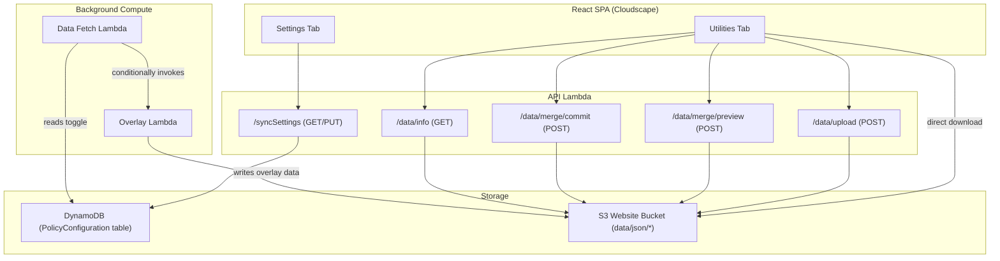

# Design Document: External Sync Settings & Utilities

## Overview

This feature introduces runtime-configurable sync settings and data management utilities for the Capability Insights application. It replaces deploy-time configuration (`deploy-config.yaml`) with a DynamoDB-backed settings store, exposes settings through the existing API Lambda, and adds a tabbed Settings page UI with two sections:

1. **Settings tab** — Terraform overlay toggle + GitHub token management, data synchronization controls
2. **Utilities tab** — Data file upload, dataset merge (additive), and dataset export

The design reuses the existing `PolicyConfiguration` DynamoDB table (adding a new item type for sync settings), the existing API Lambda routing infrastructure, and the existing `mergeJson` utility for dataset merge operations.

## Architecture



### Key Design Decisions

1. **Reuse PolicyConfiguration DynamoDB table** — The sync settings record uses a well-known partition key (`policyId = "SYNC_SETTINGS"`) in the existing table. This avoids creating a new table and leverages existing IAM permissions infrastructure.

2. **API Lambda handles upload/merge server-side** — All data mutations go through the API Lambda to maintain data integrity, validate inputs, and ensure consistent S3 writes. The frontend never writes directly to S3.

3. **Additive-only merge** — Merge never deletes items. This is the safest strategy for combining data from different partitions where each source may have unique entries.

4. **Two-phase merge (preview → commit)** — The merge preview is computed server-side and returned to the client. The client displays it and sends a separate commit request. The uploaded data is held in a temporary S3 key between preview and commit.

5. **Export uses existing S3 paths** — Individual file exports use the same `/data/json/{name}.json` URLs the frontend already fetches. ZIP export is assembled client-side from those files (no server-side ZIP generation needed).

## Components and Interfaces

### Backend Components

#### SyncSettingsStore (new module)

```typescript
// source/lambda/services/sync-settings-store.ts

export interface SyncSettings {
  terraformOverlayEnabled: boolean;
  githubToken?: string; // stored encrypted at rest via DynamoDB SSE
  updatedAt: string; // ISO timestamp
}

export interface SyncSettingsResponse {
  terraformOverlayEnabled: boolean;
  hasToken: boolean;
  updatedAt: string;
}

export class SyncSettingsStore {
  constructor(private tableName: string) {}

  async getSettings(): Promise<SyncSettings>;
  async updateSettings(update: { terraformOverlayEnabled: boolean; githubToken?: string }): Promise<SyncSettings>;
}
```

The store uses `policyId = "SYNC_SETTINGS"` as the partition key in the existing PolicyConfiguration table. When `terraformOverlayEnabled` is set to false, the `githubToken` field is removed from the record.

#### Sync Settings Routes (new)

```typescript
// source/lambda/routes/sync-settings-routes.ts

// GET /syncSettings → SyncSettingsResponse
// PUT /syncSettings → SyncSettingsResponse
//   Body: { terraformOverlayEnabled: boolean, githubToken?: string }
```

#### Data Utilities Routes (new)

```typescript
// source/lambda/routes/data-utilities-routes.ts

// GET /data/info → DataFilesInfo
//   Returns: { files: Array<{ name: string, lastModified: string | null, sizeBytes: number | null }> }

// POST /data/upload
//   Body: { fileName: DataFile, content: string (JSON) }
//   Returns: { success: true, lastModified: string }

// POST /data/merge/preview
//   Body: { fileName: DataFile, content: string (JSON) }
//   Returns: MergePreview

// POST /data/merge/commit
//   Body: { fileName: DataFile, mergeId: string }
//   Returns: { success: true, itemCount: number }
```

#### MergePreview Interface

```typescript
export interface MergePreview {
  mergeId: string; // temporary ID for the staged merge
  fileName: string;
  additions: number; // count of new items
  updates: number; // count of existing items that will be updated
  unchanged: number; // count of existing items not affected
  totalAfterMerge: number; // total items in result
}
```

### Frontend Components

#### Settings Page (refactored)

```typescript
// source/website/app/pages/settings.tsx
// Refactored to use Cloudscape Tabs component

<Tabs tabs={[
  { id: "settings", label: "Settings", content: <SettingsTabContent /> },
  { id: "utilities", label: "Utilities", content: <UtilitiesTabContent /> },
]} />
```

#### SettingsTabContent

Contains:

- Existing "Data synchronization" container (sync button, metadata display)
- New "External data sources" container (Terraform overlay toggle + token input)

#### UtilitiesTabContent

Contains three containers:

- **Data upload** — File selector (dropdown of DataFile enum), file input, upload button, file status table
- **Dataset merge** — File selector, file input, "Preview merge" button, preview results display, "Confirm merge" / "Cancel" buttons
- **Export** — Individual download links per file, "Download all as ZIP" button

### API Client Extensions

```typescript
// Added to CapabilityInsightsClient or a new utilities-client.ts

async getSyncSettings(): Promise<SyncSettingsResponse>;
async updateSyncSettings(settings: { terraformOverlayEnabled: boolean; githubToken?: string }): Promise<SyncSettingsResponse>;
async getDataFilesInfo(): Promise<DataFilesInfo>;
async uploadDataFile(fileName: DataFile, content: string): Promise<{ success: boolean; lastModified: string }>;
async previewMerge(fileName: DataFile, content: string): Promise<MergePreview>;
async commitMerge(fileName: DataFile, mergeId: string): Promise<{ success: boolean; itemCount: number }>;
```

## Data Models

### DynamoDB Record: Sync Settings

Stored in the existing `PolicyConfiguration` table with a reserved partition key:

| Field                     | Type              | Description                                    |
| ------------------------- | ----------------- | ---------------------------------------------- |
| `policyId`                | String (PK)       | Always `"SYNC_SETTINGS"`                       |
| `terraformOverlayEnabled` | Boolean           | Whether Terraform overlay sync is active       |
| `githubToken`             | String (optional) | GitHub PAT, encrypted at rest via DynamoDB SSE |
| `updatedAt`               | String            | ISO 8601 timestamp of last update              |

### S3 Data File Paths

| DataFile      | S3 Key                         |
| ------------- | ------------------------------ |
| REGIONS       | `data/json/regions.json`       |
| PRODUCTS      | `data/json/products.json`      |
| APIS          | `data/json/apis.json`          |
| CFN_RESOURCES | `data/json/cfn_resources.json` |

### S3 Temporary Merge Staging

Uploaded merge data is staged at:

```
data/merge-staging/{mergeId}/{fileName}.json
```

Staging files are cleaned up after commit or after a TTL (e.g., 1 hour via S3 lifecycle rule or explicit cleanup).

### Merge Identity Functions

The merge reuses the same identity functions from `data-fetch-lambda-main.ts`:

| DataFile      | getId function          | childConfigs                                                        |
| ------------- | ----------------------- | ------------------------------------------------------------------- |
| regions       | `r => r.Region`         | none                                                                |
| products      | `p => p.productId`      | `[{ key: 'childProducts', getId: c => c.productId }]`               |
| apis          | `a => a.sdkServiceName` | `[{ key: 'apis', getId: op => op.apiName }]`                        |
| cfn_resources | `r => r.serviceName`    | `[{ key: 'resourceTypes', getId: rt => rt.resourceTypeName }, ...]` |

### Merge Preview Computation

To compute the preview without performing the actual merge:

1. Parse existing data from S3 into a Map keyed by ID
2. Parse uploaded data into items
3. For each uploaded item:
   - If ID exists in existing map → count as "update"
   - If ID does not exist → count as "addition"
4. Items in existing map not in uploaded data → count as "unchanged"
5. `totalAfterMerge = unchanged + updates + additions`

## Correctness Properties

_A property is a characteristic or behavior that should hold true across all valid executions of a system — essentially, a formal statement about what the system should do. Properties serve as the bridge between human-readable specifications and machine-verifiable correctness guarantees._

### Property 1: Token secrecy

_For any_ stored GitHub token string, the GET `/syncSettings` response SHALL contain `hasToken: true` but SHALL NOT contain the token value anywhere in the response body.

**Validates: Requirements 2.1**

### Property 2: Settings round-trip

_For any_ valid sync settings (a boolean toggle and a non-empty trimmed token string), performing a PUT followed by a GET SHALL return the same toggle value and `hasToken: true`.

**Validates: Requirements 2.2**

### Property 3: Token whitespace validation

_For any_ string that contains leading or trailing whitespace characters, a PUT request with that string as `githubToken` SHALL be rejected with a 400 error. Conversely, _for any_ non-empty string with no leading or trailing whitespace, the PUT request SHALL accept it.

**Validates: Requirements 2.4**

### Property 4: Upload file name validation

_For any_ string that is not one of the allowed DataFile names (`regions`, `products`, `apis`, `cfn_resources`), an upload request with that file name SHALL be rejected with a 400 error.

**Validates: Requirements 8.2**

### Property 5: Upload JSON array validation

_For any_ string that is not valid JSON or is valid JSON but not an array, an upload request with that content SHALL be rejected with a 400 error. _For any_ valid JSON array string, the upload SHALL be accepted.

**Validates: Requirements 8.3**

### Property 6: Merge preview accuracy

_For any_ existing dataset (a JSON array of items with unique IDs) and _any_ uploaded dataset (a JSON array of items), the merge preview SHALL report: additions = count of uploaded item IDs not present in existing, updates = count of uploaded item IDs present in existing, and totalAfterMerge = existing.length + additions.

**Validates: Requirements 9.1**

### Property 7: Merge additive invariant

_For any_ existing dataset and _any_ uploaded dataset, after performing the merge: (1) every item ID from the original dataset SHALL still be present in the result, (2) every item ID from the uploaded dataset SHALL be present in the result, and (3) the result length SHALL be greater than or equal to the original dataset length.

**Validates: Requirements 9.2**

## Error Handling

### API Error Responses

| Scenario                             | Status Code | Response                                                                          |
| ------------------------------------ | ----------- | --------------------------------------------------------------------------------- |
| Invalid file name for upload/merge   | 400         | `{ error: "Invalid file name. Allowed: regions, products, apis, cfn_resources" }` |
| Invalid JSON content                 | 400         | `{ error: "Content must be a valid JSON array" }`                                 |
| Token required but missing           | 400         | `{ error: "GitHub token is required when enabling Terraform overlay" }`           |
| Token has whitespace                 | 400         | `{ error: "GitHub token must not have leading or trailing whitespace" }`          |
| Merge ID not found (expired/invalid) | 404         | `{ error: "Merge session not found or expired" }`                                 |
| DynamoDB unreachable                 | 500         | `{ error: "Settings store unavailable" }`                                         |
| S3 read/write failure                | 500         | `{ error: "Data storage unavailable" }`                                           |

### Data Fetch Lambda Error Handling

- If DynamoDB read fails → log error, skip overlay invocation (fail-safe to disabled)
- If overlay Lambda invocation fails → log error, continue with primary sync, include error in metadata
- Sync metadata always written regardless of overlay success/failure

### Frontend Error Handling

- API errors display Cloudscape `Alert` with error type and message
- Network failures show generic "Unable to reach server" message
- Upload validation errors (file too large, wrong format) caught client-side before API call
- Merge preview failures allow retry without re-uploading

## Testing Strategy

### Unit Tests (Example-Based)

- **SyncSettingsStore**: CRUD operations, default behavior when no record exists, token clearing on disable
- **Sync settings routes**: Request validation, response shape, error responses
- **Data utilities routes**: File name validation, JSON validation, S3 interactions (mocked)
- **Merge preview computation**: Specific examples with known datasets
- **Frontend components**: Render tests for tab structure, toggle behavior, upload flow, merge flow

### Property-Based Tests

Property-based testing is appropriate for this feature because several components involve input validation and data transformation with large input spaces.

**Library**: `fast-check` (already available in the project's test infrastructure via vitest)

**Configuration**: Minimum 100 iterations per property test.

**Tests to implement**:

1. **Token secrecy** — Generate random token strings, store them, verify GET never exposes them
   - Tag: `Feature: external-sync-settings, Property 1: Token secrecy`

2. **Settings round-trip** — Generate random valid settings, PUT then GET, verify consistency
   - Tag: `Feature: external-sync-settings, Property 2: Settings round-trip`

3. **Token whitespace validation** — Generate strings with/without whitespace, verify accept/reject
   - Tag: `Feature: external-sync-settings, Property 3: Token whitespace validation`

4. **Upload file name validation** — Generate arbitrary strings, verify only allowed names pass
   - Tag: `Feature: external-sync-settings, Property 4: Upload file name validation`

5. **Upload JSON array validation** — Generate arbitrary strings and JSON values, verify only arrays pass
   - Tag: `Feature: external-sync-settings, Property 5: Upload JSON array validation`

6. **Merge preview accuracy** — Generate random datasets with overlapping/non-overlapping IDs, verify preview counts
   - Tag: `Feature: external-sync-settings, Property 6: Merge preview accuracy`

7. **Merge additive invariant** — Generate random datasets, perform merge, verify no items lost and all uploaded items present
   - Tag: `Feature: external-sync-settings, Property 7: Merge additive invariant`

### Integration Tests

- End-to-end settings flow: PUT settings → Data Fetch Lambda reads them → overlay invoked/skipped
- Upload flow: POST upload → verify S3 content matches
- Merge flow: preview → commit → verify merged S3 content

### CDK Snapshot Tests

- Verify no `GitHubToken` parameter
- Verify no `HasTerraformOverlay` condition
- Verify `TERRAFORM_OVERLAY_FUNCTION_NAME` always set
- Verify DynamoDB permissions for Data Fetch Lambda and API Lambda
