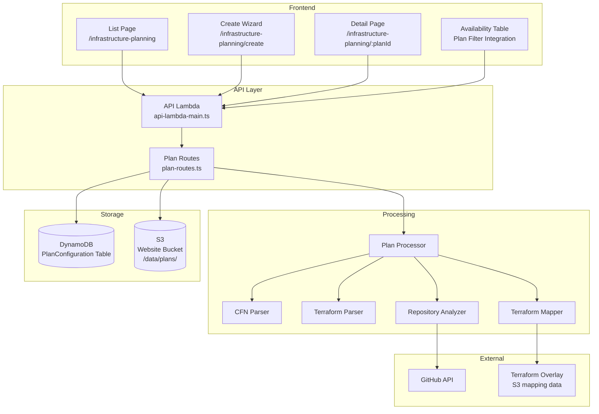
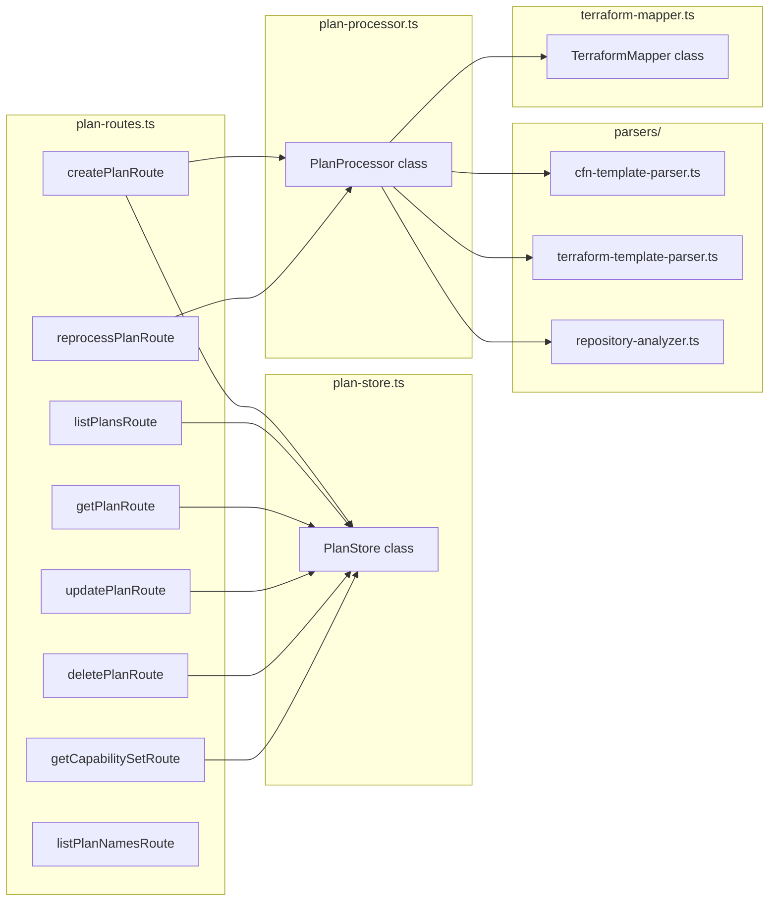
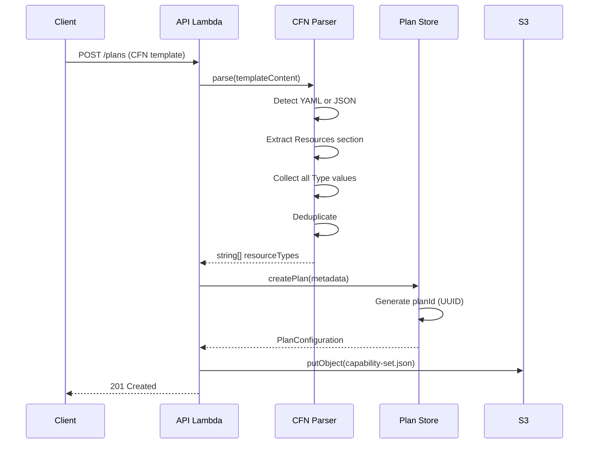
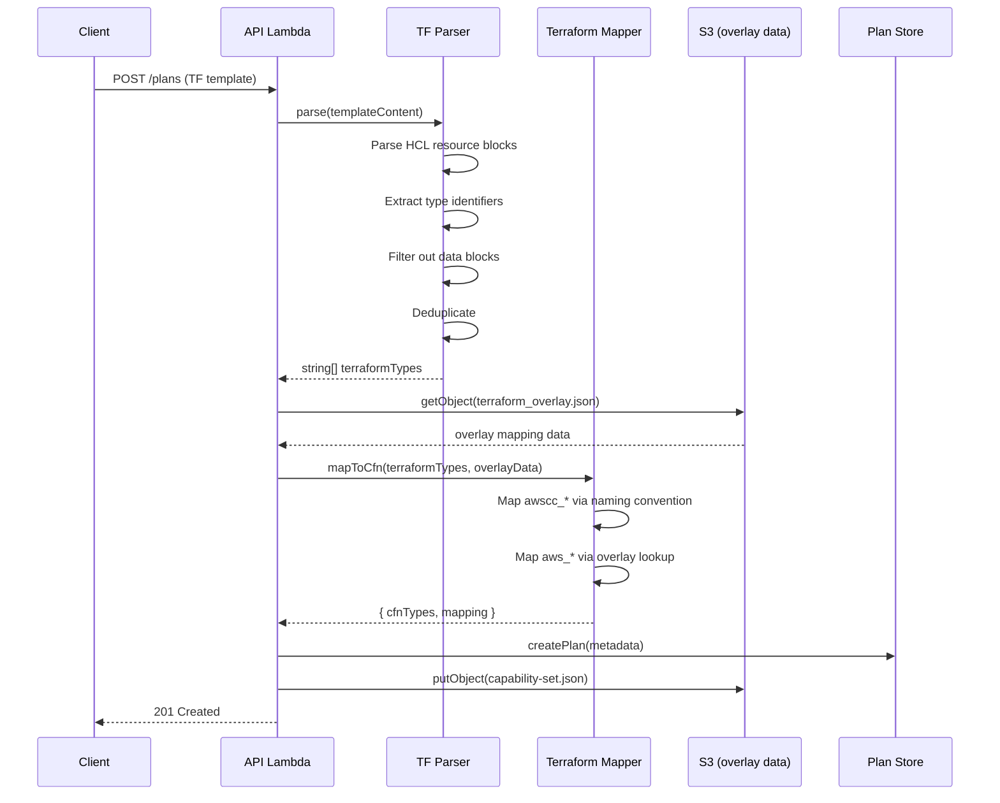
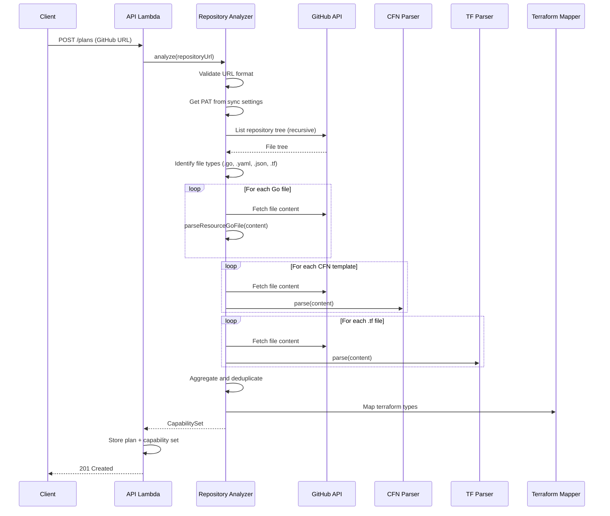

# Design Document: Infrastructure Planning

## Overview

Infrastructure Planning extends the Capability Insights dashboard to let users upload IaC templates (CloudFormation YAML/JSON, Terraform HCL) or point to GitHub repositories, extract the AWS resources and API operations they use, and then filter the regional availability table to show only relevant services. This enables quick assessment of whether planned infrastructure is available in target regions.

The feature follows established patterns in the codebase:

- **Persistence**: DynamoDB for plan metadata + S3 for extracted capability set data (mirrors policy-config-store)
- **API**: REST endpoints registered in `api-lambda-main.ts` with parameterized routes
- **Frontend**: React Router pages with Cloudscape components, wizard for creation, PropertyFilter integration for filtering
- **Parsing**: Reuses existing terraform-overlay mapping data and classic-resource-parser patterns

## Architecture



### Key Design Decisions

1. **S3 for Capability Set data**: Resource type lists and API operations can be large (hundreds of entries for complex repos). Storing them in S3 keeps DynamoDB items small and allows efficient retrieval.

2. **Synchronous processing for templates**: CloudFormation and Terraform template parsing is fast (< 1s) and can be done synchronously during the API request. GitHub repository analysis may take longer but is bounded by the Lambda timeout (60s).

3. **Reuse terraform-overlay mapping**: The existing `terraform_overlay.json` in S3 already maps Terraform types to CloudFormation types. The plan processor reads this at processing time rather than maintaining a separate mapping.

4. **Filter integration via PropertyFilter**: Following the existing `stack` filter pattern, the `plan` filter uses `onLoadItems` for autocomplete and an async cache pattern for capability set data.

## Components and Interfaces

### Backend Components



````

### Frontend Components

```mermaid
graph LR
    subgraph Pages
        ILP[InfrastructurePlanningPage]
        CPW[CreatePlanWizard]
        PDP[PlanDetailPage]
    end

    subgraph Hooks
        UPL[usePlanList]
        UPD[usePlanDetail]
        UPC[usePlanCapabilitySet]
    end

    subgraph Client
        IPC[infrastructure-planning-client.ts]
    end

    subgraph Filter Integration
        FI[plan filter in availability-table-properties.tsx]
    end

    ILP --> UPL
    CPW --> IPC
    PDP --> UPD
    PDP --> UPC
    FI --> IPC
    UPL --> IPC
    UPD --> IPC
    UPC --> IPC
````

### TypeScript Interfaces

```typescript
// source/shared/types/infrastructure-planning/plan-configuration.ts

/** Source type for an Infrastructure Plan. */
export type PlanSourceType = 'cloudformation' | 'terraform' | 'github';

/** Processing status of an Infrastructure Plan. */
export type PlanStatus = 'processing' | 'ready' | 'error';

/** A key-value metadata label for organizing plans. */
export interface PlanLabel {
  key: string;
  value: string;
}

/** Full plan configuration stored in DynamoDB. */
export interface PlanConfiguration {
  planId: string;
  planName: string;
  sourceType: PlanSourceType;
  labels: PlanLabel[];
  status: PlanStatus;
  errorMessage?: string;
  /** S3 key for the capability set JSON file. */
  capabilitySetKey: string;
  /** Summary counts for quick display without loading full capability set. */
  resourceTypeCount: number;
  apiOperationCount: number;
  createdAt: string;
  updatedAt: string;
}

/** The extracted capability data stored in S3. */
export interface CapabilitySet {
  /** CloudFormation resource types (e.g., "AWS::S3::Bucket"). */
  cfnResourceTypes: string[];
  /** Original Terraform resource types if source was Terraform (e.g., "aws_s3_bucket"). */
  terraformResourceTypes: string[];
  /** API operations extracted from Go source files (e.g., "s3:GetObject"). */
  apiOperations: string[];
  /** Service names derived from resource types (e.g., "Amazon S3"). */
  serviceNames: string[];
  /** Mapping of terraform type → CFN type for types that have a mapping. */
  terraformToCfnMapping: Record<string, string>;
}

/** Request body for POST /plans. */
export interface CreatePlanRequest {
  planName: string;
  sourceType: PlanSourceType;
  labels?: PlanLabel[];
  /** Base64-encoded template content (for cloudformation/terraform source types). */
  templateContent?: string;
  /** GitHub repository URL (for github source type). */
  repositoryUrl?: string;
}

/** Request body for PUT /plans/:planId (metadata update only). */
export interface UpdatePlanRequest {
  planName?: string;
  labels?: PlanLabel[];
}

/** Query parameters for GET /plans. */
export interface ListPlansQuery {
  search?: string;
  sourceType?: PlanSourceType;
  labelKey?: string;
  labelValue?: string;
}

/** Response from GET /plans/names (for filter autocomplete). */
export interface PlanNamesResponse {
  planNames: string[];
}
```

## Data Models

### DynamoDB Schema: PlanConfiguration Table

| Attribute           | Type      | Key                      | Description                             |
| ------------------- | --------- | ------------------------ | --------------------------------------- |
| `planId`            | String    | HASH                     | UUID, primary key                       |
| `planName`          | String    | GSI (PlanNameIndex) HASH | Unique plan name                        |
| `sourceType`        | String    | —                        | `cloudformation`, `terraform`, `github` |
| `labels`            | List<Map> | —                        | Array of `{key, value}` objects         |
| `status`            | String    | —                        | `processing`, `ready`, `error`          |
| `errorMessage`      | String    | —                        | Error details if status is `error`      |
| `capabilitySetKey`  | String    | —                        | S3 object key for capability set        |
| `resourceTypeCount` | Number    | —                        | Count of CFN resource types             |
| `apiOperationCount` | Number    | —                        | Count of API operations                 |
| `createdAt`         | String    | —                        | ISO 8601 timestamp                      |
| `updatedAt`         | String    | —                        | ISO 8601 timestamp                      |

**Global Secondary Indexes:**

- `PlanNameIndex`: HASH on `planName` — enforces uniqueness and enables name lookups

### S3 Structure

```
data/plans/{planId}/capability-set.json
```

Each capability set file contains a `CapabilitySet` JSON object. Files are stored in the website bucket under the `data/plans/` prefix, following the same pattern as `data/json/terraform_overlay.json`.

### CDK Infrastructure Additions

The `CapabilityInsightsStack` needs:

1. A new DynamoDB table (`CapabilityInsightsPlanConfiguration`) with the schema above
2. IAM permissions for the API Lambda to read/write the new table
3. IAM permissions for the API Lambda to read/write `data/plans/*` in the website bucket (already has `s3:GetObject` on `data/*`; needs `s3:PutObject` and `s3:DeleteObject` on `data/plans/*`)

## API Design

### REST Endpoints

All endpoints are registered in `api-lambda-main.ts` following existing patterns.

| Method   | Path                            | Handler                 | Description                                 |
| -------- | ------------------------------- | ----------------------- | ------------------------------------------- |
| `POST`   | `/plans`                        | `createPlanRoute`       | Create and process a new plan               |
| `GET`    | `/plans`                        | `listPlansRoute`        | List all plans (with optional filters)      |
| `GET`    | `/plans/names`                  | `listPlanNamesRoute`    | Get plan names for autocomplete             |
| `GET`    | `/plans/:planId`                | `getPlanRoute`          | Get plan metadata                           |
| `PUT`    | `/plans/:planId`                | `updatePlanRoute`       | Update plan metadata                        |
| `DELETE` | `/plans/:planId`                | `deletePlanRoute`       | Delete plan and capability set              |
| `POST`   | `/plans/:planId/reprocess`      | `reprocessPlanRoute`    | Re-process source and update capability set |
| `GET`    | `/plans/:planId/capability-set` | `getCapabilitySetRoute` | Get the full capability set                 |

### Request/Response Examples

**POST /plans** — Create a plan from a CloudFormation template:

```json
{
  "planName": "Payment Service Infrastructure",
  "sourceType": "cloudformation",
  "labels": [
    { "key": "environment", "value": "production" },
    { "key": "team", "value": "payments" }
  ],
  "templateContent": "QVdTOjpUZW1wbGF0ZUZvcm1hdFZlcnNpb24..."
}
```

**Response (201):**

```json
{
  "planId": "a1b2c3d4-...",
  "planName": "Payment Service Infrastructure",
  "sourceType": "cloudformation",
  "labels": [
    { "key": "environment", "value": "production" },
    { "key": "team", "value": "payments" }
  ],
  "status": "ready",
  "capabilitySetKey": "data/plans/a1b2c3d4-.../capability-set.json",
  "resourceTypeCount": 12,
  "apiOperationCount": 0,
  "createdAt": "2025-01-15T10:30:00Z",
  "updatedAt": "2025-01-15T10:30:00Z"
}
```

**GET /plans/:planId/capability-set** — Response:

```json
{
  "cfnResourceTypes": ["AWS::S3::Bucket", "AWS::Lambda::Function", "AWS::DynamoDB::Table"],
  "terraformResourceTypes": [],
  "apiOperations": [],
  "serviceNames": ["Amazon S3", "AWS Lambda", "Amazon DynamoDB"],
  "terraformToCfnMapping": {}
}
```

## Processing Pipeline

### CloudFormation Template Processing



**CFN Parser Logic** (`source/lambda/services/infrastructure-planning/parsers/cfn-template-parser.ts`):

1. Attempt YAML parse (using `js-yaml`). If fails, attempt JSON parse.
2. Validate presence of `Resources` key at top level.
3. Iterate over `Resources` entries, extract `Type` field from each.
4. Filter to only `AWS::*` prefixed types.
5. Deduplicate and sort.
6. Return unique resource type list.

### Terraform Template Processing



**Terraform Parser Logic** (`source/lambda/services/infrastructure-planning/parsers/terraform-template-parser.ts`):

1. Use regex-based HCL parsing to extract `resource "type" "name"` blocks.
2. Pattern: `/resource\s+"([^"]+)"\s+"[^"]+"/g` — captures the resource type.
3. Filter to only `aws_*` or `awscc_*` prefixed types.
4. Ignore `data` blocks (pattern: `data "type" "name"`).
5. Deduplicate and sort.

**Terraform Mapper Logic** (`source/lambda/services/infrastructure-planning/terraform-mapper.ts`):

- For `awscc_*` types: Convert using naming convention (`awscc_s3_bucket` → `AWS::S3::Bucket`). Split on `_`, capitalize each segment, join with `::`, prefix with `AWS::`.
- For `aws_*` types: Look up in the terraform overlay data (loaded from S3). The overlay contains `classicAwsMappings` with `terraformType` → `cfnType` entries.
- Unmapped types are retained in the capability set without a CFN equivalent.

### GitHub Repository Processing



**Repository Analyzer Logic** (`source/lambda/services/infrastructure-planning/parsers/repository-analyzer.ts`):

1. Validate GitHub URL format (`https://github.com/{owner}/{repo}`).
2. Retrieve PAT from sync settings (DynamoDB).
3. Use GitHub Trees API to list all files recursively.
4. Classify files by extension and content.
5. For `.go` files: Reuse `parseResourceGoFile` from `terraform-overlay/classic-resource-parser.ts`.
6. For `.yaml`/`.json` files: Check for `Resources` section, then use CFN parser.
7. For `.tf` files: Use Terraform parser.
8. Aggregate all extracted types and operations, deduplicate.

## Filter Integration

The plan filter follows the same pattern as the existing `stack` filter in `availability-table-properties.tsx`.

### Implementation Approach

1. **Add `plan` property to `createFilteringProperties`**:

```typescript
if (options?.includePlanProperty) {
  properties.push({
    key: 'plan',
    propertyLabel: 'Plan',
    groupValuesLabel: 'Plan values',
    operators: ['=', '!='],
    group: 'properties',
  });
}
```

2. **Add plan data cache** (same pattern as `stackResourceCache`):

```typescript
const planCapabilityCache = useRef<Map<string, CapabilitySet>>(new Map());
```

3. **Add `onLoadItems` handler for plan names**:

```typescript
if (detail.filteringProperty?.key === 'plan') {
  infrastructurePlanningClient.listPlanNames().then(names => {
    setPlanFilteringOptions(names.map(name => ({ propertyKey: 'plan', value: name })));
  });
}
```

4. **Extend `createFilteringFunction`** to handle `plan` tokens:

```typescript
const evaluatePlanToken = (item: RegionalAvailability, token: PropertyFilterToken): boolean => {
  const planName = token.value as string;
  const capabilitySet = planCapabilityCache?.get(planName);
  if (!capabilitySet) {
    onPlanDataNeeded?.(planName);
    return false; // Don't filter until data loads
  }
  const matches = itemMatchesPlan(item, capabilitySet, byId);
  return token.operator === '=' ? matches : !matches;
};
```

5. **`itemMatchesPlan` matching logic** (per tab):

- **CFN tab**: Match `item.name` (or `cfnName`) against `capabilitySet.cfnResourceTypes`. Service rows match if any child resource type matches.
- **API tab**: Match `item.name` against `capabilitySet.apiOperations`. SDK Service rows match if any child operation matches.
- **Services tab**: Match `item.name` against `capabilitySet.serviceNames`.

### Tab-Specific Matching

The `AvailabilityTable` component receives an `includePlanProperty` prop (similar to `includeStackProperty`). The filtering function determines which capability set field to match against based on the row's `regionalAvailabilityType`:

| Row Type                  | Matches Against                            |
| ------------------------- | ------------------------------------------ |
| `SERVICE` (Services tab)  | `capabilitySet.serviceNames`               |
| `FEATURE` (Services tab)  | Parent service name in `serviceNames`      |
| `SDK_SERVICE` (API tab)   | Any child operation in `apiOperations`     |
| `OPERATION` (API tab)     | `capabilitySet.apiOperations`              |
| `RESOURCE_TYPE` (CFN tab) | `capabilitySet.cfnResourceTypes`           |
| `PROPERTY` (CFN tab)      | Parent resource type in `cfnResourceTypes` |

## Correctness Properties

_A property is a characteristic or behavior that should hold true across all valid executions of a system — essentially, a formal statement about what the system should do. Properties serve as the bridge between human-readable specifications and machine-verifiable correctness guarantees._

### Property 1: CloudFormation parser extracts all resource types

_For any_ valid CloudFormation template (YAML or JSON) containing a `Resources` section with one or more resource definitions, the parser SHALL return exactly the set of unique `AWS::*` type values present in that section, regardless of intrinsic functions, conditions, or other template features.

**Validates: Requirements 1.1, 1.2, 10.1, 10.2, 10.5**

### Property 2: CloudFormation parser round-trip

_For any_ list of valid CloudFormation resource types, constructing a template containing those types, then parsing it, SHALL produce an equivalent (same elements, order-independent) resource type list.

**Validates: Requirements 10.4**

### Property 3: Terraform parser extracts all resource block types

_For any_ valid Terraform HCL file containing `resource` blocks (with `aws_*` or `awscc_*` type identifiers), the parser SHALL return exactly the set of unique resource type identifiers from `resource` blocks, excluding `data` blocks and `module` blocks.

**Validates: Requirements 2.1, 2.2, 11.1, 11.2, 11.5**

### Property 4: Terraform parser round-trip

_For any_ list of valid Terraform resource type identifiers, constructing an HCL file containing those types as resource blocks, then parsing it, SHALL produce an equivalent (same elements, order-independent) resource type list.

**Validates: Requirements 11.4**

### Property 5: Invalid template rejection

_For any_ string that is not valid YAML, JSON, or HCL (as appropriate for the declared source type), the parser SHALL return an error and SHALL NOT produce a resource type list.

**Validates: Requirements 1.4, 2.4**

### Property 6: Deduplication invariant

_For any_ template or repository containing duplicate resource type references, the resulting Capability_Set SHALL contain no duplicate entries — the set of resource types and API operations SHALL be strictly unique.

**Validates: Requirements 1.6, 2.6, 3.10**

### Property 7: Plan name uniqueness

_For any_ two create-plan requests with the same `planName`, the second request SHALL fail with a name conflict error, and the first plan SHALL remain unchanged.

**Validates: Requirements 4.1, 4.5**

### Property 8: Plan metadata round-trip

_For any_ valid plan configuration with arbitrary metadata labels (key-value pairs), creating the plan and then retrieving it SHALL return an equivalent configuration with all labels preserved.

**Validates: Requirements 4.2, 4.4, 4.6**

### Property 9: AWSCC-to-CloudFormation mapping

_For any_ valid `awscc_*` resource type following the naming convention `awscc_{service}_{resource}`, the mapper SHALL produce the CloudFormation equivalent `AWS::{Service}::{Resource}` where service and resource segments are properly capitalized.

**Validates: Requirements 12.1**

### Property 10: AWS-to-CloudFormation mapping via overlay

_For any_ `aws_*` resource type that exists in the terraform overlay mapping data, the mapper SHALL produce the corresponding CloudFormation type from the overlay. For types not in the overlay, the mapper SHALL retain the original Terraform type without a CFN equivalent.

**Validates: Requirements 12.2, 12.3**

### Property 11: Mapping preserves both original and mapped types

_For any_ Terraform resource type that is successfully mapped to a CloudFormation equivalent, the resulting Capability_Set SHALL contain both the original Terraform type (in `terraformResourceTypes`) and the mapped CloudFormation type (in `cfnResourceTypes`).

**Validates: Requirements 12.4**

### Property 12: Plan filter inclusion correctness

_For any_ set of availability rows and any Capability_Set, applying a `plan = "X"` filter SHALL include a row if and only if the row's resource type, API operation, or derived service name is present in the plan's Capability_Set.

**Validates: Requirements 6.1, 6.3, 6.7, 6.8, 6.9**

### Property 13: Plan filter exclusion correctness

_For any_ set of availability rows and any Capability_Set, applying a `plan != "X"` filter SHALL include a row if and only if the row's resource type, API operation, or derived service name is NOT present in the plan's Capability_Set.

**Validates: Requirements 6.4**

### Property 14: Plan filter composition with AND/OR

_For any_ combination of a `plan` filter token with other filter tokens (name, type, region, stack), the composed filter SHALL evaluate correctly under both AND and OR operations — the plan token result is combined with other token results using standard boolean logic.

**Validates: Requirements 6.6**

### Property 15: GitHub URL validation

_For any_ string, the URL validator SHALL accept it if and only if it matches the pattern `https://github.com/{owner}/{repo}` where owner and repo are non-empty strings containing valid GitHub identifier characters.

**Validates: Requirements 3.7**

### Property 16: Service name derivation from resource types

_For any_ CloudFormation resource type in the format `AWS::{ServiceName}::{ResourceType}`, the service name derivation function SHALL extract the service name segment and map it to the corresponding display name used in the Services tab.

**Validates: Requirements 6.9**

## Error Handling

### Parser Errors

| Error Condition                    | Response                                                     | HTTP Status |
| ---------------------------------- | ------------------------------------------------------------ | ----------- |
| Invalid YAML/JSON content          | `{ error: "Failed to parse template: <details>" }`           | 400         |
| Invalid HCL content                | `{ error: "Failed to parse Terraform template: <details>" }` | 400         |
| No Resources/resource blocks found | `{ error: "No AWS resources found in template" }`            | 400         |
| Template too large (> 1MB)         | `{ error: "Template exceeds maximum size of 1MB" }`          | 400         |

### GitHub Errors

| Error Condition                   | Response                                                             | HTTP Status |
| --------------------------------- | -------------------------------------------------------------------- | ----------- |
| No PAT configured                 | `{ error: "GitHub token not configured. Add a token in Settings." }` | 400         |
| Invalid/expired PAT               | `{ error: "GitHub token is invalid or expired" }`                    | 401         |
| Invalid repository URL            | `{ error: "Invalid GitHub repository URL format" }`                  | 400         |
| Repository not found/inaccessible | `{ error: "Cannot access repository: <details>" }`                   | 404         |
| Network timeout                   | `{ error: "GitHub request timed out" }`                              | 504         |

### Storage Errors

| Error Condition          | Response                                                  | HTTP Status |
| ------------------------ | --------------------------------------------------------- | ----------- |
| Plan name already exists | `{ error: "Plan with name \"X\" already exists" }`        | 409         |
| Plan not found           | `{ error: "Plan \"X\" not found" }`                       | 404         |
| S3 write failure         | `{ error: "Failed to store capability data" }`            | 500         |
| Partial delete failure   | `{ error: "Plan partially deleted. Retry to complete." }` | 500         |

### Frontend Error Handling

- **Wizard**: Errors during processing are displayed inline with the ability to go back and correct input. Form state is preserved.
- **Filter**: If capability set fetch fails, the filter token shows an error state and no rows are excluded (fail-open for usability).
- **List/Detail pages**: Standard Flashbar error messages with retry actions.

## Testing Strategy

### Unit Tests (Example-Based)

- **Parser edge cases**: Empty templates, templates with only comments, templates with intrinsic functions, nested stacks
- **URL validation**: Specific valid/invalid GitHub URL examples
- **Wizard UI**: Step navigation, form validation, error display
- **Filter integration**: Verify `plan` property registration, `onLoadItems` behavior

### Property-Based Tests

Property-based testing is appropriate for this feature because the parsers and mappers are pure functions with clear input/output behavior and large input spaces.

**Library**: `fast-check` (already available in the project's test dependencies)

**Configuration**: Minimum 100 iterations per property test.

**Tag format**: `Feature: infrastructure-planning, Property {N}: {description}`

Properties to implement as PBT:

1. CFN parser extraction (Property 1)
2. CFN parser round-trip (Property 2)
3. Terraform parser extraction (Property 3)
4. Terraform parser round-trip (Property 4)
5. Invalid template rejection (Property 5)
6. Deduplication invariant (Property 6)
7. Plan name uniqueness (Property 7)
8. Plan metadata round-trip (Property 8)
9. AWSCC-to-CFN mapping (Property 9)
10. AWS-to-CFN mapping (Property 10)
11. Mapping preserves both types (Property 11)
12. Plan filter inclusion (Property 12)
13. Plan filter exclusion (Property 13)
14. Plan filter composition (Property 14)
15. GitHub URL validation (Property 15)
16. Service name derivation (Property 16)

### Integration Tests

- **DynamoDB + S3 persistence**: Create, read, update, delete plans with real AWS services
- **GitHub repository analysis**: Test with a known public repository
- **End-to-end filter**: Upload template → create plan → apply filter → verify correct rows shown

### Test File Organization

```
source/lambda/services/infrastructure-planning/
├── parsers/
│   ├── cfn-template-parser.test.ts        # Unit + property tests
│   ├── terraform-template-parser.test.ts  # Unit + property tests
│   └── repository-analyzer.test.ts        # Unit + integration tests
├── terraform-mapper.test.ts               # Property tests
├── plan-store.test.ts                     # Unit + integration tests
└── plan-processor.test.ts                 # Unit tests

source/website/app/
├── pages/infrastructure-planning/
│   └── __tests__/                         # Component tests
└── components/availability/
    └── plan-filter.test.ts                # Property tests for filter logic
```
