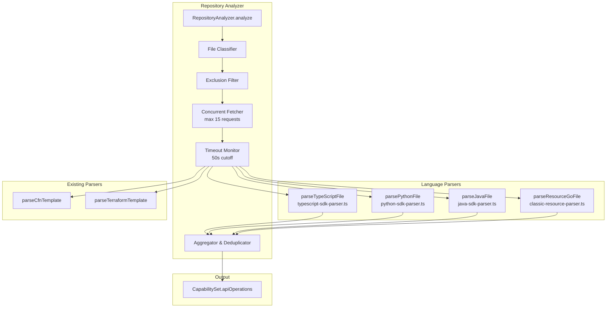
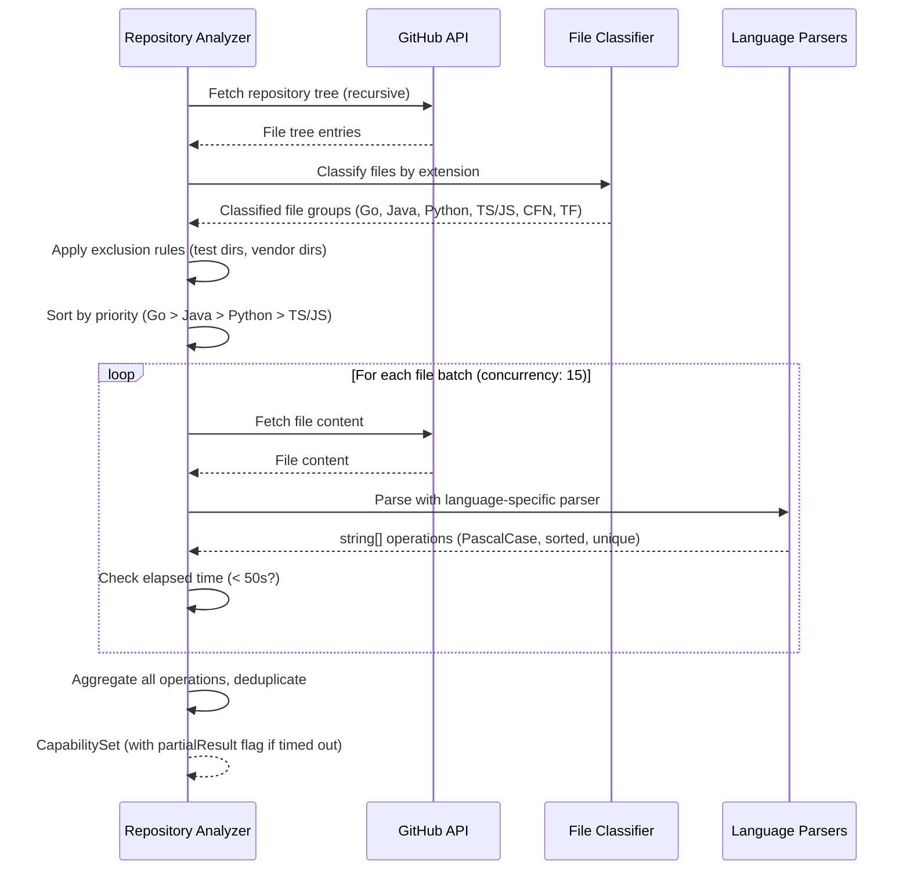
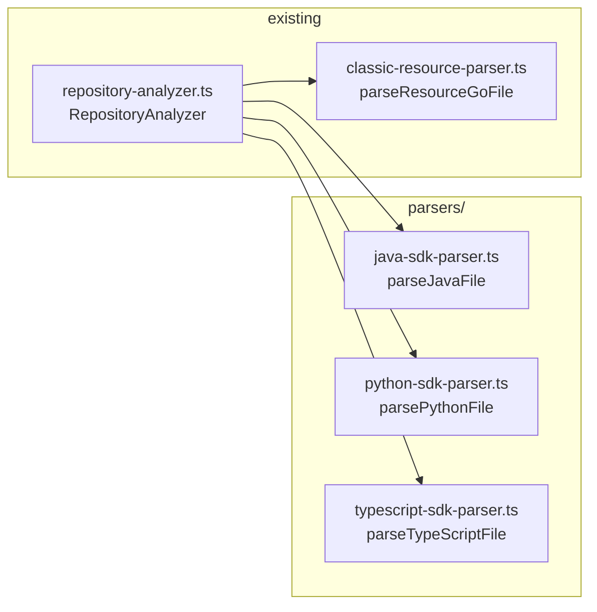

# Design Document: Multi-Language SDK Extraction

## Overview

Multi-Language SDK Extraction extends the existing GitHub Repository Analyzer to extract AWS SDK API operations from Java, Python, and TypeScript/JavaScript source files. Currently, only Go SDK client method calls are captured via the `parseResourceGoFile` function in `classic-resource-parser.ts`. By adding language-specific parsers for Java (AWS SDK v2), Python (boto3), and TypeScript/JavaScript (AWS SDK v3), the system captures a more complete picture of AWS API usage across polyglot repositories.

Each new parser follows the same architectural pattern as the existing Go parser:

- **Pure function**: `(content: string) => string[]`
- **Regex-based extraction**: No AST parsing needed (keeps execution fast within Lambda timeout)
- **Sorted, deduplicated output**: All operation names normalized to PascalCase

The extracted operations feed into the existing `CapabilitySet.apiOperations` field, which powers the plan filter on the API Operations tab.

### Design Decisions

1. **Regex over AST parsing**: Lambda has a 60-second timeout. Regex-based extraction is fast enough to process thousands of files within this budget. AST parsing (e.g., tree-sitter) would add dependency weight and parsing time without meaningful accuracy gains for the patterns we target.

2. **Standalone parser modules**: Each parser is an independent module with no cross-parser dependencies. This enables independent testing, maintenance, and future extension (e.g., adding Rust or C# parsers).

3. **PascalCase normalization at parser level**: Each parser normalizes its own output to PascalCase before returning. This keeps the repository analyzer simple — it just aggregates and deduplicates.

4. **Concurrent file fetching with timeout cutoff**: The repository analyzer fetches files concurrently (max 15 requests) and monitors elapsed time. If the 50-second cutoff is reached, it returns a partial result rather than failing.

5. **Partial result indicator**: The `CapabilitySet` type gains an optional `partialResult` field so the UI can inform users when analysis was incomplete.

## Architecture



### File Processing Flow



## Components and Interfaces

### New Parser Modules



### Parser Function Signatures

```typescript
// source/lambda/services/infrastructure-planning/parsers/java-sdk-parser.ts
export function parseJavaFile(content: string): string[];

// source/lambda/services/infrastructure-planning/parsers/python-sdk-parser.ts
export function parsePythonFile(content: string): string[];

// source/lambda/services/infrastructure-planning/parsers/typescript-sdk-parser.ts
export function parseTypeScriptFile(content: string): string[];
```

All parsers share the same contract:

- **Input**: File content as a string (up to 1MB)
- **Output**: Sorted, deduplicated array of PascalCase operation names
- **Empty input**: Returns `[]` without throwing
- **No matches**: Returns `[]` without throwing

### Java SDK Parser — Pattern Details

Targets AWS SDK for Java v2 client method calls:

```java
// Pattern 1: Instance method on variable ending with "Client"
s3Client.putObject(request);
dynamoDbClient.getItem(request);
lambdaClient.invoke(request);

// Pattern 2: Static-style call on class ending with "Client"
S3Client.putObject(request);
DynamoDbClient.getItem(request);
```

**Regex**: `/(?:\w*Client)\.(\w+)\(/g` — captures method name (group 1)

**Exclusions**: `create`, `builder`, `build`, `close`, `serviceClientConfiguration`, `serviceName`, `waiter`, and methods < 3 characters.

**Normalization**: camelCase → PascalCase (uppercase first letter)

### Python SDK Parser — Pattern Details

Targets boto3 client and resource method calls:

```python
# Pattern 1: Variable ending with "client" or exactly "conn"/"svc"
s3_client.put_object(Bucket='my-bucket')
client.get_item(TableName='my-table')
conn.describe_instances()
svc.list_functions()

# Pattern 2: Variable ending with "resource"
s3_resource.Object('my-bucket', 'key')
resource.Table('my-table')
```

**Regex**: `/(?:\w*(?:client|resource)|conn|svc)\.(\w+)\(/g` — captures method name (group 1)

**Exclusions**: `get_paginator`, `get_waiter`, `can_paginate`, `generate_presigned_url`, `generate_presigned_post`, methods starting with `_`, and methods < 3 characters after conversion.

**Normalization**: snake*case → PascalCase (split on `*`, capitalize each segment, join)

### TypeScript/JavaScript SDK Parser — Pattern Details

Targets AWS SDK v3 Command pattern and v2-style calls:

```typescript
// Pattern 1: v3 Command pattern
const response = await client.send(new PutObjectCommand(params));
new GetItemCommand({ TableName: 'my-table' });

// Pattern 2: v2-style client method calls
s3Client.putObject(params);
dynamodb.getItem(params);
```

**Regex (v3)**: `/new\s+([A-Z][a-zA-Z]+)Command\s*\(/g` — captures operation name (group 1)

**Regex (v2)**: `/(?:s3|dynamodb|dynamoDb|lambda|sqs|sns|ec2|iam|sts|cloudwatch|cloudformation|kinesis|stepfunctions)(?:Client|client)?\.(\w+)\(/g` — captures method name (group 1)

**Exclusions**: Bare `Command` without prefix, `import`/`require` lines, type annotations, methods < 3 characters.

**Normalization**: v3 names are already PascalCase (just strip `Command` suffix). v2 camelCase names get first letter uppercased.

### Repository Analyzer Updates

The existing `RepositoryAnalyzer` class needs these changes:

1. **Extended file classification**: Add `.java`, `.py`, `.ts`, `.js` to the `classifyFile` function
2. **Exclusion filter**: New function to exclude test directories and vendor directories
3. **Concurrent fetching**: Replace sequential file processing with a concurrency-limited fetch pool (max 15)
4. **Timeout monitoring**: Track elapsed time and stop at 50 seconds
5. **Language priority ordering**: Process Go → Java → Python → TS/JS
6. **Partial result support**: Return `partialResult` metadata when timeout occurs

```typescript
// Updated classifyFile function
function classifyFile(
  path: string,
): 'go' | 'java' | 'python' | 'typescript' | 'yaml' | 'json' | 'terraform' | 'unknown' {
  if (path.endsWith('.go')) return 'go';
  if (path.endsWith('.java')) return 'java';
  if (path.endsWith('.py')) return 'python';
  if (path.endsWith('.ts') || path.endsWith('.js')) return 'typescript';
  if (path.endsWith('.yaml') || path.endsWith('.yml')) return 'yaml';
  if (path.endsWith('.json')) return 'json';
  if (path.endsWith('.tf')) return 'terraform';
  return 'unknown';
}

// Exclusion rules
function shouldExcludeFile(path: string): boolean {
  const testDirs = ['test', 'tests', '__tests__', 'spec'];
  const vendorDirs = [
    'vendor',
    'node_modules',
    '.venv',
    'site-packages',
    '__pycache__',
    'target/dependency',
    'build/classes',
  ];
  const testFilePatterns = [/_test\./, /\.test\./, /\.spec\./];

  const segments = path.split('/');

  // Check directory exclusions
  for (const segment of segments.slice(0, -1)) {
    if (testDirs.includes(segment) || vendorDirs.includes(segment)) return true;
  }

  // Check test file patterns
  const filename = segments[segments.length - 1];
  if (testFilePatterns.some(p => p.test(filename))) return true;

  return false;
}
```

## Data Models

### Updated CapabilitySet Type

```typescript
/** The extracted capability data stored in S3. */
export interface CapabilitySet {
  /** CloudFormation resource types (e.g., "AWS::S3::Bucket"). */
  cfnResourceTypes: string[];
  /** Original Terraform resource types if source was Terraform (e.g., "aws_s3_bucket"). */
  terraformResourceTypes: string[];
  /** API operations extracted from source files (e.g., "PutObject", "GetItem"). */
  apiOperations: string[];
  /** Service names derived from resource types (e.g., "Amazon S3"). */
  serviceNames: string[];
  /** Mapping of terraform type → CFN type for types that have a mapping. */
  terraformToCfnMapping: Record<string, string>;
  /** Indicates whether the analysis was terminated early due to timeout. */
  partialResult?: {
    isPartial: boolean;
    filesProcessed: number;
    totalFilesIdentified: number;
  };
}
```

### File Classification Model

```typescript
interface ClassifiedFiles {
  go: GitHubTreeEntry[];
  java: GitHubTreeEntry[];
  python: GitHubTreeEntry[];
  typescript: GitHubTreeEntry[]; // includes .ts and .js
  yaml: GitHubTreeEntry[];
  json: GitHubTreeEntry[];
  terraform: GitHubTreeEntry[];
}
```

### Normalization Functions

```typescript
/** Convert camelCase to PascalCase (Java) */
function camelToPascal(name: string): string {
  return name.charAt(0).toUpperCase() + name.slice(1);
}

/** Convert snake_case to PascalCase (Python) */
function snakeToPascal(name: string): string {
  return name
    .split('_')
    .map(s => s.charAt(0).toUpperCase() + s.slice(1))
    .join('');
}

/** Strip Command suffix (TypeScript v3) */
function stripCommandSuffix(name: string): string {
  return name.endsWith('Command') ? name.slice(0, -7) : name;
}
```

## Correctness Properties

_A property is a characteristic or behavior that should hold true across all valid executions of a system — essentially, a formal statement about what the system should do. Properties serve as the bridge between human-readable specifications and machine-verifiable correctness guarantees._

### Property 1: Java SDK pattern extraction

_For any_ Java source file content containing one or more method calls on variables or classes whose names end with `Client`, the Java parser SHALL extract all non-excluded method names from those calls. Specifically, for any identifier `I` ending in `Client` and any method name `M` (≥ 3 characters, not in the exclusion list), if the content contains `I.M(`, then the normalized form of `M` SHALL appear in the output.

**Validates: Requirements 1.2, 1.3**

### Property 2: Python boto3 pattern extraction

_For any_ Python source file content containing one or more method calls on variables whose names end with `client` or `resource` (or are exactly `conn` or `svc`), the Python parser SHALL extract all non-excluded method names from those calls. Specifically, for any identifier `I` matching the pattern and any method name `M` (≥ 3 characters after conversion, not in the exclusion list, not starting with `_`), if the content contains `I.M(`, then the normalized form of `M` SHALL appear in the output.

**Validates: Requirements 2.2, 2.3**

### Property 3: TypeScript v3 Command pattern extraction

_For any_ TypeScript/JavaScript source file content containing one or more `new {OperationName}Command(` patterns where `OperationName` is a PascalCase identifier of at least 2 characters, the TypeScript parser SHALL extract `OperationName` (without the `Command` suffix) as an API operation.

**Validates: Requirements 3.2, 3.3**

### Property 4: TypeScript v2-style extraction

_For any_ TypeScript/JavaScript source file content containing method calls on variables matching known service prefixes (with optional `Client`/`client` suffix), the TypeScript parser SHALL extract the method name and normalize it to PascalCase.

**Validates: Requirements 3.4**

### Property 5: Normalization to PascalCase

_For any_ extracted operation name in its source language format (Go PascalCase, Java camelCase, Python snake_case, TypeScript PascalCase+Command suffix), applying the language-specific normalization function SHALL produce a valid PascalCase string where each word segment starts with an uppercase letter and contains only ASCII letters.

**Validates: Requirements 6.1, 1.4, 2.4**

### Property 6: Normalization idempotence

_For any_ valid PascalCase operation name (containing only ASCII letters, each word segment starting with an uppercase letter), applying any of the normalization functions SHALL produce the same string unchanged.

**Validates: Requirements 6.4**

### Property 7: Cross-language deduplication

_For any_ set of source files across multiple languages that yield operation names normalizing to the same PascalCase string, the final aggregated `CapabilitySet.apiOperations` SHALL contain exactly one entry for that operation name.

**Validates: Requirements 6.3**

### Property 8: Output format invariant

_For any_ valid source file content string passed to any SDK parser, the returned array SHALL be: (a) sorted in ascending lexicographic order, (b) contain no duplicate entries, and (c) contain only valid PascalCase strings (each entry starts with an uppercase letter and contains only ASCII letters and digits).

**Validates: Requirements 7.4, 1.6, 2.6, 3.6**

### Property 9: Parser determinism

_For any_ source file content string, invoking the same parser function twice with identical input SHALL produce identical output arrays (same elements in the same order).

**Validates: Requirements 7.6**

### Property 10: File classification by extension

_For any_ file path string, the classification function SHALL return `java` if and only if the path ends with `.java`, `python` if and only if it ends with `.py`, `typescript` if and only if it ends with `.ts` or `.js`, `go` if and only if it ends with `.go`, and the appropriate type for other supported extensions.

**Validates: Requirements 4.1, 4.2, 4.3**

### Property 11: Test and vendor directory exclusion

_For any_ file path containing a directory segment exactly matching one of the test directories (`test`, `tests`, `__tests__`, `spec`) or vendor directories (`vendor`, `node_modules`, `.venv`, `site-packages`, `__pycache__`, `target/dependency`, `build/classes`), or whose filename matches test file patterns (`*_test.*`, `*.test.*`, `*.spec.*`), the exclusion filter SHALL return `true`. For paths not matching any exclusion rule, it SHALL return `false`.

**Validates: Requirements 4.4, 4.5**

## Error Handling

### Parser Errors

| Error Condition                 | Behavior                | Notes                            |
| ------------------------------- | ----------------------- | -------------------------------- |
| Empty/whitespace input          | Return `[]`             | No error thrown                  |
| No matching patterns            | Return `[]`             | No error thrown                  |
| Input > 1MB                     | Return `[]` (skip file) | Log warning, continue processing |
| Regex catastrophic backtracking | Timeout per-file (5s)   | Skip file, continue with next    |

### Repository Analyzer Errors

| Error Condition                | Behavior                                               | HTTP Status                 |
| ------------------------------ | ------------------------------------------------------ | --------------------------- |
| File fetch fails (single file) | Skip file, continue processing                         | N/A (internal)              |
| All files fail to fetch        | Return empty CapabilitySet                             | 200 (with empty operations) |
| Timeout at 50 seconds          | Return partial CapabilitySet with `partialResult` flag | 200                         |
| GitHub API rate limit (403)    | Stop fetching, return partial result                   | 200 (with partial flag)     |
| GitHub token invalid           | Throw error (existing behavior)                        | 401                         |
| Repository not found           | Throw error (existing behavior)                        | 404                         |

### Graceful Degradation

The system follows a "best effort" approach:

- Individual file failures don't fail the entire analysis
- Timeout produces a partial result rather than an error
- The `partialResult` field lets the UI inform users about incomplete analysis
- Existing Go/CFN/Terraform parsing continues to work unchanged even if new parsers have issues

## Testing Strategy

### Unit Tests (Example-Based)

Each parser gets example-based tests for:

- **Specific SDK patterns**: Real-world code snippets from each language
- **Exclusion list verification**: Each excluded method name is tested
- **Edge cases**: Empty input, whitespace-only, no matches, very long lines
- **Normalization examples**: Specific camelCase/snake_case/Command conversions

The repository analyzer gets example-based tests for:

- **File routing**: Verify each extension routes to the correct parser
- **Exclusion rules**: Specific test/vendor directory paths
- **Timeout behavior**: Mocked timing to verify cutoff at 50s
- **Partial result**: Verify flag and counts when timeout occurs
- **Language priority**: Verify Go > Java > Python > TS/JS ordering

### Property-Based Tests

Property-based testing is appropriate for this feature because the parsers are pure functions with clear input/output behavior, large input spaces (any valid source file content), and universal invariants (sorted, deduplicated, PascalCase output).

**Library**: `fast-check` (already in devDependencies)

**Configuration**: Minimum 100 iterations per property test.

**Tag format**: `Feature: multi-language-sdk-extraction, Property {N}: {description}`

Properties to implement as PBT:

1. Java SDK pattern extraction (Property 1)
2. Python boto3 pattern extraction (Property 2)
3. TypeScript v3 Command pattern extraction (Property 3)
4. TypeScript v2-style extraction (Property 4)
5. Normalization to PascalCase (Property 5)
6. Normalization idempotence (Property 6)
7. Cross-language deduplication (Property 7)
8. Output format invariant (Property 8)
9. Parser determinism (Property 9)
10. File classification by extension (Property 10)
11. Test/vendor directory exclusion (Property 11)

### Integration Tests

- **Mixed-language repository**: Mock a repository with Go, Java, Python, and TS files; verify all operations appear in single aggregated output
- **Large repository timeout**: Mock 1000+ files with artificial delays; verify partial result behavior
- **Cross-language deduplication**: Repository with same operations in multiple languages; verify single entries

### Test File Organization

```
source/lambda/services/infrastructure-planning/parsers/
├── java-sdk-parser.ts
├── java-sdk-parser.test.ts              # Unit tests
├── java-sdk-parser.property.test.ts     # Property tests (Properties 1, 5, 6, 8, 9)
├── python-sdk-parser.ts
├── python-sdk-parser.test.ts            # Unit tests
├── python-sdk-parser.property.test.ts   # Property tests (Properties 2, 5, 6, 8, 9)
├── typescript-sdk-parser.ts
├── typescript-sdk-parser.test.ts        # Unit tests
├── typescript-sdk-parser.property.test.ts # Property tests (Properties 3, 4, 5, 6, 8, 9)
├── repository-analyzer.ts               # Updated
├── repository-analyzer.test.ts          # Updated unit tests
├── repository-analyzer.property.test.ts # Updated (Properties 7, 10, 11)
```
