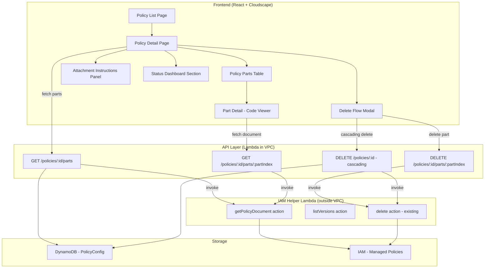

# Design Document: Policy Enforcer UX Improvements

## Overview

This design extends the existing Policy Enforcer feature with a detail view for individual policy configurations, attachment guidance, per-part operations, a status dashboard, and cascading delete. The system already generates IAM managed policies via a two-tier strategy (blanket deny + specific API deny) and stores configuration in DynamoDB. The current UI only provides a listing page; this work adds a detail page with live policy document viewing, multi-part attachment instructions, and robust delete flows.

The architecture follows the existing pattern: React frontend (Cloudscape Design System) → API Gateway → API Lambda (VPC) → IAM Helper Lambda (non-VPC) for IAM operations. New API routes are added to `policy-routes.ts`, new actions are added to the IAM Helper Lambda, and new React pages/components are created.

## Architecture



### Request Flow for Policy Part Detail

1. User navigates to `/policy-enforcer/:policyId`
2. Frontend calls `GET /policies/:policyId` (existing) to load config metadata
3. Frontend calls `GET /policies/:policyId/parts` to load part summaries
4. User selects a part → Frontend calls `GET /policies/:policyId/parts/:partIndex`
5. API Lambda invokes IAM Helper with `getPolicyDocument` action
6. IAM Helper calls `GetPolicyVersion` on the default version
7. Response flows back with the live JSON document

## Components and Interfaces

### New IAM Helper Actions

The IAM Helper Lambda (`iam-policy-helper.ts`) gains two new actions:

```typescript
// Extended event type
export interface IAMHelperEvent {
  action: 'create' | 'update' | 'delete' | 'getPolicyDocument' | 'listVersions';
  policyArn?: string;
  policyName?: string;
  policyDocument?: string;
  description?: string;
  versionId?: string; // for getPolicyDocument - defaults to default version
}

// Extended result type
export interface IAMHelperResult {
  success: boolean;
  policyArn?: string;
  policyDocument?: string;
  versions?: PolicyVersionSummary[];
  error?: string;
}

export interface PolicyVersionSummary {
  versionId: string;
  isDefaultVersion: boolean;
  createDate: string;
}
```

### New API Routes

Added to `policy-routes.ts`:

| Method | Path                                   | Description                                    |
| ------ | -------------------------------------- | ---------------------------------------------- |
| GET    | `/policies/:policyId/parts`            | List all policy parts with metadata            |
| GET    | `/policies/:policyId/parts/:partIndex` | Fetch live policy document for a specific part |
| DELETE | `/policies/:policyId/parts/:partIndex` | Delete a single policy part from IAM           |

### Updated Delete Route

The existing `DELETE /policies/:policyId` route is enhanced to perform cascading deletion of all policy parts (primary + additional ARNs) with partial failure reporting.

### New Shared Types

```typescript
/** Represents a single IAM managed policy part. */
export interface PolicyPart {
  partIndex: number;
  arn: string;
  partType: 'blanket-deny' | 'specific-api-deny';
  documentSize: number;
  statementItemCount: number; // NotAction wildcards or Action items
}

/** Response from GET /policies/:policyId/parts */
export interface PolicyPartsResponse {
  parts: PolicyPart[];
  totalParts: number;
  combinedSize: number;
}

/** Response from GET /policies/:policyId/parts/:partIndex */
export interface PolicyPartDetailResponse {
  part: PolicyPart;
  document: Record<string, unknown>; // The full IAM policy JSON
  services: ServiceActionGroup[];
}

/** Actions grouped by service prefix for display. */
export interface ServiceActionGroup {
  servicePrefix: string;
  actions: string[];
}

/** Response from cascading delete with partial failures. */
export interface CascadingDeleteResponse {
  success: boolean;
  deletedArns: string[];
  failedArns: { arn: string; error: string }[];
}
```

### New Frontend Components

| Component                 | Location                                       | Purpose                                        |
| ------------------------- | ---------------------------------------------- | ---------------------------------------------- |
| `PolicyDetailPage`        | `pages/policy-enforcer/policy-detail-page.tsx` | Detail view for a single policy configuration  |
| `PolicyPartsTable`        | `components/policy-parts-table.tsx`            | Table listing all policy parts                 |
| `PartDetailViewer`        | `components/part-detail-viewer.tsx`            | Read-only JSON code viewer for a selected part |
| `AttachmentInstructions`  | `components/attachment-instructions.tsx`       | Multi-part attachment guidance with snippets   |
| `StatusDashboard`         | `components/status-dashboard.tsx`              | Dashboard section with auto-refresh            |
| `DeleteConfirmationModal` | `components/delete-confirmation-modal.tsx`     | Cascading delete confirmation with ARN listing |

### Frontend Client Extensions

```typescript
// Added to PolicyEnforcerClient
async getPolicyParts(policyId: string): Promise<PolicyPartsResponse>;
async getPolicyPartDetail(policyId: string, partIndex: number): Promise<PolicyPartDetailResponse>;
async deletePolicyPart(policyId: string, partIndex: number): Promise<void>;
async deletePolicyCascading(policyId: string): Promise<CascadingDeleteResponse>;
async refreshAllPolicies(): Promise<void>;
```

## Data Models

### DynamoDB Schema (unchanged)

The existing `PolicyConfiguration` schema in DynamoDB remains unchanged. The `policyArn` and `additionalPolicyArns` fields already store the information needed to identify policy parts. Part type is inferred by index: index 0 is always the blanket deny policy, indices 1+ are specific API deny policies.

### Policy Part Derivation

Policy parts are derived at query time from the stored configuration:

```
Part 0: policyArn → Blanket Deny Policy (Tier 1, NotAction with service:* wildcards)
Part 1..N: additionalPolicyArns[0..N-1] → Specific API Deny Policies (Tier 2, Action lists)
```

The live document content is fetched from IAM on demand (not cached) to ensure the UI always shows the current state.

### Next Refresh Computation

```typescript
function computeNextRefresh(lastRefreshTime: string, refreshIntervalHours: number): string {
  const last = new Date(lastRefreshTime);
  const next = new Date(last.getTime() + refreshIntervalHours * 60 * 60 * 1000);
  return next.toISOString();
}
```

### Action Grouping

```typescript
function groupActionsByService(actions: string[]): ServiceActionGroup[] {
  const groups = new Map<string, string[]>();
  for (const action of actions) {
    const [prefix, ...rest] = action.split(':');
    const servicePrefix = prefix;
    if (!groups.has(servicePrefix)) groups.set(servicePrefix, []);
    groups.get(servicePrefix)!.push(rest.join(':'));
  }
  return Array.from(groups.entries())
    .map(([servicePrefix, actions]) => ({ servicePrefix, actions }))
    .sort((a, b) => a.servicePrefix.localeCompare(b.servicePrefix));
}
```

## Correctness Properties

_A property is a characteristic or behavior that should hold true across all valid executions of a system — essentially, a formal statement about what the system should do. Properties serve as the bridge between human-readable specifications and machine-verifiable correctness guarantees._

### Property 1: Policy parts summary computation

_For any_ array of policy parts with known document sizes, the computed `totalParts` SHALL equal the array length and the computed `combinedSize` SHALL equal the sum of all individual `documentSize` values.

**Validates: Requirements 1.3**

### Property 2: Policy statement item count

_For any_ IAM policy document containing either a NotAction array or an Action array, the reported `statementItemCount` SHALL equal the number of elements in that array.

**Validates: Requirements 1.5, 1.6**

### Property 3: Attachment snippet ARN inclusion

_For any_ non-empty array of policy part ARNs, the generated CDK snippet and CloudFormation YAML snippet SHALL each contain every ARN from the input array as a substring.

**Validates: Requirements 2.2, 2.3, 2.4**

### Property 4: Action grouping by service prefix

_For any_ list of IAM actions in the format `service:ActionName`, the grouping function SHALL produce groups where every action in a group shares the same service prefix, and the union of all actions across all groups equals the original input set.

**Validates: Requirements 3.1**

### Property 5: Next refresh time computation

_For any_ valid ISO 8601 timestamp and positive refresh interval in hours, the computed next refresh time SHALL equal the input timestamp plus exactly the interval converted to milliseconds.

**Validates: Requirements 4.2**

### Property 6: Delete confirmation ARN completeness

_For any_ PolicyConfiguration with a primary ARN and zero or more additional ARNs, the delete confirmation dialog SHALL list exactly the set of all ARNs (primary + additional) with no omissions or duplicates.

**Validates: Requirements 5.1**

### Property 7: Partial delete failure reporting

_For any_ set of policy part ARNs where a subset of IAM deletions fail, the cascading delete response SHALL report exactly the failed ARNs in `failedArns` and exactly the successful ARNs in `deletedArns`, with the union equaling the original set.

**Validates: Requirements 5.3**

### Property 8: Parts API response completeness

_For any_ PolicyConfiguration with N policy parts (1 primary + M additional ARNs), the `GET /policies/:id/parts` response SHALL contain exactly N parts, each with a valid ARN, non-negative document size, and a part type of either `blanket-deny` or `specific-api-deny`.

**Validates: Requirements 6.1**

## Error Handling

| Scenario                             | Behavior                                                                                 |
| ------------------------------------ | ---------------------------------------------------------------------------------------- |
| IAM `GetPolicyVersion` fails         | API returns 502 with "upstream IAM service unavailable" message                          |
| Policy not found in DynamoDB         | API returns 404 with "Policy not found" message                                          |
| Part index out of range              | API returns 404 with "Part not found" message                                            |
| Single-part deletion fails           | UI displays error toast, ARN retained in config                                          |
| Cascading delete partial failure     | UI displays warning with list of failed ARNs, successful deletions are not rolled back   |
| IAM Helper Lambda invocation timeout | API returns 504 with "IAM operation timed out" message                                   |
| Auto-refresh network failure         | Dashboard shows stale data with "Last updated X ago" indicator, retries on next interval |

## Testing Strategy

### Property-Based Tests (fast-check)

Property-based testing is appropriate for this feature because several components involve pure data transformations (summary computation, snippet generation, action grouping, time computation, ARN set operations) that have clear universal properties.

- **Library**: `fast-check` (already used in the project — see existing `.property.test.ts` files)
- **Minimum iterations**: 100 per property
- **Tag format**: `Feature: policy-enforcer-ux, Property {N}: {title}`

Each correctness property above maps to a single property-based test:

1. Summary computation → test `computePartsSummary` function
2. Statement item count → test `countStatementItems` function
3. Snippet ARN inclusion → test `generateCdkSnippet` and `generateCfnSnippet` functions
4. Action grouping → test `groupActionsByService` function
5. Next refresh computation → test `computeNextRefresh` function
6. Delete confirmation completeness → test `buildDeleteConfirmationArns` function
7. Partial failure reporting → test cascading delete logic with mock failures
8. Parts API response → test route handler with mock store/IAM helper

### Unit Tests (Vitest)

- Component rendering tests for each new Cloudscape component
- API route handler tests with mocked DynamoDB and IAM Helper
- Error handling edge cases (404, 502, timeout)
- Conditional rendering (SCP vs IAM, single vs multi-part)

### Integration Tests

- End-to-end flow: create policy → refresh → view parts → delete
- IAM Helper Lambda with mocked IAM SDK calls
- Auto-refresh timer behavior with fake timers

### Test File Locations

```
source/lambda/routes/policy-parts-routes.test.ts
source/lambda/services/policy-enforcer/policy-parts.property.test.ts
source/website/app/pages/policy-enforcer/components/__tests__/
```
