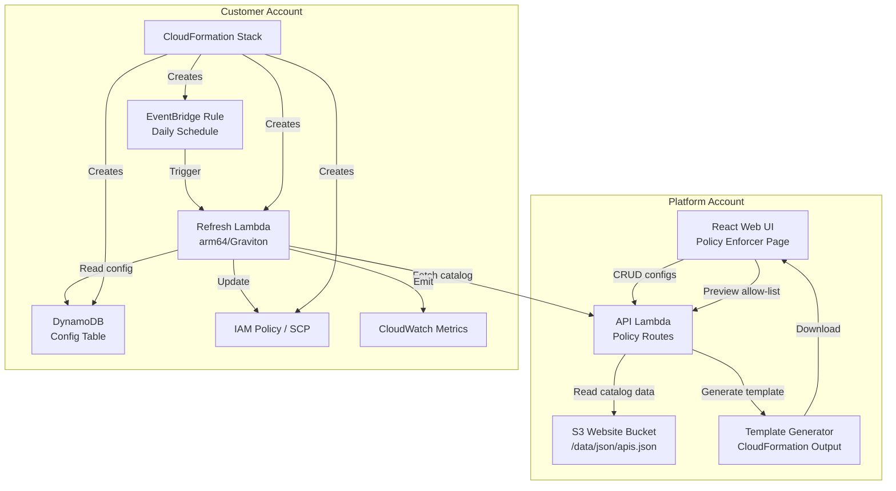
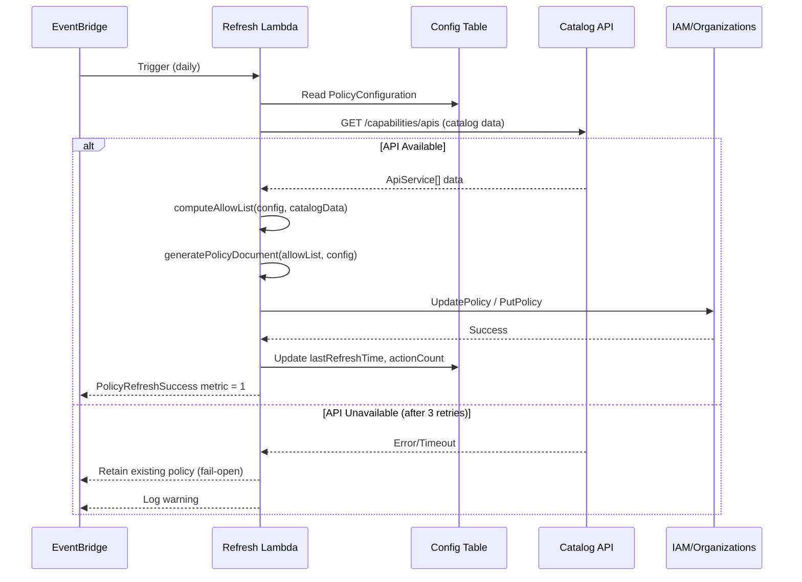
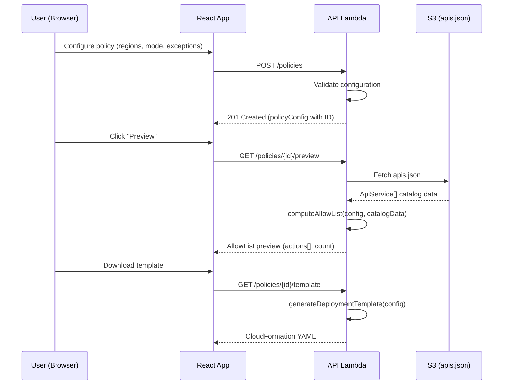

# Design Document: Policy Enforcer

## Overview

The Policy Enforcer feature extends the Capability Insights platform to generate and maintain IAM Policies or Service Control Policies (SCPs) that restrict AWS capabilities based on regional availability data. Users configure target regions, a computation mode (intersection or union), and optional exceptions through the existing web UI. The system produces a "Deny all, except [allow-list]" policy document and deploys infrastructure to the customer's account that refreshes the policy daily.

The feature spans three deployment boundaries:

1. **Platform side** (our account): New API routes on the existing API Lambda, new UI pages in the React website, and a CloudFormation template generator.
2. **Customer side** (their account): A deployed CloudFormation stack containing a Refresh Lambda, DynamoDB config table, EventBridge schedule, and the managed IAM Policy/SCP.
3. **Data flow**: The customer's Refresh Lambda calls our Catalog API to fetch current availability data, recomputes the allow-list, and updates the policy in-place.

### Key Design Decisions

| Decision               | Choice                                                                 | Rationale                                                                  |
| ---------------------- | ---------------------------------------------------------------------- | -------------------------------------------------------------------------- |
| Policy structure       | Deny + NotAction                                                       | Standard AWS pattern for "deny everything except these actions"            |
| Customer deployment    | CloudFormation template                                                | Self-contained, auditable, no cross-account trust needed beyond API access |
| Config storage         | DynamoDB in customer account                                           | Low-latency reads for Lambda, no cross-account data residency concerns     |
| Allow-list computation | Pure function                                                          | Enables deterministic testing, caching, and preview without side effects   |
| IAM action mapping     | `sdkServiceName:apiAction` with exceptions table                       | Covers 95%+ of services; exceptions table handles known mismatches         |
| Policy size overflow   | Split into multiple managed policies (IAM) / error with guidance (SCP) | IAM supports multiple policies per role; SCPs have hard org-level limits   |
| Failure mode           | Fail-open (retain last good policy)                                    | Avoids accidental lockout when catalog API is temporarily unavailable      |

## Architecture

### High-Level Architecture



### Data Flow: Policy Refresh Cycle



### Request Flow: Configuration Management



## Components and Interfaces

### 1. Allow-List Computation Engine (`source/lambda/services/allow-list-engine.ts`)

The core pure function that computes the set of allowed IAM actions from catalog data and configuration.

```typescript
export interface AllowListInput {
  catalogData: ApiService[];
  configuration: PolicyConfiguration;
}

export interface AllowListResult {
  actions: string[]; // Sorted list of IAM actions (e.g., "s3:GetObject")
  actionCount: number;
  excludedCount: number; // Actions excluded by availability filter
  exceptionCount: number; // Actions added via exceptions
}

/**
 * Pure function: computes the allow-list from catalog data and configuration.
 * No side effects, deterministic output for identical inputs.
 */
export function computeAllowList(input: AllowListInput): AllowListResult;
```

**IAM Action Mapping Logic:**

```typescript
// Primary mapping: sdkServiceName:apiAction
// e.g., { sdkServiceName: "s3", apiAction: "GetObject" } → "s3:GetObject"

export const IAM_SERVICE_PREFIX_OVERRIDES: Record<string, string> = {
  elasticloadbalancingv2: 'elasticloadbalancing',
  monitoring: 'cloudwatch',
  logs: 'logs',
  events: 'events',
  // Additional known mismatches added as discovered
};

export function toIamAction(sdkServiceName: string, apiAction: string): string {
  const prefix = IAM_SERVICE_PREFIX_OVERRIDES[sdkServiceName] ?? sdkServiceName;
  return `${prefix}:${apiAction}`;
}
```

### 2. Policy Document Generator (`source/lambda/services/policy-document-generator.ts`)

Transforms an allow-list into a valid IAM Policy or SCP JSON document.

```typescript
export interface PolicyDocumentOptions {
  allowList: string[];
  policyType: 'IAM' | 'SCP';
  policyName: string;
  generationTimestamp: string;
}

export interface GeneratedPolicy {
  documents: PolicyDocument[]; // May be multiple if size limit exceeded (IAM only)
  totalSize: number;
  splitRequired: boolean;
}

export interface PolicyDocument {
  Version: '2012-10-17';
  Statement: PolicyStatement[];
}

export interface PolicyStatement {
  Sid: string;
  Effect: 'Deny';
  NotAction: string[];
  Resource: '*';
}

export function generatePolicyDocument(options: PolicyDocumentOptions): GeneratedPolicy;
```

**Size Limit Handling:**

- IAM Policy: 6,144 characters max. If exceeded, split NotAction list across multiple policy documents.
- SCP: 5,120 characters max. If exceeded, return error with guidance (cannot split SCPs).

### 3. Policy Configuration API Routes (`source/lambda/routes/policy-routes.ts`)

New routes registered on the existing API Lambda:

| Method   | Path                           | Description                                      |
| -------- | ------------------------------ | ------------------------------------------------ |
| `POST`   | `/policies`                    | Create new PolicyConfiguration                   |
| `GET`    | `/policies`                    | List all PolicyConfigurations                    |
| `GET`    | `/policies/:policyId`          | Get single PolicyConfiguration                   |
| `PUT`    | `/policies/:policyId`          | Update PolicyConfiguration                       |
| `DELETE` | `/policies/:policyId`          | Delete PolicyConfiguration and associated policy |
| `POST`   | `/policies/:policyId/refresh`  | Trigger immediate refresh                        |
| `GET`    | `/policies/:policyId/preview`  | Compute and return allow-list preview            |
| `GET`    | `/policies/:policyId/template` | Generate and return CloudFormation template      |

### 4. Deployment Template Generator (`source/lambda/services/template-generator.ts`)

Generates a CloudFormation template (JSON) that the customer deploys to their account.

```typescript
export interface TemplateParameters {
  catalogApiEndpoint: string;
  refreshIntervalHours: number;
  vpcDeployment: boolean;
  policyType: 'IAM' | 'SCP';
  policyConfigId: string;
}

export function generateDeploymentTemplate(params: TemplateParameters): string;
```

**Resources created by the template:**

- `RefreshLambda` — Node.js 24.x, arm64, 256 MB, 300s timeout
- `ConfigTable` — DynamoDB table (PAY_PER_REQUEST, encryption at rest)
- `LambdaExecutionRole` — IAM role with least-privilege permissions
- `RefreshSchedule` — EventBridge rule (configurable interval)
- `ManagedPolicy` — The IAM Policy or SCP (initially empty, populated on first refresh)
- `InitialRefreshCustomResource` — Triggers first policy generation on stack creation
- (Optional) VPC Endpoints for DynamoDB, IAM, Organizations, Catalog API

### 5. Refresh Lambda (`source/lambda/refresh-lambda-main.ts`)

Deployed to the customer's account. Packaged separately from the API Lambda.

```typescript
export interface RefreshResult {
  success: boolean;
  actionCount: number;
  policyUpdated: boolean;
  error?: string;
  retainedExistingPolicy: boolean;
}

export async function handler(): Promise<RefreshResult>;
```

**Retry Strategy:**

- Catalog API fetch: 3 retries, exponential backoff (1s, 2s, 4s)
- IAM/Organizations API update: 3 retries, exponential backoff (1s, 2s, 4s)
- On total failure: retain existing policy, emit `PolicyUpdateFailure` metric

### 6. Web UI Components (`source/website/app/pages/policy-enforcer/`)

| Component            | Purpose                                                                                      |
| -------------------- | -------------------------------------------------------------------------------------------- |
| `PolicyEnforcerPage` | Main page listing all policy configs in a table (name, regions, tags, status) with filtering |
| `CreatePolicyWizard` | Multi-step wizard: name/description/tags → regions → mode → exceptions → type → review       |
| `RegionPicker`       | Multi-select populated from catalog regions                                                  |
| `ModeSelector`       | Radio group: Intersection / Union with descriptions                                          |
| `ExceptionsEditor`   | Add/remove/search exception entries                                                          |
| `TagEditor`          | Add/remove key-value tags with autocomplete for existing keys                                |
| `AllowListPreview`   | Searchable table showing computed actions                                                    |
| `PolicyArnDisplay`   | Shows ARN with copy button and CDK/CFN snippets                                              |
| `RefreshStatus`      | Shows last refresh time, outcome, and "Refresh Now" button                                   |

## Data Models

### PolicyConfiguration (DynamoDB Item / API Payload)

```typescript
export interface PolicyConfiguration {
  policyId: string; // UUID, partition key
  policyName: string; // User-friendly name, unique per account (e.g., "Payment Service - US/EU")
  description?: string; // Optional description of the workload/purpose
  tags: PolicyTag[]; // Key-value tags for organization (e.g., team, environment, application)
  regions: string[]; // Selected region codes (e.g., ["us-east-1", "eu-west-1"])
  mode: 'intersection' | 'union'; // Computation mode
  policyType: 'IAM' | 'SCP'; // Output policy type
  exceptions: ExceptionEntry[]; // Manual exceptions
  refreshIntervalHours: number; // 1–24, default 24
  status: PolicyStatus; // 'active' | 'pending' | 'error'
  policyArn?: string; // ARN of generated policy (set after first refresh)
  additionalPolicyArns?: string[]; // Additional ARNs if policy was split
  lastRefreshTime?: string; // ISO 8601 timestamp
  lastRefreshOutcome?: RefreshOutcome; // 'success' | 'retained' | 'error'
  lastActionCount?: number; // Number of actions in last generated allow-list
  stackId?: string; // CloudFormation stack ID in customer account
  createdAt: string; // ISO 8601
  updatedAt: string; // ISO 8601
}

export type PolicyStatus = 'active' | 'pending' | 'error';
export type RefreshOutcome = 'success' | 'retained' | 'error';

export interface PolicyTag {
  key: string; // Tag key (e.g., "team", "environment", "application")
  value: string; // Tag value (e.g., "payments", "production", "order-service")
}

export interface ExceptionEntry {
  action: string; // Format: "service:Action" or "service:*"
  reason?: string; // Optional user-provided reason
  addedAt: string; // ISO 8601
}
```

### DynamoDB Table Schema

| Attribute     | Type   | Key                                   |
| ------------- | ------ | ------------------------------------- |
| `policyId`    | String | Partition Key                         |
| `policyName`  | String | GSI-1 PK (for uniqueness lookups)     |
| `accountId`   | String | GSI-2 PK (for listing by account)     |
| `status`      | String | —                                     |
| `description` | String | —                                     |
| `tags`        | List   | List of {key, value} maps             |
| `config`      | Map    | Full PolicyConfiguration (minus keys) |
| `createdAt`   | String | Sort Key on GSI-2                     |
| `updatedAt`   | String | —                                     |

### API Request/Response Schemas

**POST /policies (Create)**

```typescript
// Request
interface CreatePolicyRequest {
  policyName: string;
  description?: string;
  tags?: PolicyTag[];
  regions: string[];
  mode: 'intersection' | 'union';
  policyType: 'IAM' | 'SCP';
  exceptions?: ExceptionEntry[];
  refreshIntervalHours?: number; // Default: 24
}

// Response: 201 Created
interface CreatePolicyResponse {
  policy: PolicyConfiguration;
}
```

**GET /policies (List)**

```typescript
// Query Parameters (all optional)
interface ListPoliciesQuery {
  tagKey?: string; // Filter by tag key
  tagValue?: string; // Filter by tag value (requires tagKey)
  status?: PolicyStatus;
  search?: string; // Search across name and description
}

// Response: 200 OK
interface ListPoliciesResponse {
  policies: PolicyConfiguration[];
}
```

**GET /policies/:policyId/preview**

```typescript
// Response: 200 OK
interface PreviewResponse {
  actions: string[];
  actionCount: number;
  excludedCount: number;
  exceptionCount: number;
  estimatedPolicySize: number;
  splitRequired: boolean;
}
```

### IAM Policy Document Structure

```json
{
  "Version": "2012-10-17",
  "Statement": [
    {
      "Sid": "PolicyEnforcer_20240115T120000Z_Part1",
      "Effect": "Deny",
      "NotAction": ["s3:GetObject", "s3:PutObject", "ec2:DescribeInstances"],
      "Resource": "*"
    }
  ]
}
```

### Catalog Data Shape (Input to Computation)

Leverages the existing `ApiService` type from `source/shared/types/capability/api.ts`:

```typescript
// Already defined in the codebase:
interface ApiService {
  sdkServiceName: string; // Maps to IAM service prefix
  sdkServiceFullName: string;
  apis: ApiOperation[];
}

interface ApiOperation {
  apiName: string;
  apiAction: string; // Operation name
  regionalAvailability: Record<RegionCode, AvailabilityStatus>;
}

// AvailabilityStatus enum: 'Available' | 'Planned' | 'Planning' | 'Not Expanding' | 'Not Available'
```

### Allow-List Computation Algorithm

```
FUNCTION computeAllowList(catalogData: ApiService[], config: PolicyConfiguration) → string[]

  allowSet ← empty Set<string>

  FOR EACH service IN catalogData:
    iamPrefix ← IAM_SERVICE_PREFIX_OVERRIDES[service.sdkServiceName] ?? service.sdkServiceName

    FOR EACH operation IN service.apis:
      IF config.mode == 'intersection':
        included ← ALL regions in config.regions have
                    operation.regionalAvailability[region] == 'Available'
      ELSE (union):
        included ← ANY region in config.regions has
                    operation.regionalAvailability[region] == 'Available'

      IF included:
        allowSet.add(iamPrefix + ':' + operation.apiAction)

  // Add exceptions (regardless of availability)
  FOR EACH exception IN config.exceptions:
    allowSet.add(exception.action)

  RETURN Array.from(allowSet).sort()  // Deterministic alphabetical order
```

## Correctness Properties

_A property is a characteristic or behavior that should hold true across all valid executions of a system — essentially, a formal statement about what the system should do. Properties serve as the bridge between human-readable specifications and machine-verifiable correctness guarantees._

### Property 1: Intersection mode includes only universally available actions

_For any_ set of `ApiService[]` catalog data and _for any_ non-empty set of selected regions, when the allow-list is computed in intersection mode, every action in the result SHALL have an availability status of `"Available"` in ALL selected regions in the source catalog data.

**Validates: Requirements 2.2, 3.1**

### Property 2: Union mode includes only regionally available actions

_For any_ set of `ApiService[]` catalog data and _for any_ non-empty set of selected regions, when the allow-list is computed in union mode, every action in the result (excluding exceptions) SHALL have an availability status of `"Available"` in at least one of the selected regions in the source catalog data.

**Validates: Requirements 2.3, 3.2**

### Property 3: Intersection is a subset of union

_For any_ set of `ApiService[]` catalog data and _for any_ non-empty set of selected regions, the allow-list computed in intersection mode SHALL be a subset of or equal to the allow-list computed in union mode (given the same exceptions).

**Validates: Requirements 3.5**

### Property 4: Exceptions are always included

_For any_ set of `ExceptionEntry[]` items and _for any_ catalog data and region selection (regardless of mode), every exception action SHALL appear in the computed allow-list, even if the corresponding capability has no availability data or is marked as unavailable in all selected regions.

**Validates: Requirements 3.4, 6.4**

### Property 5: IAM action mapping preserves service and operation identity

_For any_ `sdkServiceName` and `apiAction` pair, the `toIamAction` function SHALL produce a string in the format `"prefix:action"` where `prefix` is either the override value from `IAM_SERVICE_PREFIX_OVERRIDES[sdkServiceName]` or `sdkServiceName` itself, and `action` is the original `apiAction` unchanged.

**Validates: Requirements 3.3**

### Property 6: Generated policy document has valid structure

_For any_ non-empty allow-list and _for any_ policy type (IAM or SCP), the generated policy document SHALL contain: `Version` equal to `"2012-10-17"`, at least one `Statement` with `Effect` equal to `"Deny"`, a `NotAction` array containing actions from the allow-list, `Resource` equal to `"*"`, and a `Sid` field containing the generation timestamp string.

**Validates: Requirements 4.1, 4.2, 4.4, 5.2, 5.4**

### Property 7: Policy size limits are enforced

_For any_ allow-list, when generating an IAM policy, every individual policy document in the result SHALL have a JSON-serialized size of at most 6,144 characters. When generating an SCP, if the document would exceed 5,120 characters, the generator SHALL return an error result rather than an oversized document.

**Validates: Requirements 4.3, 5.3**

### Property 8: Policy document action round-trip

_For any_ valid sorted allow-list, generating a policy document and then extracting the `NotAction` array from the parsed JSON (flattened across all statements if split) SHALL produce a list that is equal to the original allow-list.

**Validates: Requirements 4.5, 14.4**

### Property 9: Allow-list output invariants

_For any_ valid inputs (catalog data + configuration), the computed allow-list SHALL be: (a) sorted in alphabetical order, (b) free of duplicate entries, and (c) deterministic — computing the allow-list twice with identical inputs SHALL produce identical output.

**Validates: Requirements 14.1, 14.2, 6.6**

### Property 10: Exception entry format validation

_For any_ string, the exception validation function SHALL accept it if and only if it matches the pattern `^[a-zA-Z0-9-]+:(([A-Z][a-zA-Z0-9]*)|(\*))$` (a service prefix followed by a colon and either a PascalCase action name or a wildcard `*`).

**Validates: Requirements 6.3**

### Property 11: Configuration serialization round-trip

_For any_ valid `PolicyConfiguration` object, serializing it to the DynamoDB item format and deserializing it back SHALL produce an object that is deeply equal to the original configuration.

**Validates: Requirements 7.6**

## Error Handling

### Allow-List Computation Errors

| Error Condition                            | Handling                                     | User Impact                                                   |
| ------------------------------------------ | -------------------------------------------- | ------------------------------------------------------------- |
| Empty region selection                     | Reject at validation layer (API returns 400) | User sees validation error in UI                              |
| Catalog data unavailable (preview)         | API returns 503 with retry guidance          | User sees "data temporarily unavailable"                      |
| Unknown sdkServiceName (no override match) | Use sdkServiceName as-is (passthrough)       | Action included with original prefix                          |
| Missing availability data for a region     | Treat as "Not Available"                     | Action excluded from intersection, may be excluded from union |

### Policy Document Generation Errors

| Error Condition                     | Handling                                                 | User Impact                                            |
| ----------------------------------- | -------------------------------------------------------- | ------------------------------------------------------ |
| Allow-list empty                    | Generate policy with empty NotAction (denies everything) | Warning displayed: "Policy will deny all actions"      |
| IAM policy exceeds 6,144 chars      | Split into multiple documents                            | UI shows multiple ARNs                                 |
| SCP exceeds 5,120 chars             | Return error with guidance                               | UI shows error: "Reduce scope or switch to IAM Policy" |
| Invalid action format in exceptions | Reject at validation (API returns 400)                   | User sees format error                                 |

### Refresh Lambda Errors

| Error Condition                 | Handling                                       | Recovery                                            |
| ------------------------------- | ---------------------------------------------- | --------------------------------------------------- |
| Catalog API timeout             | Retry 3× with exponential backoff (1s, 2s, 4s) | Retain existing policy                              |
| Catalog API 5xx                 | Retry 3× with exponential backoff              | Retain existing policy                              |
| Catalog API 4xx                 | No retry (client error)                        | Log error, emit `PolicyUpdateFailure` metric        |
| DynamoDB read failure           | Retry 3× with backoff                          | Abort refresh, emit metric                          |
| IAM UpdatePolicy failure        | Retry 3× with backoff                          | Retain existing policy, emit metric                 |
| Organizations PutPolicy failure | Retry 3× with backoff                          | Retain existing policy, emit metric                 |
| Lambda timeout (>300s)          | Execution terminates                           | CloudWatch alarm triggers on missing success metric |

### API Route Errors

| Status Code | Condition                              | Response Body                                                      |
| ----------- | -------------------------------------- | ------------------------------------------------------------------ |
| 400         | Missing required field, invalid format | `{ "error": "ValidationError", "message": "..." }`                 |
| 404         | Policy ID not found                    | `{ "error": "NotFound", "message": "Policy {id} not found" }`      |
| 409         | Duplicate policy name                  | `{ "error": "Conflict", "message": "Policy name already exists" }` |
| 500         | Unexpected server error                | `{ "error": "InternalError", "message": "..." }`                   |
| 503         | Catalog data unavailable               | `{ "error": "ServiceUnavailable", "message": "..." }`              |

## Testing Strategy

### Unit Tests (Example-Based)

Unit tests cover specific scenarios, edge cases, and integration points:

- **Allow-list computation**: Specific examples with known catalog data and expected outputs
- **Edge cases**: Empty regions, empty catalog, all-unavailable services, single region, overlapping exceptions
- **Policy document generation**: Known allow-lists producing expected JSON structures
- **Template generation**: Snapshot tests for CloudFormation template output
- **Validation functions**: Specific valid/invalid inputs for exception format, region selection, refresh interval
- **API route handlers**: Request/response validation with mocked dependencies

### Property-Based Tests

Property tests verify universal correctness guarantees using the [fast-check](https://github.com/dubzzz/fast-check) library (already available in the Node.js ecosystem used by this project).

**Configuration:**

- Minimum 100 iterations per property test
- Each test tagged with: `Feature: policy-enforcer, Property {number}: {title}`

**Properties to implement:**

| Property                 | Module Under Test                       | Generator Strategy                                                                       |
| ------------------------ | --------------------------------------- | ---------------------------------------------------------------------------------------- |
| 1: Intersection mode     | `computeAllowList`                      | Random `ApiService[]` with random `AvailabilityStatus` per region, random region subsets |
| 2: Union mode            | `computeAllowList`                      | Same generator as Property 1                                                             |
| 3: Intersection ⊆ Union  | `computeAllowList`                      | Same generator, compute both modes, assert subset                                        |
| 4: Exceptions included   | `computeAllowList`                      | Random catalog + random exceptions (some unavailable)                                    |
| 5: IAM action mapping    | `toIamAction`                           | Random alphanumeric service names and PascalCase action names                            |
| 6: Document structure    | `generatePolicyDocument`                | Random non-empty action lists, both policy types                                         |
| 7: Size limits           | `generatePolicyDocument`                | Action lists of varying sizes (small to very large)                                      |
| 8: Action round-trip     | `generatePolicyDocument` + parse        | Random sorted action lists                                                               |
| 9: Output invariants     | `computeAllowList`                      | Random inputs, verify sorted + unique + deterministic                                    |
| 10: Exception validation | `validateExceptionEntry`                | Random strings (valid and invalid patterns)                                              |
| 11: Config round-trip    | `serializeConfig` / `deserializeConfig` | Random valid `PolicyConfiguration` objects                                               |

### Integration Tests

Integration tests verify cross-component behavior with real or mocked AWS services:

- **API routes**: Full request lifecycle through the Lambda handler with mocked DynamoDB/S3
- **Refresh Lambda**: End-to-end execution with mocked Catalog API, DynamoDB, and IAM
- **Retry behavior**: Verify exponential backoff timing and retry counts
- **CloudWatch metrics**: Verify metric emission on success and failure paths

### Snapshot Tests

- **Deployment template**: Snapshot the generated CloudFormation JSON for regression detection
- **Policy document**: Snapshot known allow-lists producing expected policy JSON
