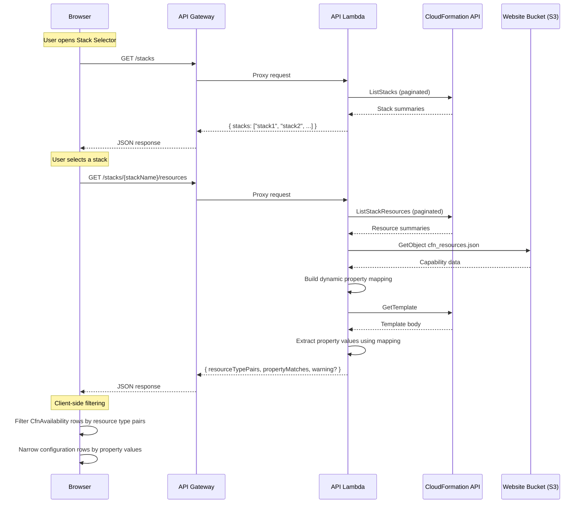
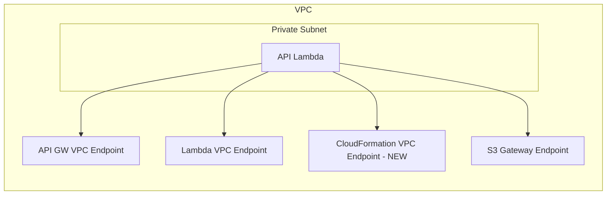

# Design Document: Stack Resource Filter

## Overview

The Stack Resource Filter feature adds the ability to filter the CloudFormation resources tab by a running CloudFormation stack. When a user selects a stack, the table narrows to show only the resource types actually used in that stack — and when property data is available (e.g., `InstanceType: "t3.micro"`), it further narrows configuration rows to only the values in use.

The feature spans three layers:

1. **Infrastructure** — A new VPC endpoint for CloudFormation and IAM permissions so the API Lambda can call `ListStacks`, `ListStackResources`, and `GetTemplate`.
2. **Backend** — Two new API routes (`GET /stacks` and `GET /stacks/{stackName}/resources`) on the existing API Lambda, plus a CloudFormation service client and a dynamic property mapper that reads `cfn_resources.json`.
3. **Frontend** — A rewritten custom filtering function with correct recursive AND/OR evaluation, stack filtering integrated as a first-class PropertyFilter property, client methods to call the new APIs, and filtering logic that narrows `CfnAvailability` rows by resource type pairs and property values.

Since the initial implementation of requirements 1–7, two additional changes are needed:

- **Requirement 8 (Fix PropertyFilter OR Logic):** The custom `createFilteringFunction` in `availability-table-properties.tsx` flattens `tokenGroups` and AND's all tokens, silently skipping `PropertyFilterTokenGroup` objects. This breaks OR operations entirely. The fix rewrites the function with a recursive `evaluate` pattern matching the Cloudscape default `defaultFilteringFunction`, while preserving region availability lookups, parent-chain inheritance, and `matchedIds` tracking (with the accumulation bug fixed).

- **Requirement 9 (Integrate Stack Filter as PropertyFilter Property):** The separate `StackSelector` dropdown is replaced by a "Stack" filtering property inside the PropertyFilter. Stack names load asynchronously via `onLoadItems`, and `Stack = MyStack` tokens are evaluated by fetching the stack's resource types and checking row membership. This lets users combine stack filtering with region/name filters using AND/OR boolean logic. The `StackSelector` component, `stack-filter.ts` utility, and related state in `capability-by-region.tsx` are removed.

### Design Decisions

| Decision                                                             | Rationale                                                                                                                                                                                                                                                            |
| -------------------------------------------------------------------- | -------------------------------------------------------------------------------------------------------------------------------------------------------------------------------------------------------------------------------------------------------------------- |
| Add routes to existing API Lambda (not a new Lambda)                 | Keeps the architecture simple; the API Lambda already has VPC networking and API Gateway integration. Two lightweight routes don't justify a separate function.                                                                                                      |
| Dynamic property mapping from `cfn_resources.json`                   | Avoids hardcoding the 8 resource types that have property/configuration data. As the data source adds new properties, the mapping automatically expands.                                                                                                             |
| Client-side row filtering (not server-side)                          | The `CfnAvailability` rows are already loaded in the browser. Filtering in the frontend avoids a second data fetch and keeps the UX snappy. The server only provides the resource type pairs and property values.                                                    |
| Graceful degradation when `GetTemplate` fails                        | The resource type filter still works; only the property-value narrowing is lost. This avoids blocking the entire feature on template access.                                                                                                                         |
| Reuse existing API Gateway proxy integration                         | The `{proxy+}` resource already routes all methods to the API Lambda. No new API Gateway resources are needed — only new route handlers in the Lambda router.                                                                                                        |
| Recursive `evaluate` pattern for filtering function                  | Mirrors the Cloudscape `defaultFilteringFunction` structure exactly, ensuring correct AND/OR/nested semantics. A recursive function over the `PropertyFilterToken` / `PropertyFilterTokenGroup` union type is the natural way to evaluate a boolean expression tree. |
| Stack as a PropertyFilter property (not a separate dropdown)         | Unifies all filtering into a single control. Users can combine `Stack = X` with region and name tokens using AND/OR logic, which was impossible with the separate `StackSelector` dropdown.                                                                          |
| Cache stack resource data in a `Map<string, StackResourcesResponse>` | The filtering function is called once per row per query change. Without caching, every row evaluation would trigger an API call. A simple in-memory cache keyed by stack name avoids redundant fetches.                                                              |
| `onLoadItems` for async stack name loading                           | Cloudscape PropertyFilter supports `onLoadItems` for lazy-loading filtering options. This avoids fetching all stack names upfront and provides a responsive typeahead experience.                                                                                    |

## Architecture



### Infrastructure Changes



The only new infrastructure resource is the CloudFormation VPC endpoint. It uses the same security group as the existing Lambda VPC endpoint (which allows HTTPS egress). The API Lambda's IAM role gets two new policy statements: one for CloudFormation actions, one for S3 read access to `data/json/cfn_resources.json`.

## Components and Interfaces

### Backend Components

#### 1. CloudFormation Service Client (`source/lambda/services/cloudformation-client.ts`)

A thin wrapper around the AWS SDK CloudFormation client, following the same pattern as `s3-client.ts` and `lambda-client.ts`.

```typescript
interface CloudFormationServiceClient {
  /** Returns all stack names matching the allowed statuses, paginating automatically. */
  listActiveStacks(): Promise<string[]>;

  /** Returns all resource type strings for a stack, paginating automatically. */
  listStackResourceTypes(stackName: string): Promise<string[]>;

  /** Returns the template body for a stack. */
  getTemplate(stackName: string): Promise<string>;
}
```

**Allowed statuses** (defined as a constant):

```typescript
const ACTIVE_STACK_STATUSES = [
  'CREATE_COMPLETE',
  'UPDATE_COMPLETE',
  'UPDATE_ROLLBACK_COMPLETE',
  'IMPORT_COMPLETE',
] as const;
```

#### 2. Resource Type Parser (`source/lambda/util/cfn-resource-parser.ts`)

Pure functions for parsing CloudFormation resource type strings and building the dynamic property mapping.

```typescript
interface ResourceTypePair {
  serviceName: string;
  resourceTypeName: string;
}

interface PropertyMatch {
  serviceName: string;
  resourceTypeName: string;
  propertyName: string;
  value: string;
}

interface PropertyMapping {
  /** Map from "ServiceName::ResourceTypeName" to array of property names that have configurations. */
  [resourceTypeKey: string]: string[];
}

/** Splits "AWS::EC2::Instance" into { serviceName: "EC2", resourceTypeName: "Instance" }. */
function parseResourceType(fullType: string): ResourceTypePair | null;

/** Deduplicates an array of ResourceTypePair by serviceName+resourceTypeName. */
function deduplicateResourceTypePairs(pairs: ResourceTypePair[]): ResourceTypePair[];

/** Builds a mapping of resource types to their property names from CfnResource[] data. */
function buildPropertyMapping(cfnResources: CfnResource[]): PropertyMapping;

/** Returns true if a CloudFormation template value is an intrinsic function (Ref, Fn::*, Condition). */
function isIntrinsicFunction(value: unknown): boolean;

/** Extracts property values from a CloudFormation template body using the property mapping. */
function extractPropertyValues(templateBody: string, propertyMapping: PropertyMapping): PropertyMatch[];
```

#### 3. List Stacks Route (`source/lambda/routes/list-stacks-route.ts`)

Handles `GET /stacks`. Calls `cloudFormationClient.listActiveStacks()` and returns the stack names.

**Response format:**

```json
{
  "stacks": ["StackA", "StackB", "StackC"]
}
```

#### 4. Stack Resources Route (`source/lambda/routes/stack-resources-route.ts`)

Handles `GET /stacks/{stackName}/resources`. Orchestrates:

1. `ListStackResources` → parse into `ResourceTypePair[]`
2. Read `cfn_resources.json` from S3 → `buildPropertyMapping()`
3. `GetTemplate` → `extractPropertyValues()`
4. Return combined response

**Response format:**

```json
{
  "resourceTypePairs": [
    { "serviceName": "EC2", "resourceTypeName": "Instance" },
    { "serviceName": "S3", "resourceTypeName": "Bucket" }
  ],
  "propertyMatches": [
    { "serviceName": "EC2", "resourceTypeName": "Instance", "propertyName": "InstanceType", "value": "t3.micro" }
  ],
  "warning": "Could not retrieve template: <message>"
}
```

The `warning` field is only present when `GetTemplate` fails. The `propertyMatches` array is empty in that case.

#### 5. Router Changes (`source/lambda/api-lambda-main.ts`)

The existing router uses exact string matching (`${method} ${path}`). To support path parameters like `/stacks/{stackName}/resources`, the router needs a small enhancement to match parameterized paths.

**Approach:** Add a `registerParameterizedRoute` function that uses a regex pattern. When a request comes in, the router first checks exact matches (existing behavior), then falls back to parameterized routes. Matched parameters are attached to the event object or passed via a wrapper.

```typescript
// New: parameterized route support
interface ParameterizedRoute {
  pattern: RegExp;
  paramNames: string[];
  handler: (event: APIGatewayProxyEvent, params: Record<string, string>) => Promise<APIGatewayProxyResult>;
}

// Register: GET /stacks (exact match, existing pattern)
registerRoute(HttpMethod.GET, '/stacks', listStacksRoute);

// Register: GET /stacks/{stackName}/resources (parameterized)
registerParameterizedRoute(HttpMethod.GET, '/stacks/:stackName/resources', stackResourcesRoute);
```

### Frontend Components

#### 6. API Client Extensions (`source/website/app/clients/capability-insights-client.ts`)

Two new methods on the existing `CapabilityInsightsClient`:

```typescript
interface StackResourcesResponse {
  resourceTypePairs: ResourceTypePair[];
  propertyMatches: PropertyMatch[];
  warning?: string;
}

class CapabilityInsightsClient {
  /** Calls GET /stacks and returns stack names. */
  async listStacks(): Promise<string[]>;

  /** Calls GET /stacks/{stackName}/resources and returns resource type pairs + property matches. */
  async getStackResourceTypes(stackName: string): Promise<StackResourcesResponse>;
}
```

#### 7. Stack Selector Component — REMOVED (Requirement 9)

> **Note:** The `StackSelector` component (`source/website/app/components/availability/stack-selector.tsx`) is removed as part of Requirement 9. Its functionality is subsumed by the "Stack" filtering property integrated into the PropertyFilter (see Component 10 below). The original design for this component is retained here for historical reference only.

~~A Cloudscape `Select` component with `filteringType="auto"` for built-in substring search.~~

#### 8. Stack Filter Logic — REMOVED (Requirement 9)

> **Note:** The standalone `filterByStackResources` function in `source/website/app/utils/stack-filter.ts` is removed as part of Requirement 9. The stack matching logic moves into the filtering function's token evaluation (see Component 10 below). The file `stack-filter.ts` is deleted.

~~Pure functions for filtering `CfnAvailability` rows by stack resource data.~~

#### 9. CloudFormation Resources Tab Integration (Updated for Requirements 8 & 9)

The `capability-by-region.tsx` page is simplified:

1. **Remove** the `StackSelector` component, `selectedStack` state, `stackResourceData` state, `stackFilterLoading` state, `stackFilterWarning` state, `stackFilterError` state, and the `handleStackSelected` callback.
2. **Remove** the `filteredCfnRows` memo and the `filterByStackResources` import.
3. **Remove** the `StackSelector` rendering, the `Flashbar` for stack warnings/errors, and the `Spinner` for stack loading.
4. Pass the raw `cfnRows` directly to the `AvailabilityTable` component for the CFN tab.
5. All filtering (including stack filtering) is now handled by the PropertyFilter via the rewritten `createFilteringFunction`.
6. Stack resource data caching, loading states, and error handling are managed inside the filtering function and the `AvailabilityTable` component.

**Removed imports:** `StackSelector`, `filterByStackResources`, `Spinner`, `StackResourcesResponse`.

#### 10. Rewritten Filtering Function (Requirement 8 & 9) (`source/website/app/components/availability/availability-table-properties.tsx`)

The `createFilteringFunction` is rewritten to fix the OR logic bug and integrate stack token evaluation. The new implementation uses a recursive `evaluate` pattern matching the Cloudscape `defaultFilteringFunction`.

**Key changes:**

```typescript
import type {
  PropertyFilterQuery,
  PropertyFilterToken,
  PropertyFilterTokenGroup,
} from '@cloudscape-design/collection-hooks';

/** Detect PropertyFilterTokenGroup by checking for the 'operation' key. */
function isTokenGroup(t: PropertyFilterToken | PropertyFilterTokenGroup): t is PropertyFilterTokenGroup {
  return 'operation' in t;
}

/**
 * Creates a filtering function that handles:
 * - Recursive AND/OR evaluation of token groups (fixes Requirement 8)
 * - Region availability lookups (keys prefixed with "region:")
 * - Parent-chain inheritance for known property keys
 * - Stack token evaluation via cached API calls (Requirement 9)
 * - Free-text token matching against all filtering properties
 * - Parent-to-child inheritance (matched parent → children included)
 */
export function createFilteringFunction(
  items: RegionalAvailability[],
  stackResourceCache: Map<string, StackResourcesResponse>,
  onStackDataNeeded?: (stackName: string) => void,
) {
  const byId = new Map(items.map(i => [i.id, i]));

  // --- Value resolution (unchanged from original) ---
  const resolveValue = (item: RegionalAvailability, key: string): string | undefined => {
    if (key.startsWith('region:')) {
      return item.regionalAvailability?.[key.slice(7)];
    }
    // Walk parent chain for known keys
    let current: RegionalAvailability | undefined = item;
    while (current) {
      if (key === 'name' && current.name !== undefined) return current.name;
      if (key === 'regionalAvailabilityType' && current.regionalAvailabilityType !== undefined)
        return current.regionalAvailabilityType;
      current = current.parentId ? byId.get(current.parentId) : undefined;
    }
    return undefined;
  };

  // --- Single token matching ---
  const tokenMatches = (value: string | undefined, token: PropertyFilterToken): boolean => {
    const tokenValues: string[] = Array.isArray(token.value) ? token.value : [token.value];
    const stringValue = value ?? '';
    switch (token.operator) {
      case '=':
        return tokenValues.includes(stringValue);
      case '!=':
        return !tokenValues.includes(stringValue);
      case ':':
        return tokenValues.some(tv => stringValue.toLowerCase().includes(tv.toLowerCase()));
      case '!:':
        return !tokenValues.some(tv => stringValue.toLowerCase().includes(tv.toLowerCase()));
      default:
        return false;
    }
  };

  // --- Stack token evaluation ---
  const evaluateStackToken = (item: RegionalAvailability, token: PropertyFilterToken): boolean => {
    const stackName = token.value;
    const data = stackResourceCache.get(stackName);
    if (!data) {
      // Signal that we need this stack's data; match nothing until loaded
      onStackDataNeeded?.(stackName);
      return false;
    }
    // Delegate to the same hierarchical matching logic as filterByStackResources
    const matches = itemMatchesStack(item, data, byId);
    return token.operator === '=' ? matches : !matches;
  };

  // --- Free-text token matching ---
  const freeTextMatches = (item: RegionalAvailability, token: PropertyFilterToken): boolean => {
    // Match against 'name' and 'regionalAvailabilityType'
    const isNegation = token.operator.startsWith('!');
    const keys = ['name', 'regionalAvailabilityType'];
    return keys[isNegation ? 'every' : 'some'](key => {
      const value = resolveValue(item, key);
      return tokenMatches(value, token);
    });
  };

  // --- Evaluate a single token ---
  const evaluateToken = (item: RegionalAvailability, token: PropertyFilterToken): boolean => {
    if (token.propertyKey === 'stack') {
      return evaluateStackToken(item, token);
    }
    if (!token.propertyKey) {
      return freeTextMatches(item, token);
    }
    const value = resolveValue(item, token.propertyKey);
    return tokenMatches(value, token);
  };

  // --- Recursive evaluate (mirrors Cloudscape defaultFilteringFunction) ---
  const evaluate = (
    item: RegionalAvailability,
    tokenOrGroup: PropertyFilterToken | PropertyFilterTokenGroup,
  ): boolean => {
    if (isTokenGroup(tokenOrGroup)) {
      const { operation, tokens } = tokenOrGroup;
      let result = operation === 'and' ? true : !tokens.length;
      for (const child of tokens) {
        if (operation === 'and') {
          result = result && evaluate(item, child);
        } else {
          result = result || evaluate(item, child);
        }
      }
      return result;
    }
    return evaluateToken(item, tokenOrGroup);
  };

  // --- Parent-chain inheritance (fixed: re-evaluate per query) ---
  let lastQuery: PropertyFilterQuery | null = null;
  const matchedIds = new Set<string>();

  return (item: RegionalAvailability, query: PropertyFilterQuery): boolean => {
    if (query !== lastQuery) {
      matchedIds.clear();
      lastQuery = query;
    }

    // Build the root token group from the query
    const rootGroup: PropertyFilterTokenGroup = {
      operation: query.operation,
      tokens: query.tokenGroups ?? query.tokens,
    };

    // Direct match via recursive evaluation
    if (evaluate(item, rootGroup)) {
      matchedIds.add(item.id);
      return true;
    }

    // Parent-chain inheritance: include child if an ancestor genuinely matches
    // the full query (checked via matchedIds, which only contains items that
    // passed the full evaluate above — not partial matches)
    let current = item.parentId ? byId.get(item.parentId) : undefined;
    while (current) {
      if (matchedIds.has(current.id)) return true;
      current = current.parentId ? byId.get(current.parentId) : undefined;
    }

    return false;
  };
}
```

**`itemMatchesStack` helper** (inlined or in the same file):

```typescript
/**
 * Determines if a RegionalAvailability item matches a stack's resources.
 * Replicates the logic from the removed filterByStackResources but for a single item.
 */
function itemMatchesStack(
  item: RegionalAvailability,
  data: StackResourcesResponse,
  byId: Map<string, RegionalAvailability>,
): boolean {
  const resourceTypeSet = new Set(data.resourceTypePairs.map(p => `${p.serviceName}::${p.resourceTypeName}`));
  const propertyMatchMap = new Map<string, PropertyMatch[]>();
  for (const m of data.propertyMatches) {
    const key = `${m.serviceName}::${m.resourceTypeName}`;
    const arr = propertyMatchMap.get(key) ?? [];
    arr.push(m);
    propertyMatchMap.set(key, arr);
  }

  switch (item.regionalAvailabilityType) {
    case RegionalAvailabilityType.SERVICE: {
      // Service matches if any child resource type is in the stack
      // (checked via children that will be evaluated separately)
      // For a service row, check if any resource type child exists in the set
      return /* walk children logic */ hasMatchingChild(item, resourceTypeSet, byId);
    }
    case RegionalAvailabilityType.RESOURCE_TYPE: {
      const parent = item.parentId ? byId.get(item.parentId) : undefined;
      const key = `${parent?.name ?? ''}::${item.name}`;
      return resourceTypeSet.has(key);
    }
    case RegionalAvailabilityType.PROPERTY: {
      // Property row matches if its parent resource type matches
      const rtRow = item.parentId ? byId.get(item.parentId) : undefined;
      if (!rtRow) return false;
      const parent = rtRow.parentId ? byId.get(rtRow.parentId) : undefined;
      const key = `${parent?.name ?? ''}::${rtRow.name}`;
      return resourceTypeSet.has(key);
    }
    case RegionalAvailabilityType.CONFIGURATION: {
      // Configuration row: check resource type match + property value narrowing
      const propRow = item.parentId ? byId.get(item.parentId) : undefined;
      const rtRow = propRow?.parentId ? byId.get(propRow.parentId) : undefined;
      if (!rtRow) return false;
      const parent = rtRow.parentId ? byId.get(rtRow.parentId) : undefined;
      const key = `${parent?.name ?? ''}::${rtRow.name}`;
      if (!resourceTypeSet.has(key)) return false;
      const matches = propertyMatchMap.get(key);
      if (matches && matches.length > 0) {
        return matches.some(m => m.value === item.name);
      }
      return true; // No property matches → include all configs
    }
    default:
      return false;
  }
}
```

**Signature change:** `createFilteringFunction` now accepts two additional parameters:

- `stackResourceCache: Map<string, StackResourcesResponse>` — a cache of stack name → resource data, managed by the parent component.
- `onStackDataNeeded?: (stackName: string) => void` — a callback to trigger fetching stack data when a stack token is encountered but not yet cached.

#### 11. Stack Property in PropertyFilter (`source/website/app/components/availability/availability-table-properties.tsx`)

The `createFilteringProperties` function is updated to include a "Stack" filtering property for the CFN table:

```typescript
export function createFilteringProperties(
  regions: Region[],
  options?: { includeStackProperty?: boolean },
): PropertyFilterProps.FilteringProperty[] {
  const properties: PropertyFilterProps.FilteringProperty[] = [
    {
      key: 'name',
      propertyLabel: 'Name',
      groupValuesLabel: 'Name values',
      operators: ['=', '!=', ':', '!:'],
      group: 'properties',
    },
    {
      key: 'regionalAvailabilityType',
      propertyLabel: 'Type',
      groupValuesLabel: 'Type values',
      operators: enumOperators,
      group: 'properties',
    },
    ...regions.map(r => ({
      key: `region:${r.Region}`,
      propertyLabel: `${r.RegionLongName} (${r.Region})`,
      groupValuesLabel: `${r.RegionLongName} values`,
      operators: enumOperators,
      group: 'regions',
    })),
  ];

  if (options?.includeStackProperty) {
    properties.push({
      key: 'stack',
      propertyLabel: 'Stack',
      groupValuesLabel: 'Stack values',
      operators: ['=', '!='],
      group: 'properties',
    });
  }

  return properties;
}
```

#### 12. AvailabilityTable Updates for Stack Integration (`source/website/app/components/availability/availability-table.tsx`)

The `AvailabilityTable` component is updated to support the stack property:

```typescript
interface AvailabilityTableProps<T extends RegionalAvailability> {
  // ... existing props ...
  /** Whether to include the Stack filtering property (CFN tab only). */
  includeStackProperty?: boolean;
}
```

**New behavior when `includeStackProperty` is true:**

1. Pass `includeStackProperty` to `createFilteringProperties`.
2. Maintain a `stackResourceCache: Map<string, StackResourcesResponse>` via `useRef`.
3. Maintain `stackLoadingNames: Set<string>` state to track in-flight fetches.
4. Maintain `stackError: string | null` state for error display.
5. Pass `stackResourceCache` and an `onStackDataNeeded` callback to `createFilteringFunction`.
6. The `onStackDataNeeded` callback:
   - Checks if the stack name is already cached or loading.
   - If not, adds it to `stackLoadingNames`, calls `capabilityInsightsClient.getStackResourceTypes(stackName)`, stores the result in the cache, and triggers a re-render.
   - On error, sets `stackError` and stores an empty response in the cache (so the token matches no rows).
7. Use `onLoadItems` on the PropertyFilter to asynchronously load stack name options when the user types in the Stack property value field.
8. Display a `Flashbar` for stack loading errors.

#### 13. CloudFormation Resources Tab Simplification (`source/website/app/pages/capability-by-region.tsx`)

With the stack filter integrated into the PropertyFilter, the CFN tab in `capability-by-region.tsx` is simplified:

**Removed:**

- `StackSelector` component import and rendering
- `selectedStack`, `stackResourceData`, `stackFilterLoading`, `stackFilterWarning`, `stackFilterError` state
- `handleStackSelected` callback
- `filteredCfnRows` memo
- `filterByStackResources` import
- `Spinner` import (no longer needed for stack loading)
- `StackResourcesResponse` type import

**Updated:**

- The CFN tab content is just `<AvailabilityTable ... includeStackProperty />` — no wrapping `SpaceBetween`, no `Flashbar`, no `Spinner`.

**Files to delete:**

- `source/website/app/components/availability/stack-selector.tsx`
- `source/website/app/utils/stack-filter.ts`

## Data Models

### Shared Types (`source/shared/types/capability/stack.ts`)

```typescript
/** A resource type pair derived from splitting a CloudFormation resource type string. */
export interface ResourceTypePair {
  serviceName: string;
  resourceTypeName: string;
}

/** A property value match from a CloudFormation stack template. */
export interface PropertyMatch {
  serviceName: string;
  resourceTypeName: string;
  propertyName: string;
  value: string;
}

/** Response from GET /stacks/{stackName}/resources. */
export interface StackResourcesResponse {
  resourceTypePairs: ResourceTypePair[];
  propertyMatches: PropertyMatch[];
  warning?: string;
}

/** Response from GET /stacks. */
export interface ListStacksResponse {
  stacks: string[];
}
```

### Dynamic Property Mapping (Runtime)

Built at request time from `cfn_resources.json`. Not persisted — computed on each `GET /stacks/{stackName}/resources` call.

```typescript
/**
 * Maps "ServiceName::ResourceTypeName" → property names that have configurations.
 *
 * Example from current data:
 * {
 *   "EC2::Instance": ["InstanceType"],
 *   "RDS::DBInstance": ["EngineVersion"],
 *   ...
 * }
 *
 * Built by iterating CfnResource[].resourceTypes[].resourceProperties[]
 * and collecting property names where resourceConfigurations.length > 0.
 */
type PropertyMapping = Record<string, string[]>;
```

### CloudFormation Template Parsing

The `GetTemplate` API returns a JSON or YAML template body. The parser:

1. Parses the template body as JSON (CloudFormation templates from `GetTemplate` with `TemplateStage: Original` are in the original format).
2. Navigates to `Resources` section.
3. For each resource, checks if its `Type` (e.g., `AWS::EC2::Instance`) maps to a key in the property mapping.
4. If so, looks up each mapped property name in the resource's `Properties`.
5. If the value is a plain string (not an object like `{ "Ref": "..." }` or `{ "Fn::If": [...] }`), it's a match.

**Intrinsic function detection:**
A value is an intrinsic function if it is an object with a single key that is one of: `Ref`, `Fn::Base64`, `Fn::Cidr`, `Fn::FindInMap`, `Fn::GetAtt`, `Fn::GetAZs`, `Fn::If`, `Fn::ImportValue`, `Fn::Join`, `Fn::Length`, `Fn::Select`, `Fn::Split`, `Fn::Sub`, `Fn::ToJsonString`, `Fn::Transform`, `Condition`.

Simpler check: a value is a "plain string" if `typeof value === 'string'`. Anything else (object, array, number, boolean) is not extractable as a property match.

### Environment Variables

The API Lambda needs one new environment variable:

| Variable              | Value            | Purpose                                             |
| --------------------- | ---------------- | --------------------------------------------------- |
| `WEBSITE_BUCKET_NAME` | (already exists) | Used to read `data/json/cfn_resources.json` from S3 |

No new environment variable is needed — the existing `WEBSITE_BUCKET_NAME` provides the bucket name for reading capability data.

## Correctness Properties

_A property is a characteristic or behavior that should hold true across all valid executions of a system — essentially, a formal statement about what the system should do. Properties serve as the bridge between human-readable specifications and machine-verifiable correctness guarantees._

### Property 1: Stack status filtering preserves only allowed statuses

_For any_ array of CloudFormation stack summaries with arbitrary status values, filtering by the allowed statuses (`CREATE_COMPLETE`, `UPDATE_COMPLETE`, `UPDATE_ROLLBACK_COMPLETE`, `IMPORT_COMPLETE`) SHALL return only stacks whose status is one of those four values, and SHALL not exclude any stack that has an allowed status.

**Validates: Requirements 1.1**

### Property 2: Resource type parsing round-trip

_For any_ valid CloudFormation resource type string in the format `AWS::{ServiceName}::{ResourceTypeName}` where `ServiceName` and `ResourceTypeName` are non-empty alphanumeric strings, parsing the string into a `ResourceTypePair` SHALL produce `{ serviceName: ServiceName, resourceTypeName: ResourceTypeName }`, and the pair SHALL satisfy `"AWS::" + pair.serviceName + "::" + pair.resourceTypeName === originalString`.

**Validates: Requirements 2.1**

### Property 3: Resource type pair deduplication

_For any_ array of `ResourceTypePair` objects, deduplication SHALL produce an array where no two elements have the same `serviceName` and `resourceTypeName`, and every unique pair from the input SHALL appear exactly once in the output.

**Validates: Requirements 2.1**

### Property 4: Dynamic property mapping correctness

_For any_ array of `CfnResource` objects, the property mapping built from that data SHALL contain an entry for a resource type if and only if that resource type has at least one `resourceProperty` with a non-empty `resourceConfigurations` array. The mapped property names SHALL exactly match the `resourcePropertyName` values of properties that have configurations.

**Validates: Requirements 2.3**

### Property 5: Intrinsic function detection

_For any_ value, `isIntrinsicFunction` SHALL return `true` if and only if the value is a non-null object (not a string, number, boolean, or array). Plain string values SHALL always return `false`.

**Validates: Requirements 2.3**

### Property 6: Hierarchical row filtering preserves structure

_For any_ set of `CfnAvailability` rows with a valid parent-child hierarchy and any set of `ResourceTypePair` filters, the filtered result SHALL: (a) contain every resource type row that matches a filter pair, (b) contain the parent service row for every included resource type row, (c) not contain any resource type row that does not match a filter pair, and (d) not contain any service row whose children are all excluded.

**Validates: Requirements 4.1, 4.2**

### Property 7: Configuration row filtering with property values

_For any_ set of `CfnAvailability` rows and any set of `PropertyMatch` values, when a resource type has property matches, the filtered result SHALL include only the configuration rows whose name matches a property match value for that resource type. When a resource type has no property matches, the filtered result SHALL include all child rows (properties and configurations) for that resource type.

**Validates: Requirements 4.3, 4.4**

### Property 8: Stack filter and PropertyFilter composition

_For any_ set of `CfnAvailability` rows, any stack resource filter, and any PropertyFilter query, applying both filters simultaneously SHALL produce the same result as applying the stack filter first and then the PropertyFilter (or vice versa) — the filters are commutative.

**Validates: Requirements 4.7**

### Property 9: Recursive boolean evaluation of token groups

_For any_ `PropertyFilterTokenGroup` tree with arbitrary nesting depth and any combination of `"and"` and `"or"` operations at each level, and _for any_ `RegionalAvailability` item, the recursive `evaluate` function SHALL return `true` for an `"or"` group if and only if at least one child token or nested group evaluates to `true`, and SHALL return `true` for an `"and"` group if and only if every child token and nested group evaluates to `true`.

**Validates: Requirements 8.1, 8.2, 8.3**

### Property 10: Value resolution correctness for region and property keys

_For any_ `RegionalAvailability` item with a `regionalAvailability` map and _for any_ property key prefixed with `"region:"`, the resolved value SHALL equal the item's `regionalAvailability[regionCode]` where `regionCode` is the key with the `"region:"` prefix stripped. _For any_ item in a parent-child hierarchy and _for any_ known property key (`"name"`, `"regionalAvailabilityType"`), the resolved value SHALL be the item's own value if present, or the nearest ancestor's value if the item has no direct value.

**Validates: Requirements 8.4, 8.5**

### Property 11: Parent-chain inheritance respects full boolean query

_For any_ set of `RegionalAvailability` items with a parent-child hierarchy and _for any_ PropertyFilter query, a child row SHALL be included via parent-chain inheritance if and only if at least one of its ancestors genuinely satisfies the complete query expression (passes the full recursive `evaluate`). A child SHALL NOT be included merely because an ancestor was included for a different reason in a prior iteration or partial match.

**Validates: Requirements 8.6, 8.7**

### Property 12: Free-text token matching against all filtering properties

_For any_ `RegionalAvailability` item and _for any_ free-text token (a token without a `propertyKey`), the token SHALL match the item if the token's value is found in at least one of the item's filtering properties (`name`, `regionalAvailabilityType`) using the token's operator. For negation operators (`!:`, `!=`), the token SHALL match only if none of the filtering properties match.

**Validates: Requirements 8.8**

### Property 13: Round-trip equivalence with Cloudscape default for standard tokens

_For any_ valid PropertyFilter query containing any combination of AND and OR operations with non-region, non-stack property tokens, and _for any_ flat `RegionalAvailability` item (no parent-child hierarchy), the custom `evaluate` function SHALL produce the same boolean result as the Cloudscape `defaultFilteringFunction` would produce for the same query and item.

**Validates: Requirements 8.9**

### Property 14: Stack token evaluation with = and != operators

_For any_ `RegionalAvailability` item and _for any_ cached `StackResourcesResponse`, evaluating a `Stack = <stackName>` token SHALL return `true` if and only if the item matches the stack's resource types (considering the hierarchical row type and property match narrowing). Evaluating a `Stack != <stackName>` token SHALL return the complement: `true` if and only if the item does NOT match the stack's resources.

**Validates: Requirements 9.3, 9.7**

### Property 15: Stack token hierarchical filtering preserves structure

_For any_ set of `RegionalAvailability` items with a valid parent-child hierarchy and _for any_ `StackResourcesResponse`, when a resource type row matches the stack, its parent service row SHALL also match the stack token. Configuration rows SHALL match only if their ancestor resource type matches AND (when property matches exist for that resource type) their name matches a property match value.

**Validates: Requirements 9.11**

## Error Handling

### Backend Error Handling

| Scenario                                   | HTTP Status | Response Body                                                     | Behavior                                                                           |
| ------------------------------------------ | ----------- | ----------------------------------------------------------------- | ---------------------------------------------------------------------------------- |
| `ListStacks` API call fails                | 500         | `{ "error": "Internal Server Error", "message": "<details>" }`    | Log error, return generic error response                                           |
| `ListStackResources` — stack not found     | 404         | `{ "error": "Not Found", "message": "Stack '<name>' not found" }` | Detect `StackNotFoundException` or `ValidationError` with "does not exist" message |
| `ListStackResources` — other failure       | 500         | `{ "error": "Internal Server Error", "message": "<details>" }`    | Log error, return generic error response                                           |
| `GetTemplate` fails                        | 200         | Normal response with `warning` field                              | Graceful degradation — return resource type pairs without property matches         |
| `cfn_resources.json` read fails            | 200         | Normal response with empty `propertyMatches` and `warning`        | Graceful degradation — property mapping unavailable                                |
| Invalid/missing `stackName` path parameter | 400         | `{ "error": "Bad Request", "message": "Stack name is required" }` | Validate before calling CloudFormation                                             |

### Frontend Error Handling

| Scenario                                          | UI Behavior                                                                             |
| ------------------------------------------------- | --------------------------------------------------------------------------------------- |
| `listStacks()` fails (onLoadItems)                | PropertyFilter stack options show error state; other filtering continues to work        |
| `getStackResourceTypes()` fails for a stack token | Flash bar error message; stack token matches no rows; other tokens continue to evaluate |
| Response includes `warning`                       | Flash bar warning message displayed; stack token matches without property narrowing     |
| Stack data not yet loaded for a token             | Stack token matches no rows until data arrives; loading indicator shown on the table    |

### CloudFormation Error Detection

The CloudFormation SDK throws errors with specific `name` properties:

- **Stack not found**: Error name `ValidationError` with message containing "does not exist" → map to 404
- **Access denied**: Error name `AccessDeniedException` → map to 500 with logged warning
- **Throttling**: Error name `Throttling` → map to 503 (Service Unavailable)

## Testing Strategy

### Unit Tests

**Backend:**

- `cfn-resource-parser.test.ts` — Tests for `parseResourceType`, `deduplicateResourceTypePairs`, `buildPropertyMapping`, `isIntrinsicFunction`, `extractPropertyValues` with specific examples and edge cases
- `list-stacks-route.test.ts` — Mock CloudFormation client, test success/error responses
- `stack-resources-route.test.ts` — Mock CloudFormation + S3 clients, test success/error/degraded responses, test 404 for missing stacks
- `cloudformation-client.test.ts` — Mock AWS SDK, test pagination aggregation

**Frontend:**

- `availability-table-properties.test.ts` — Tests for the rewritten `createFilteringFunction`:
  - OR queries return rows matching at least one condition
  - AND queries return rows matching all conditions
  - Nested token groups (AND within OR, OR within AND) evaluate correctly
  - Region availability lookups (`region:` prefix) resolve correctly
  - Parent-chain inheritance for `name` and `regionalAvailabilityType`
  - Parent-to-child inheritance: matched parent includes children
  - Free-text tokens match against all filtering properties
  - Stack token evaluation with `=` and `!=` operators
  - Stack token with cached data matches correct rows
  - Stack token without cached data triggers `onStackDataNeeded` and matches no rows
  - Stack token error handling (empty cache entry matches no rows)
  - Combined queries: `Stack = X AND region:us-east-1 = Available`
  - Combined queries: `Stack = X OR Name : EC2`
  - Multiple stack tokens: `Stack = A OR Stack = B`
- `availability-table.test.tsx` — Tests for the updated `AvailabilityTable` component:
  - Stack property appears in filtering properties when `includeStackProperty` is true
  - `onLoadItems` triggers stack name loading
  - Stack resource data is cached and reused
  - Error handling for failed stack data fetches
- `capability-insights-client.test.ts` — Mock fetch, test `listStacks()` and `getStackResourceTypes()` methods

**Infrastructure:**

- CDK snapshot tests to verify the CloudFormation VPC endpoint, IAM policies, and environment variables are correctly configured

**Removed test files:**

- `stack-filter.test.ts` — Removed along with `stack-filter.ts` (Requirement 9)
- `stack-selector.test.tsx` — Removed along with `stack-selector.tsx` (Requirement 9)

### Property-Based Tests

Property-based tests use `fast-check` (already available in the Node.js ecosystem) with a minimum of 100 iterations per property.

| Property                                                    | Test File                               | What It Generates                                                                                        |
| ----------------------------------------------------------- | --------------------------------------- | -------------------------------------------------------------------------------------------------------- |
| Property 1: Stack status filtering                          | `cfn-resource-parser.test.ts`           | Random arrays of `{ stackName, status }` with statuses from a superset of allowed values                 |
| Property 2: Resource type parsing round-trip                | `cfn-resource-parser.test.ts`           | Random `AWS::{alphanumeric}::{alphanumeric}` strings                                                     |
| Property 3: Deduplication                                   | `cfn-resource-parser.test.ts`           | Random arrays of `ResourceTypePair` with controlled duplicates                                           |
| Property 4: Dynamic property mapping                        | `cfn-resource-parser.test.ts`           | Random `CfnResource[]` arrays with varying `resourceProperties`                                          |
| Property 5: Intrinsic function detection                    | `cfn-resource-parser.test.ts`           | Random values: strings, numbers, objects with `Ref`/`Fn::*` keys, plain objects                          |
| Property 6: Hierarchical row filtering                      | `availability-table-properties.test.ts` | Random `CfnAvailability` hierarchies and `ResourceTypePair` filter sets (via stack token evaluation)     |
| Property 7: Configuration filtering                         | `availability-table-properties.test.ts` | Random `CfnAvailability` rows with property/config children and `PropertyMatch` sets                     |
| Property 8: Filter composition                              | `availability-table-properties.test.ts` | Random rows, stack filters, and PropertyFilter queries                                                   |
| Property 9: Recursive boolean evaluation                    | `availability-table-properties.test.ts` | Random `PropertyFilterTokenGroup` trees (depth 1–3) with mixed AND/OR, random items                      |
| Property 10: Value resolution correctness                   | `availability-table-properties.test.ts` | Random items with `regionalAvailability` maps, parent-child hierarchies, region and property keys        |
| Property 11: Parent-chain inheritance respects full query   | `availability-table-properties.test.ts` | Random hierarchies with compound queries where ancestors match partially vs fully                        |
| Property 12: Free-text token matching                       | `availability-table-properties.test.ts` | Random items and free-text tokens with various operators                                                 |
| Property 13: Round-trip equivalence with Cloudscape default | `availability-table-properties.test.ts` | Random queries with non-region tokens, flat items; compare against Cloudscape `defaultFilteringFunction` |
| Property 14: Stack token evaluation (= and !=)              | `availability-table-properties.test.ts` | Random items and `StackResourcesResponse` data; verify = and != are complements                          |
| Property 15: Stack token hierarchical filtering             | `availability-table-properties.test.ts` | Random hierarchies and `StackResourcesResponse` data; verify parent/config inclusion rules               |

Each property test is tagged with: `Feature: stack-resource-filter, Property {N}: {title}`
