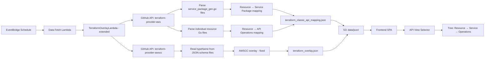
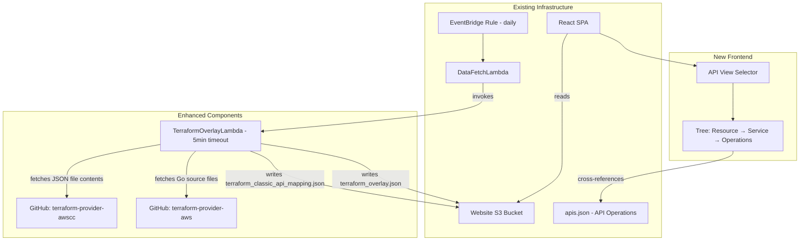

# Design Document: Terraform Classic AWS API Availability

## Overview

This feature adds a "Terraform AWS" view to the API Operations tab on the Capability by Region page. When selected, it re-groups the existing API operations data under Terraform resource names, showing whether each classic Terraform AWS provider resource (e.g., `aws_s3_bucket`) will work in a given region based on the availability of its underlying SDK API operations.

**Key design principle:** The Terraform resource becomes a new parent level in the existing API operations tree hierarchy. The existing SDK service and operation data is re-grouped underneath it. Availability is computed as the AND of all child operations.

**Data source:** The mapping of Terraform resources to required API operations is extracted from the Terraform provider Go source code on GitHub during the scheduled sync. The mapping file is stored in S3 — no runtime dependency on GitHub.

### Data Flow



## Architecture

The feature extends the existing `TerraformOverlayLambda` with a longer timeout (5 minutes) and additional responsibilities. Rather than creating a separate Lambda, the existing overlay Lambda is enhanced to:

1. **Fix AWSCC mapping** — read `typeName` from inside JSON schema files (not filenames)
2. **Extract classic AWS mappings** — parse Go source files for SDK client method calls

Both tasks require fetching file contents from GitHub (thousands of files), which justifies the increased timeout and shared `GITHUB_TOKEN` for rate limiting.

### Component Placement



### Deployment Model

- The overlay Lambda timeout is increased from 60s to 300s (5 minutes)
- Memory increased to 512 MB to handle concurrent file fetching
- `GITHUB_TOKEN` environment variable required for 5,000 req/hour rate limit
- S3 PutObject permission extended to include `data/json/terraform_classic_api_mapping.json`
- Same deployment pattern: outside VPC, invoked by data-fetch Lambda

### Single Lambda Rationale

The AWSCC fix and classic AWS extraction share:

- The same GitHub client infrastructure
- The same need for extended timeout (file content fetching)
- The same `GITHUB_TOKEN` for rate limits
- The same invocation pattern (called by data-fetch Lambda)

Combining them avoids duplicating infrastructure and keeps the deployment simple.

## Components and Interfaces

### 1. Enhanced TerraformOverlayLambda (`source/lambda/terraform-overlay/`)

**Responsibility:** Fetch both AWSCC and classic AWS provider data from GitHub, produce both `terraform_overlay.json` and `terraform_classic_api_mapping.json`.

**Updated entry point:** `source/lambda/terraform-overlay/handler.ts`

```typescript
interface OverlayLambdaEvent {
  dataBucketName: string;
}

interface OverlayLambdaResponse {
  statusCode: number;
  awsccCount: number;
  classicAwsCount: number;
  classicApiMappingCount: number;
  errors?: string[];
}
```

**Updated orchestration:**

1. Fetch AWSCC provider tree → fetch JSON file contents → extract `typeName` fields (AWSCC fix)
2. Fetch classic AWS provider tree → identify `service_package_gen.go` files → parse resource names
3. Fetch individual resource Go files → parse SDK client method calls → extract API operations
4. Assemble both output files → write to S3

### 2. AWSCC Parser — Fixed (`source/lambda/terraform-overlay/awscc-parser.ts`)

**Change:** Instead of parsing filenames, read the `typeName` field from inside each JSON schema file.

```typescript
interface AwsccMapping {
  terraformType: string; // e.g., "awscc_s3_bucket"
  cfnType: string; // e.g., "AWS::S3::Bucket"
}

/**
 * Extract the typeName from a JSON schema file's content.
 * The typeName field is the authoritative CFN type (e.g., "AWS::S3::Bucket").
 */
function parseAwsccSchemaContent(jsonContent: string): AwsccMapping | null;

/**
 * Convert a CFN type (from typeName) to its AWSCC Terraform equivalent.
 * "AWS::S3::Bucket" → "awscc_s3_bucket"
 */
function cfnTypeToAwscc(cfnType: string): string;
```

**Key difference from current implementation:** The current `parseAwsccSchemaFilename` derives the CFN type from the filename (e.g., `AWS_S3_Bucket.json` → `AWS::S3::Bucket`). The fix reads the `typeName` field from inside the JSON, which is authoritative and handles edge cases where filename conventions don't match.

### 3. Classic AWS Service Package Parser (`source/lambda/terraform-overlay/classic-service-package-parser.ts`)

**Pure function** — extracts resource TypeNames from `service_package_gen.go` files.

```typescript
interface ServicePackageResource {
  typeName: string; // e.g., "aws_s3_bucket"
  factoryName: string; // e.g., "resourceBucket" — used to find the Go file
}

/**
 * Parse a service_package_gen.go file to extract all resource TypeNames
 * and their factory function names.
 */
function parseServicePackageGen(content: string): ServicePackageResource[];
```

### 4. Classic AWS Resource Parser (`source/lambda/terraform-overlay/classic-resource-parser.ts`)

**Pure function** — parses individual resource Go files to find AWS SDK client method calls.

```typescript
interface ResourceApiMapping {
  terraformType: string; // e.g., "aws_s3_bucket"
  sdkService: string; // e.g., "S3" (from the service package)
  apiOperations: string[]; // e.g., ["CreateBucket", "PutBucketPolicy", "DeleteBucket"]
}

/**
 * Parse a resource Go file to extract AWS SDK client method calls.
 * Looks for patterns like:
 *   conn.CreateBucket(...)
 *   client.PutObject(...)
 *   conn.CreateBucketWithContext(...)
 *
 * Returns the list of unique API operation names found.
 */
function parseResourceGoFile(content: string): string[];
```

**Parsing strategy:**

- Match patterns: `conn\.(\w+)\(`, `client\.(\w+)\(`, `svc\.(\w+)\(`
- Filter out common non-API methods: `String()`, `GoString()`, `SetXxx()`, etc.
- Deduplicate operation names
- Strip `WithContext` suffix (SDK v1 pattern)

### 5. Concurrent File Fetcher (`source/lambda/terraform-overlay/concurrent-fetcher.ts`)

Fetches multiple files from GitHub concurrently with controlled parallelism.

```typescript
interface FetchResult<T> {
  path: string;
  result: T | null;
  error?: string;
}

/**
 * Fetch multiple files concurrently with a concurrency limit.
 * Uses the existing GitHubClient.getFileContent method.
 *
 * @param paths - Array of file paths to fetch
 * @param fetchFn - Function to fetch and parse a single file
 * @param concurrency - Maximum concurrent requests (default: 15)
 */
function fetchFilesConcurrently<T>(
  paths: string[],
  fetchFn: (path: string) => Promise<T>,
  concurrency?: number,
): Promise<FetchResult<T>[]>;
```

### 6. Classic API Mapping Assembler (`source/lambda/terraform-overlay/classic-api-mapping-assembler.ts`)

**Pure function** — combines parsed data into the final mapping structure.

```typescript
interface ClassicApiResourceMapping {
  terraformType: string; // e.g., "aws_s3_bucket"
  sdkService: string; // e.g., "S3"
  requiredApis: string[]; // e.g., ["CreateBucket", "PutBucketPolicy"]
  registryPath: string; // e.g., "s3_bucket"
}

interface ClassicApiMappingData {
  metadata: ClassicApiMappingMetadata;
  resources: ClassicApiResourceMapping[];
}

interface ClassicApiMappingMetadata {
  generatedAt: string;
  providerCommitSha: string;
  resourceCount: number;
  serviceCount: number;
}

/**
 * Assemble the final mapping from parsed service packages and resource files.
 */
function assembleClassicApiMapping(params: {
  serviceResources: Map<string, ResourceApiMapping[]>; // serviceName → resources
  commitSha: string;
}): ClassicApiMappingData;
```

### 7. Frontend: API View Selector (`source/website/app/components/availability/api-view-selector.tsx`)

A Cloudscape `SegmentedControl` placed above the API Operations tab content.

```typescript
type ApiViewMode = 'api-operations' | 'terraform-aws';

interface ApiViewSelectorProps {
  selectedView: ApiViewMode;
  onChange: (view: ApiViewMode) => void;
  disabled?: boolean;
  loading?: boolean;
}
```

### 8. Frontend: Classic API Availability Hook (`source/website/app/hooks/use-classic-api-availability.ts`)

A React hook that:

1. Fetches `terraform_classic_api_mapping.json` from S3
2. Cross-references each resource's `requiredApis` against the existing API operations data
3. Computes per-region availability (AND of all required operations)
4. Builds the three-level tree hierarchy

```typescript
interface UseClassicApiAvailabilityResult {
  rows: RegionalAvailability[]; // Tree: Resource → Service → Operations
  loading: boolean;
  error: string | null;
  resourceCount: number;
  serviceCount: number;
}

function useClassicApiAvailability(apiRows: ApiAvailability[], regions: Region[]): UseClassicApiAvailabilityResult;
```

### 9. Frontend: Availability Computation Engine (`source/website/app/hooks/classic-api-availability-engine.ts`)

Pure functions for computing availability and building the tree.

```typescript
/**
 * Compute availability for a Terraform resource in a region.
 * Returns "Available" only if ALL required API operations are available.
 * Returns "Not Available" if any required operation is unavailable.
 * Returns "Unknown" if the resource has no required APIs mapped.
 */
function computeResourceAvailability(
  requiredApis: string[],
  sdkService: string,
  region: string,
  operationAvailabilityIndex: OperationAvailabilityIndex,
): AvailabilityStatus;

/**
 * Build an index from API operations data for O(1) lookups.
 * Maps: sdkService → operationName → Set<availableRegions>
 */
function buildOperationAvailabilityIndex(apiRows: ApiAvailability[]): OperationAvailabilityIndex;

/**
 * Build the three-level tree hierarchy:
 * - Top level: Terraform resource (computed AND availability)
 * - Middle level: SDK service
 * - Leaf level: API operations (actual availability from existing data)
 */
function buildAvailabilityTree(
  mapping: ClassicApiMappingData,
  apiRows: ApiAvailability[],
  regions: Region[],
): RegionalAvailability[];

/**
 * Get the list of missing (unavailable) API operations for a resource in a region.
 */
function getMissingOperations(
  requiredApis: string[],
  sdkService: string,
  region: string,
  operationAvailabilityIndex: OperationAvailabilityIndex,
): string[];
```

### 10. Frontend: Missing API Popover

When a Terraform resource shows "Unavailable" in a region, a popover explains which specific API operations are missing.

```typescript
interface MissingApiPopoverProps {
  missingApis: string[]; // e.g., ["s3:CreateBucket", "s3:PutBucketPolicy"]
  resourceName: string;
  region: string;
}
```

### 11. Data Fetch Lambda Integration

The existing `data-fetch-lambda-main.ts` already invokes the overlay Lambda. No change needed to the invocation — the overlay Lambda now produces both output files in a single execution.

## Data Models

### Classic API Mapping File Schema (`terraform_classic_api_mapping.json`)

```typescript
interface ClassicApiMappingData {
  metadata: ClassicApiMappingMetadata;
  resources: ClassicApiResourceMapping[];
}

interface ClassicApiMappingMetadata {
  generatedAt: string; // ISO 8601 timestamp
  providerCommitSha: string; // Git SHA of terraform-provider-aws
  resourceCount: number; // Total resources
  serviceCount: number; // Distinct SDK services
}

interface ClassicApiResourceMapping {
  terraformType: string; // e.g., "aws_s3_bucket"
  sdkService: string; // e.g., "S3" — matches API operations data service name
  requiredApis: string[]; // e.g., ["CreateBucket", "PutBucketPolicy"]
  registryPath: string; // e.g., "s3_bucket" (for Registry URL)
}
```

**Example:**

```json
{
  "metadata": {
    "generatedAt": "2025-01-15T10:30:00.000Z",
    "providerCommitSha": "abc123def456",
    "resourceCount": 1200,
    "serviceCount": 72
  },
  "resources": [
    {
      "terraformType": "aws_s3_bucket",
      "sdkService": "S3",
      "requiredApis": ["CreateBucket", "PutBucketPolicy", "DeleteBucket", "HeadBucket"],
      "registryPath": "s3_bucket"
    },
    {
      "terraformType": "aws_instance",
      "sdkService": "EC2",
      "requiredApis": ["RunInstances", "DescribeInstances", "TerminateInstances"],
      "registryPath": "instance"
    }
  ]
}
```

### Operation Availability Index (computed at runtime on frontend)

```typescript
/** Built from ApiAvailability[] for O(1) lookups */
type OperationAvailabilityIndex = Map<string, Map<string, Set<string>>>;
// Outer key: SDK service name (e.g., "S3")
// Inner key: operation name (e.g., "CreateBucket")
// Value: Set of region codes where the operation is available
```

### Frontend Tree Row Model

The tree uses the existing `RegionalAvailability` interface with parent-child relationships:

```
Level 0 (parentId: null): Terraform Resource — computed AND availability
  Level 1 (parentId: resource): SDK Service — informational grouping
    Level 2 (parentId: service): API Operation — actual availability from existing data
```

Each level uses `RegionalAvailabilityType`:

- Resource: `RegionalAvailabilityType.RESOURCE_TYPE`
- Service: `RegionalAvailabilityType.SDK_SERVICE`
- Operation: `RegionalAvailabilityType.OPERATION`

### Extended Sync Metadata

The overlay Lambda response already includes counts. The sync metadata is extended:

```typescript
interface SyncMetadata {
  lastSyncTime?: string;
  errors?: string[];
  terraformOverlay?: {
    generatedAt: string;
    awsccResourceCount: number;
    classicAwsResourceCount: number;
  };
  terraformClassicApiMapping?: {
    generatedAt: string;
    resourceCount: number;
    serviceCount: number;
  };
}
```

### Shared Types (`source/shared/types/terraform-classic-api-mapping.ts`)

```typescript
export interface ClassicApiMappingMetadata {
  generatedAt: string;
  providerCommitSha: string;
  resourceCount: number;
  serviceCount: number;
}

export interface ClassicApiResourceMapping {
  terraformType: string;
  sdkService: string;
  requiredApis: string[];
  registryPath: string;
}

export interface ClassicApiMappingData {
  metadata: ClassicApiMappingMetadata;
  resources: ClassicApiResourceMapping[];
}
```

## Correctness Properties

_A property is a characteristic or behavior that should hold true across all valid executions of a system — essentially, a formal statement about what the system should do. Properties serve as the bridge between human-readable specifications and machine-verifiable correctness guarantees._

### Property 1: Tree Structure Correctness

_For any_ valid `ClassicApiMappingData` and API operations data, the generated availability tree SHALL have exactly three levels: (a) every Terraform resource row has `parentId: null`, (b) every SDK service row's `parentId` references a resource row, (c) every operation row's `parentId` references a service row, and (d) no row exists at a fourth level.

**Validates: Requirements 1.1, 1.2, 1.3, 1.4**

### Property 2: Availability AND Computation

_For any_ `ClassicApiResourceMapping` with a non-empty `requiredApis` array, and _for any_ region: the computed availability SHALL be "Available" if and only if ALL required API operations are available in that region according to the operation availability index. If any single required operation is unavailable, the result SHALL be "Not Available". The computation SHALL be deterministic — identical inputs always produce identical outputs.

**Validates: Requirements 1.6, 2.1, 2.2, 2.4**

### Property 3: Missing Operations Completeness

_For any_ Terraform resource that is "Unavailable" in a region, the `getMissingOperations` function SHALL return exactly the set of required API operations that are not available in that region — no more, no less. The returned set SHALL be a subset of the resource's `requiredApis`.

**Validates: Requirements 3.2, 3.4**

### Property 4: Search Across Tree Levels

_For any_ search query string that is a case-insensitive substring of a Terraform resource name, SDK service name, or API operation name in the tree, the search function SHALL return the matching row and all its ancestors (so the tree remains navigable). The search SHALL be case-insensitive and support partial substring matching.

**Validates: Requirements 5.1, 5.2, 5.3, 5.4**

### Property 5: Registry URL Derivation

_For any_ `ClassicApiResourceMapping` entry where `terraformType` starts with `aws_`, the `registryPath` SHALL equal the `terraformType` with the `aws_` prefix removed, and the full registry URL SHALL be constructable as `https://registry.terraform.io/providers/hashicorp/aws/latest/docs/resources/{registryPath}`.

**Validates: Requirements 6.2**

### Property 6: Serialization Round-Trip

_For any_ valid `ClassicApiMappingData` object, serializing it to JSON and parsing it back SHALL produce a data structure deeply equal to the original, with all metadata fields (`generatedAt`, `providerCommitSha`, `resourceCount`, `serviceCount`) preserved and all resource entries retaining their `terraformType`, `sdkService`, `requiredApis`, and `registryPath` fields.

**Validates: Requirements 8.1, 8.2, 8.4**

### Property 7: Go Source Parser Extraction

_For any_ Go source file containing N distinct SDK client method call patterns (e.g., `conn.CreateBucket(`, `client.PutObject(`), the parser SHALL extract at least those N operation names. The extracted operations SHALL be deduplicated and SHALL not include common non-API methods (e.g., `String`, `GoString`).

**Validates: Requirements 7.1, 7.6**

## Error Handling

### GitHub API Failures

| Scenario                                       | Behavior                                                     |
| ---------------------------------------------- | ------------------------------------------------------------ |
| GitHub API unreachable (network error)         | Log error, skip mapping generation, retain existing files    |
| GitHub API rate limited (403)                  | Log warning with reset time, skip generation                 |
| Individual resource Go file fetch fails        | Log warning, skip that resource, continue with others        |
| `service_package_gen.go` fetch fails           | Log warning, skip that service package, continue with others |
| AWSCC schema JSON file fetch fails             | Log warning, skip that schema, continue with others          |
| Repository structure changed (paths not found) | Log error, abort generation for that provider                |

### S3 Write Failures

| Scenario               | Behavior                                       |
| ---------------------- | ---------------------------------------------- |
| S3 PutObject fails     | Log error, return error in Lambda response     |
| Existing file retained | Previous mapping remains available to frontend |

### Frontend Failures

| Scenario                                                | Behavior                                                   |
| ------------------------------------------------------- | ---------------------------------------------------------- |
| `terraform_classic_api_mapping.json` fails to load      | "Terraform AWS" option disabled, error notification shown  |
| Mapping file is malformed JSON                          | Same as load failure                                       |
| SDK service in mapping not found in API operations data | Operations for that service show as "Unknown" availability |
| API operations data not yet loaded                      | Wait for both datasets before computing availability       |

### Data Fetch Lambda Integration

| Scenario                                     | Behavior                                                                            |
| -------------------------------------------- | ----------------------------------------------------------------------------------- |
| Overlay Lambda invocation fails              | Data-fetch Lambda logs error, includes in sync metadata, does NOT fail primary sync |
| Overlay Lambda times out (>5min)             | Same as invocation failure                                                          |
| Partial results (some files failed to fetch) | Write partial mapping to S3, include warning count in response                      |

### Graceful Degradation

1. If mapping data is unavailable, the API Operations tab works exactly as before
2. The "Terraform AWS" view selector is only enabled once mapping data loads
3. Previously generated mapping data persists in S3 until explicitly overwritten
4. Partial mappings (missing some resources) still provide value for successfully parsed resources
5. The AWSCC overlay continues to work independently — if classic API mapping fails, AWSCC is unaffected

## Testing Strategy

### Property-Based Tests (fast-check)

The project uses TypeScript with Vitest and fast-check. Property-based tests run a minimum of 100 iterations per property.

| Property                             | Module Under Test                    | Generator Strategy                                                             |
| ------------------------------------ | ------------------------------------ | ------------------------------------------------------------------------------ |
| Property 1: Tree Structure           | `classic-api-availability-engine.ts` | Generate random mapping data + API rows, verify three-level tree structure     |
| Property 2: Availability AND         | `classic-api-availability-engine.ts` | Generate random resources × regions × operation availability, verify AND logic |
| Property 3: Missing Operations       | `classic-api-availability-engine.ts` | Generate random resources with mixed availability, verify missing set          |
| Property 4: Search Across Levels     | `use-classic-api-availability.ts`    | Generate random tree + search substrings, verify matches include ancestors     |
| Property 5: Registry URL             | `classic-api-mapping-assembler.ts`   | Generate random terraform type names, verify registryPath derivation           |
| Property 6: Serialization Round-Trip | `classic-api-mapping-writer.ts`      | Generate random `ClassicApiMappingData`, round-trip through JSON               |
| Property 7: Go Source Parser         | `classic-resource-parser.ts`         | Generate Go source with random SDK method calls, verify extraction             |

**Configuration:**

- Library: `fast-check` (already in project dependencies)
- Iterations: 100 minimum per property
- Tag format: `Feature: terraform-classic-api-availability, Property {N}: {title}`

### Unit Tests (Example-Based)

| Test                                           | What It Verifies                                    |
| ---------------------------------------------- | --------------------------------------------------- |
| Parse known `service_package_gen.go` content   | Correct extraction of TypeNames for S3, EC2         |
| Parse resource Go file with known SDK calls    | Correct extraction of CreateBucket, PutObject, etc. |
| Parse AWSCC schema JSON with typeName          | Correct extraction of CFN type from file content    |
| Assemble mapping with known inputs             | Correct final structure with metadata               |
| Availability: all ops available → "Available"  | AND logic positive case                             |
| Availability: one op missing → "Not Available" | AND logic negative case                             |
| Availability: empty requiredApis → "Unknown"   | Edge case for unmapped resources                    |
| Missing operations: returns correct list       | Specific missing ops for a known scenario           |
| API View Selector default state                | Renders with "API Operations" selected              |
| API View Selector disabled during load         | Loading state → disabled                            |
| API View Selector disabled on error            | Error state → disabled with notification            |
| Registry URL construction                      | `aws_s3_bucket` → correct registry URL              |
| Concurrent fetcher handles partial failures    | Some files fail, others succeed                     |

### Integration Tests

| Test                                      | What It Verifies                                 |
| ----------------------------------------- | ------------------------------------------------ |
| Overlay Lambda end-to-end (mocked GitHub) | Full execution → both output files written to S3 |
| AWSCC fix: reads typeName from content    | JSON content parsed, not filename                |
| Classic API: parses Go files concurrently | Multiple files fetched and parsed correctly      |
| Partial failure handling                  | Some files fail → partial results written        |
| Complete failure handling                 | GitHub unreachable → no S3 write, error returned |
| Frontend loads mapping + API data         | View selector becomes enabled, tree renders      |

### Test File Locations

```
source/lambda/terraform-overlay/awscc-parser.test.ts                    # Updated unit tests
source/lambda/terraform-overlay/awscc-parser.property.test.ts           # Updated property tests
source/lambda/terraform-overlay/classic-service-package-parser.test.ts
source/lambda/terraform-overlay/classic-service-package-parser.property.test.ts
source/lambda/terraform-overlay/classic-resource-parser.test.ts
source/lambda/terraform-overlay/classic-resource-parser.property.test.ts
source/lambda/terraform-overlay/classic-api-mapping-assembler.test.ts
source/lambda/terraform-overlay/classic-api-mapping-assembler.property.test.ts
source/lambda/terraform-overlay/classic-api-mapping-writer.test.ts
source/lambda/terraform-overlay/classic-api-mapping-writer.property.test.ts
source/lambda/terraform-overlay/concurrent-fetcher.test.ts
source/lambda/terraform-overlay/handler.test.ts                         # Updated integration tests
source/website/app/hooks/classic-api-availability-engine.test.ts
source/website/app/hooks/classic-api-availability-engine.property.test.ts
source/website/app/hooks/use-classic-api-availability.test.ts
source/website/app/hooks/use-classic-api-availability.property.test.ts
source/website/app/components/availability/api-view-selector.test.tsx
```
