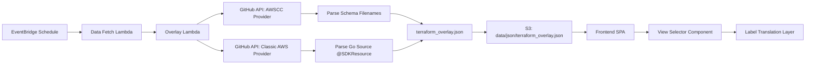
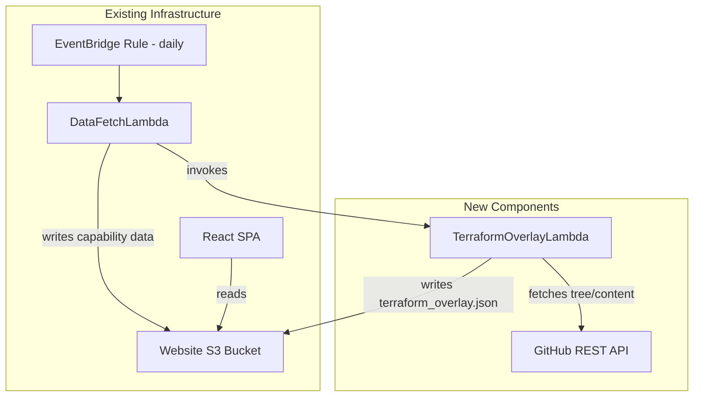

# Design Document: Terraform Overlay

## Overview

The Terraform Overlay feature extends the Capability Insights application to support Terraform resource type naming alongside the existing CloudFormation naming. It introduces a backend Lambda that dynamically derives Terraform-to-CloudFormation mappings from Terraform provider source code on GitHub, and a frontend "View by" selector that translates resource type labels in the existing availability matrix.

**Key design principle:** No static mapping tables. All mappings are derived at fetch time from the `hashicorp/terraform-provider-awscc` and `hashicorp/terraform-provider-aws` GitHub repositories.

### Data Flow



## Architecture

The feature adds one new Lambda function (`TerraformOverlayLambda`) that runs alongside the existing `CapabilityInsightsDataFetchLambda`. The data-fetch Lambda invokes the overlay Lambda after completing its primary sync, ensuring both datasets stay in lockstep.

### Component Placement



### Deployment Model

- The overlay Lambda is defined in the same CDK stack (`CapabilityInsightsStack`)
- It shares the deployment assets bucket with the existing Lambdas
- It runs outside the VPC (needs internet access for GitHub API)
- The data-fetch Lambda invokes it via the AWS SDK (already has a Lambda VPC endpoint)

## Components and Interfaces

### 1. TerraformOverlayLambda (`source/lambda/terraform-overlay/`)

**Responsibility:** Fetch Terraform provider data from GitHub, derive mappings, write `terraform_overlay.json` to S3.

**Entry point:** `source/lambda/terraform-overlay/handler.ts`

```typescript
interface OverlayLambdaEvent {
  dataBucketName: string;
}

interface OverlayLambdaResponse {
  statusCode: number;
  awsccCount: number;
  classicAwsCount: number;
  errors?: string[];
}
```

**Internal modules:**

| Module                  | Responsibility                                           |
| ----------------------- | -------------------------------------------------------- |
| `github-client.ts`      | Fetches file trees and file content from GitHub REST API |
| `awscc-parser.ts`       | Derives CFN ↔ AWSCC mappings from schema filenames       |
| `classic-aws-parser.ts` | Parses `@SDKResource` annotations from Go source files   |
| `mapping-writer.ts`     | Assembles and writes the final JSON to S3                |

### 2. GitHub Client (`source/lambda/terraform-overlay/github-client.ts`)

Uses the GitHub REST API (unauthenticated for public repos, with optional token for rate limits).

```typescript
interface GitHubClient {
  /** Get the tree (file listing) for a path in a repo */
  getTree(owner: string, repo: string, branch: string, path: string): Promise<TreeEntry[]>;

  /** Get raw file content */
  getFileContent(owner: string, repo: string, branch: string, path: string): Promise<string>;

  /** Get the latest commit SHA for a branch */
  getLatestCommitSha(owner: string, repo: string, branch: string): Promise<string>;
}

interface TreeEntry {
  path: string;
  type: 'blob' | 'tree';
  sha: string;
}
```

**Rate limiting strategy:**

- Use the Git Trees API (`GET /repos/{owner}/{repo}/git/trees/{sha}?recursive=1`) to fetch the entire repo tree in a single call, then filter client-side
- This avoids per-directory API calls and stays well within the 60 req/hour unauthenticated limit
- Optional `GITHUB_TOKEN` environment variable for higher rate limits (5000 req/hour)

### 3. AWSCC Parser (`source/lambda/terraform-overlay/awscc-parser.ts`)

**Pure function** — deterministic string transformation with no I/O.

```typescript
interface AwsccMapping {
  terraformType: string; // e.g., "awscc_s3_bucket"
  cfnType: string; // e.g., "AWS::S3::Bucket"
}

/** Parse a schema filename into a mapping entry */
function parseAwsccSchemaFilename(filename: string): AwsccMapping | null;

/** Convert a CFN type to its AWSCC equivalent */
function cfnTypeToAwscc(cfnType: string): string;

/** Convert an AWSCC type to its CFN equivalent */
function awsccToCfnType(awsccType: string): string;
```

**Transformation rules:**

- Input: `AWS_S3_Bucket.json`
- Strip `.json` suffix → `AWS_S3_Bucket`
- CFN type: replace `_` with `::` → `AWS::S3::Bucket`
- AWSCC type: lowercase, prefix `awscc_`, replace `AWS_` → `awscc_s3_bucket`

### 4. Classic AWS Parser (`source/lambda/terraform-overlay/classic-aws-parser.ts`)

Parses Go source files for `@SDKResource` annotations.

```typescript
interface ClassicAwsMapping {
  terraformType: string; // e.g., "aws_s3_bucket"
  cfnType: string | null; // null if no CFN mapping found
}

/** Parse a Go source file for @SDKResource annotations */
function parseGoSourceFile(content: string): ClassicAwsMapping[];

/** Parse @SDKResource annotation line */
function parseSdkResourceAnnotation(annotation: string): ClassicAwsMapping | null;
```

**Annotation format examples:**

```go
// @SDKResource("aws_s3_bucket", name="Bucket")
// @SDKResource("aws_instance", name="Instance", cfnType="AWS::EC2::Instance")
```

The parser extracts:

1. The Terraform resource name (first argument)
2. The `cfnType` named parameter if present
3. If no `cfnType` parameter exists, the resource is marked as unmapped (`cfnType: null`)

### 5. Frontend: View Selector (`source/website/app/components/availability/view-selector.tsx`)

A Cloudscape `SegmentedControl` component placed above the CloudFormation resources tab content.

```typescript
type NamingConvention = 'cloudformation' | 'terraform-aws' | 'terraform-awscc';

interface ViewSelectorProps {
  selectedConvention: NamingConvention;
  onChange: (convention: NamingConvention) => void;
  disabled?: boolean;
  loading?: boolean;
}
```

### 6. Frontend: Terraform Overlay Client Extension

Extends `CapabilityInsightsClient` with a method to fetch the overlay data:

```typescript
// Added to capability-insights-client.ts
async listTerraformOverlay(): Promise<TerraformOverlayData>;
```

### 7. Frontend: Label Translation Hook (`source/website/app/hooks/use-terraform-overlay.ts`)

A React hook that manages overlay state and provides translation functions:

```typescript
interface UseTerraformOverlayResult {
  convention: NamingConvention;
  setConvention: (c: NamingConvention) => void;
  loading: boolean;
  error: string | null;
  translateRows: (rows: CfnAvailability[]) => CfnAvailability[];
  searchAllConventions: (rows: CfnAvailability[], query: string) => CfnAvailability[];
  getResourceCount: () => number;
}
```

### 8. Data Fetch Lambda Integration

The existing `data-fetch-lambda-main.ts` is modified to invoke the overlay Lambda after completing its primary sync:

```typescript
// At the end of the existing handler, after writing sync-metadata:
const overlayResult = await invokeOverlayLambda(dest.bucketName);
if (overlayResult.errors) {
  metadata.errors = [...(metadata.errors ?? []), ...overlayResult.errors];
}
```

## Data Models

### Terraform Overlay File Schema (`terraform_overlay.json`)

```typescript
interface TerraformOverlayData {
  metadata: OverlayMetadata;
  awscc: AwsccMapping[];
  classicAws: ClassicAwsMapping[];
}

interface OverlayMetadata {
  generatedAt: string; // ISO 8601 timestamp
  awsccProviderCommitSha: string; // Git SHA of the AWSCC provider
  classicAwsProviderCommitSha: string; // Git SHA of the classic AWS provider
  awsccResourceCount: number;
  classicAwsResourceCount: number;
}

interface AwsccMapping {
  terraformType: string; // e.g., "awscc_s3_bucket"
  cfnType: string; // e.g., "AWS::S3::Bucket"
}

interface ClassicAwsMapping {
  terraformType: string; // e.g., "aws_s3_bucket"
  cfnType: string | null; // null for unmapped resources
}
```

### Frontend Lookup Index (derived at load time)

```typescript
/** Built from TerraformOverlayData for O(1) lookups */
interface OverlayIndex {
  /** CFN type → AWSCC terraform type */
  cfnToAwscc: Map<string, string>;
  /** CFN type → Classic AWS terraform type */
  cfnToClassicAws: Map<string, string>;
  /** AWSCC terraform type → CFN type */
  awsccToCfn: Map<string, string>;
  /** Classic AWS terraform type → CFN type */
  classicAwsToCfn: Map<string, string | null>;
  /** All unmapped classic AWS resources */
  unmappedClassicAws: ClassicAwsMapping[];
  /** All AWSCC resources (for display when no CFN match exists) */
  allAwscc: AwsccMapping[];
}
```

### Extended Sync Metadata

```typescript
interface SyncMetadata {
  lastSyncTime?: string;
  errors?: string[];
  terraformOverlay?: {
    generatedAt: string;
    awsccResourceCount: number;
    classicAwsResourceCount: number;
  };
}
```

## Correctness Properties

_A property is a characteristic or behavior that should hold true across all valid executions of a system — essentially, a formal statement about what the system should do. Properties serve as the bridge between human-readable specifications and machine-verifiable correctness guarantees._

### Property 1: AWSCC Filename Round-Trip

_For any_ valid AWSCC schema filename (matching the pattern `AWS_{Service}_{Resource}.json`), parsing the filename into a CFN type and then converting that CFN type back to an AWSCC type SHALL produce the same AWSCC type that would be derived directly from the filename.

**Validates: Requirements 2.1, 2.2, 2.4**

### Property 2: AWSCC Parser Completeness

_For any_ list of valid AWSCC schema filenames, the parser SHALL produce exactly one mapping entry per filename, and the total count of output mappings SHALL equal the count of input filenames.

**Validates: Requirements 2.3**

### Property 3: @SDKResource Annotation Parsing

_For any_ Go source file containing N `@SDKResource` annotations, the parser SHALL produce exactly N mapping entries where: (a) each entry's `terraformType` matches the first argument of its annotation, (b) each entry's `cfnType` equals the `cfnType` named parameter value if present, or null if absent.

**Validates: Requirements 3.1, 3.2, 3.3, 3.5**

### Property 4: Mapping File Serialization Round-Trip

_For any_ valid `TerraformOverlayData` object, serializing it to JSON and parsing it back SHALL produce a data structure equivalent to the original.

**Validates: Requirements 4.2, 4.3, 4.4, 4.5**

### Property 5: Label Translation Correctness

_For any_ set of CFN availability rows and a valid overlay index, translating rows for a given naming convention SHALL: (a) produce labels matching the selected convention for all mapped resources, (b) exclude resources with no mapping in the selected Terraform convention when a Terraform view is active, (c) include unmapped Terraform resources when a Terraform view is active, and (d) exclude Terraform-only resources when CloudFormation view is active.

**Validates: Requirements 6.1, 6.2, 6.3, 6.4, 6.5, 8.1, 8.3**

### Property 6: Cross-Convention Search

_For any_ search query string and any set of CFN availability rows with overlay mappings, the search function SHALL return all rows where the query is a case-insensitive substring of any of the resource's naming convention labels (CFN, AWSCC, or classic AWS), and the returned rows SHALL use the currently active convention's labels.

**Validates: Requirements 7.1, 7.2, 7.3, 7.4**

### Property 7: Resource Count Accuracy

_For any_ set of CFN availability rows and overlay data, the resource count for a selected naming convention SHALL equal the number of rows visible after applying the translation and filtering logic for that convention.

**Validates: Requirements 9.1, 9.2, 9.3, 9.4**

## Error Handling

### GitHub API Failures

| Scenario                               | Behavior                                                                     |
| -------------------------------------- | ---------------------------------------------------------------------------- |
| GitHub API unreachable (network error) | Log error, skip overlay generation, retain existing `terraform_overlay.json` |
| GitHub API rate limited (403)          | Log warning with reset time, skip overlay generation                         |
| Repository not found (404)             | Log error, treat as complete failure for that provider                       |
| Partial failure (one provider fails)   | Generate mappings for the successful provider, include error in metadata     |

### S3 Write Failures

| Scenario                | Behavior                                                                               |
| ----------------------- | -------------------------------------------------------------------------------------- |
| S3 PutObject fails      | Log error, return error in Lambda response; data-fetch Lambda records in sync metadata |
| Existing file corrupted | Not applicable — each write is atomic (S3 PutObject is atomic for objects < 5GB)       |

### Frontend Failures

| Scenario                                           | Behavior                                                                                |
| -------------------------------------------------- | --------------------------------------------------------------------------------------- |
| `terraform_overlay.json` fails to load             | View Selector remains disabled, CloudFormation view shown, error notification displayed |
| `terraform_overlay.json` is malformed JSON         | Same as load failure — treat as unavailable                                             |
| Overlay file is stale (older than capability data) | Display normally — staleness is acceptable since mappings change infrequently           |

### Data Fetch Lambda Integration

| Scenario                               | Behavior                                                                                             |
| -------------------------------------- | ---------------------------------------------------------------------------------------------------- |
| Overlay Lambda invocation fails        | Data-fetch Lambda logs error, includes in sync metadata errors array, does NOT fail the primary sync |
| Overlay Lambda times out (>60s)        | Same as invocation failure — error recorded, primary sync unaffected                                 |
| Overlay Lambda returns partial results | Results are written to S3; error count included in response                                          |

### Fallback Strategy

The system degrades gracefully:

1. If overlay data is unavailable, the page works exactly as before (CloudFormation only)
2. The View Selector is only enabled once overlay data loads successfully
3. Previously generated overlay data persists in S3 until explicitly overwritten

## Testing Strategy

### Property-Based Tests (fast-check)

The project uses TypeScript with Vitest. Property-based tests will use [fast-check](https://github.com/dubzzz/fast-check) with a minimum of 100 iterations per property.

| Property                             | Module Under Test          | Generator Strategy                                                     |
| ------------------------------------ | -------------------------- | ---------------------------------------------------------------------- |
| Property 1: AWSCC Round-Trip         | `awscc-parser.ts`          | Generate random service/resource name pairs (alphabetic, 2-20 chars)   |
| Property 2: AWSCC Completeness       | `awscc-parser.ts`          | Generate arrays of 1-50 valid schema filenames                         |
| Property 3: @SDKResource Parsing     | `classic-aws-parser.ts`    | Generate Go source strings with random annotation combinations         |
| Property 4: Serialization Round-Trip | `mapping-writer.ts`        | Generate random `TerraformOverlayData` objects with arbitrary mappings |
| Property 5: Label Translation        | `use-terraform-overlay.ts` | Generate random CFN rows + overlay index combinations                  |
| Property 6: Cross-Convention Search  | `use-terraform-overlay.ts` | Generate random search terms + row/mapping combinations                |
| Property 7: Resource Count           | `use-terraform-overlay.ts` | Generate random rows + overlay data + convention selection             |

**Configuration:**

- Library: `fast-check` (already available in the project ecosystem)
- Iterations: 100 minimum per property
- Tag format: `Feature: terraform-overlay, Property {N}: {title}`

### Unit Tests (Example-Based)

| Test                                  | What It Verifies                                             |
| ------------------------------------- | ------------------------------------------------------------ |
| AWSCC parser with known filenames     | `AWS_S3_Bucket.json` → correct CFN and AWSCC types           |
| Classic parser with known annotations | Known Go source → correct mappings                           |
| Classic parser with missing cfnType   | Annotation without cfnType → null mapping                    |
| GitHub client error handling          | Mocked 403/404/network errors → graceful failure             |
| View Selector default state           | Renders with CloudFormation selected                         |
| View Selector disabled during load    | Loading state → disabled control                             |
| View Selector disabled on error       | Error state → disabled with notification                     |
| Unmapped resource display             | Renders with "No CFN mapping" indicator                      |
| Mapping status filter                 | Filter option exists and correctly separates mapped/unmapped |

### Integration Tests

| Test                                       | What It Verifies                                                       |
| ------------------------------------------ | ---------------------------------------------------------------------- |
| Overlay Lambda end-to-end (mocked GitHub)  | Full Lambda execution with mocked GitHub responses → correct S3 output |
| Data-fetch Lambda invokes overlay          | Mocked overlay Lambda → invocation occurs after primary sync           |
| Overlay failure doesn't block primary sync | Mocked overlay failure → primary data still written, error in metadata |
| Frontend loads overlay data                | Mocked S3 response → View Selector becomes enabled                     |

### Test File Locations

```
source/lambda/terraform-overlay/awscc-parser.test.ts          # Unit + Property tests
source/lambda/terraform-overlay/awscc-parser.property.test.ts # Property tests (dedicated)
source/lambda/terraform-overlay/classic-aws-parser.test.ts    # Unit + Property tests
source/lambda/terraform-overlay/classic-aws-parser.property.test.ts
source/lambda/terraform-overlay/mapping-writer.test.ts        # Unit + Property tests
source/lambda/terraform-overlay/mapping-writer.property.test.ts
source/lambda/terraform-overlay/handler.test.ts               # Integration tests
source/website/app/hooks/use-terraform-overlay.test.ts        # Unit tests
source/website/app/hooks/use-terraform-overlay.property.test.ts # Property tests
source/website/app/components/availability/view-selector.test.tsx # Unit tests
```
