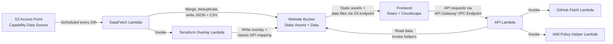

# Architecture

This document describes the system architecture of Capability Insights for AWS. It covers the data flow, Lambda topology, key subsystems, and source file references. For a high-level overview and deployment instructions, see the [README](../README.md).

**Audience**: Contributors who need to understand how the system works before making changes.

## Table of Contents

- [System Overview](#system-overview)
- [Data Flow](#data-flow)
- [Lambda Topology](#lambda-topology)
- [Terraform Overlay Pipeline](#terraform-overlay-pipeline)
- [Classic API Availability Engine](#classic-api-availability-engine)
- [Infrastructure Planning](#infrastructure-planning)
- [Key Source Files](#key-source-files)

## System Overview

The system pulls AWS capability data from an S3 access point, processes it through Lambda functions, and serves it to a React dashboard hosted on S3 within a VPC.



## Data Flow

Data moves through the system in the following steps:

### 1. Source S3 Access Point → DataFetch Lambda

The DataFetch Lambda is triggered every 24 hours by an EventBridge rule (or manually via the API). It reads capability data from the S3 access point, which provides regional availability information for AWS services, APIs, and CloudFormation resources.

The access point may contain multiple source folders (e.g., `public`, `aws-cn`). Each folder is validated by checking for a `v1/manifest.json` file.

### 2. DataFetch Lambda → Website Bucket

For each valid source folder, the Lambda fetches JSON and CSV files under `v1/{format}/`. It then:

1. **Merges** data across all source folders (combining entries from multiple partitions)
2. **Deduplicates** entries by their unique identifier (e.g., `Region` for regions, `productId` for products, `sdkServiceName` for APIs)
3. **Writes** the merged results to `data/json/` and `data/csv/` in the website bucket

The merge strategy is file-specific. For example, `apis.json` deduplicates at the service level by `sdkServiceName` and at the operation level by `apiName` within each service.

### 3. Terraform Overlay (conditional)

If the Terraform overlay is enabled in sync settings and a GitHub token is configured, the DataFetch Lambda invokes the Terraform Overlay Lambda. This Lambda fetches schema data from the HashiCorp GitHub repositories and writes `terraform_overlay.json` and `terraform_classic_api_mapping.json` to the website bucket.

### 4. Website Bucket → Frontend

The React frontend loads data files directly from the website bucket via the S3 Gateway VPC Endpoint. Data files are fetched client-side (e.g., `data/json/products.json`, `data/json/apis.json`).

### 5. Frontend → API Lambda

For actions that require server-side processing (sync triggers, policy management, infrastructure plan analysis, CloudFormation stack inspection), the frontend calls the API Lambda through the API Gateway VPC Endpoint. The API Lambda reads data from the website bucket and DynamoDB, and invokes helper Lambdas as needed.

## Lambda Topology

| Lambda                       | VPC Placement               | Rationale                                                                                                                                                                                                      |
| ---------------------------- | --------------------------- | -------------------------------------------------------------------------------------------------------------------------------------------------------------------------------------------------------------- |
| **API Lambda**               | Inside VPC (private subnet) | Serves the private API Gateway, which is only accessible via VPC Endpoint. Communicates with other AWS services through VPC Endpoints (S3, DynamoDB, Lambda, Step Functions, CloudFormation, Secrets Manager). |
| **DataFetch Lambda**         | Outside VPC                 | Needs direct connectivity to the S3 access point (which is outside the VPC). Placing it inside the VPC would require a NAT Gateway for S3 access point connectivity, adding cost and complexity.               |
| **Terraform Overlay Lambda** | Outside VPC                 | Needs internet access to call the GitHub API (`api.github.com`) for fetching provider schema files. No VPC resources are required.                                                                             |
| **GitHub Fetch Lambda**      | Outside VPC                 | Needs internet access to call the GitHub API for repository analysis (Trees API, file content fetching). Used by Infrastructure Planning.                                                                      |
| **IAM Policy Helper Lambda** | Outside VPC                 | Needs access to the global IAM endpoint for policy CRUD operations (`iam:CreatePolicy`, `iam:CreatePolicyVersion`, etc.). IAM is a global service without regional VPC Endpoints.                              |

### VPC Endpoints

The API Lambda communicates with AWS services through the following VPC Endpoints, avoiding the need for internet access:

- **S3 Gateway Endpoint** — read/write data in the website bucket
- **DynamoDB Gateway Endpoint** — policy and plan configuration tables
- **Lambda Interface Endpoint** — invoke DataFetch, GitHub Fetch, and IAM Policy Helper Lambdas
- **API Gateway Interface Endpoint** — serve the private REST API
- **Step Functions Interface Endpoint** — start and describe usage analysis executions
- **CloudFormation Interface Endpoint** — list stacks and resources
- **Secrets Manager Interface Endpoint** — retrieve GitHub PAT for sync operations

## Terraform Overlay Pipeline

The Terraform Overlay Pipeline translates CloudFormation resource type names into Terraform naming conventions. It produces two data files:

### AWSCC Provider Mapping (`terraform_overlay.json`)

Maps AWSCC Terraform resource types to their CloudFormation equivalents using a deterministic naming convention:

```
awscc_{service}_{resource} ↔ AWS::{Service}::{Resource}
```

**Process:**

1. Fetch the recursive file tree from `hashicorp/terraform-provider-awscc` on GitHub
2. For each JSON schema file under `internal/service/cloudformation/schemas/`, fetch its content
3. Extract the `typeName` field (e.g., `AWS::S3::Bucket`)
4. Derive the AWSCC Terraform type from the CFN type (e.g., `awscc_s3_bucket`)

### Classic AWS Provider Mapping

Classic AWS provider types (e.g., `aws_s3_bucket`) are derived from the AWSCC mappings by replacing the `awscc_` prefix with `aws_`. This avoids fetching thousands of Go files and provides reliable CFN type mappings for resources that exist in both providers.

### Classic API Mapping (`terraform_classic_api_mapping.json`)

Maps each classic AWS Terraform resource to the API operations it requires:

1. List service directories under `internal/service/` in `hashicorp/terraform-provider-aws`
2. For each service, fetch and parse `service_package_gen.go` to discover resource factory functions and their TypeNames
3. List all Go source files in each service directory
4. Fetch each resource Go file and parse it for SDK client method calls (`conn.Method(`, `client.Method(`, `svc.Method(`)
5. Match files to resources by finding factory function declarations (`func factoryName(`)
6. Extract the SDK service name from Go import paths (`github.com/aws/aws-sdk-go-v2/service/{serviceName}`)
7. Assemble the mapping: `terraformType → { sdkService, requiredApis[] }`

For details on how the parser works and its known limitations, see [docs/METHODOLOGY.md](./METHODOLOGY.md).

## Classic API Availability Engine

The Classic API Availability Engine computes regional availability for Terraform resources based on their required API operations. It runs entirely in the frontend.

### OperationAvailabilityIndex

The `OperationAvailabilityIndex` is a nested map structure:

```
sdkService (lowercase) → operationName → Set<availableRegions>
```

It is built from the authoritative API operations data (`apis.json`) by iterating over all operation-level rows and indexing which regions each operation is available in. Only operations with `AvailabilityStatus.AVAILABLE` are indexed.

### Tree Construction (`buildAvailabilityTree`)

The engine builds a three-level tree for display in the Terraform AWS view:

- **Level 0 — Terraform Resource**: Computed AND availability across all required operations. A resource is "Available" in a region only if ALL of its required API operations are available there.
- **Level 1 — SDK Service**: Informational grouping. Operations are attributed to their correct service by looking them up in the `OperationAvailabilityIndex`, not by trusting the single `sdkService` field from the mapping.
- **Level 2 — API Operation**: Actual availability from the authoritative API data.

### Service Attribution

When a resource calls APIs across multiple services (e.g., `aws_alb` calling both ELBv2 and EC2 APIs), the engine attributes each operation to its correct service using a reverse index built from the authoritative data:

1. If only one service owns the operation → use that service
2. If the resource's declared primary service owns it → use the primary service
3. If multiple services claim it but not the primary → use the first match
4. If no service claims it → fall back to the declared primary service

This approach correctly handles multi-service resources without trusting the single `sdkService` field from the Terraform provider mapping.

## Infrastructure Planning

Infrastructure Planning analyzes repositories, CloudFormation templates, and Terraform configurations to extract a "capability set" — the AWS resources and API operations required by a project.

### Source Types

| Source Type    | Input                               | Processing                                                          |
| -------------- | ----------------------------------- | ------------------------------------------------------------------- |
| CloudFormation | Base64-encoded template (YAML/JSON) | Parse `Resources` section, extract `AWS::*::*` type names           |
| Terraform      | Base64-encoded `.tf` content        | Parse `resource` blocks, map to CFN types via overlay data          |
| GitHub         | Repository URL                      | Fetch file tree, classify files, parse each with appropriate parser |

### Repository Analysis Pipeline

For GitHub-sourced plans, the system:

1. **Fetches** the repository file tree using the GitHub Trees API (recursive)
2. **Classifies** files by extension: `.go`, `.java`, `.py`, `.ts`/`.js`, `.yaml`/`.json`, `.tf`
3. **Excludes** test files, vendor directories, and generated code
4. **Prioritizes** SDK files by language: Go → Java → Python → TypeScript
5. **Fetches** file contents concurrently (max 15 simultaneous requests)
6. **Parses** each file with the appropriate parser:
   - Go files → extract `conn.Method(`/`client.Method(`/`svc.Method(` patterns
   - Java files → extract AWS SDK v2 client method calls
   - Python files → extract boto3 client and resource method calls
   - TypeScript/JavaScript files → extract AWS SDK v3 Command patterns and v2-style calls
   - YAML/JSON files → check for CloudFormation `Resources` section
   - `.tf` files → extract `resource` block type names
7. **Aggregates** results into a `CapabilitySet` with CFN types, Terraform types, API operations, and service names

Processing has a 50-second timeout cutoff (within a 60-second Lambda timeout). If the timeout is reached, partial results are returned with metadata indicating how many files were processed.

### Capability Set

The resulting `CapabilitySet` is stored in S3 at `data/plans/{planId}/capability-set.json` and contains:

- `cfnResourceTypes` — CloudFormation resource type names found
- `terraformResourceTypes` — Terraform resource type names found
- `apiOperations` — SDK API operation names extracted from source code
- `serviceNames` — AWS service names derived from CFN types
- `terraformToCfnMapping` — mapping from Terraform types to their CFN equivalents

## Key Source Files

| Subsystem                         | File Path                                                                             | Description                                                        |
| --------------------------------- | ------------------------------------------------------------------------------------- | ------------------------------------------------------------------ |
| **Data Fetch**                    | `source/lambda/data-fetch-lambda-main.ts`                                             | Orchestrates S3 access point fetch, merge, and write               |
| **Data Merge (JSON)**             | `source/lambda/data-fetch/merge/merge-json.ts`                                        | Generic JSON merge with deduplication                              |
| **Data Merge (CSV)**              | `source/lambda/data-fetch/merge/merge-csv.ts`                                         | CSV merge logic                                                    |
| **API Lambda**                    | `source/lambda/api-lambda-main.ts`                                                    | Route registration and request dispatch                            |
| **Terraform Overlay**             | `source/lambda/terraform-overlay/handler.ts`                                          | AWSCC schema fetch, classic AWS derivation, API mapping extraction |
| **AWSCC Parser**                  | `source/lambda/terraform-overlay/awscc-parser.ts`                                     | Extracts `typeName` from AWSCC JSON schemas                        |
| **Classic Resource Parser**       | `source/lambda/terraform-overlay/classic-resource-parser.ts`                          | Parses Go files for SDK client method calls                        |
| **Classic API Mapping Assembler** | `source/lambda/terraform-overlay/classic-api-mapping-assembler.ts`                    | Assembles the final mapping data structure                         |
| **Service Package Parser**        | `source/lambda/terraform-overlay/classic-service-package-parser.ts`                   | Parses `service_package_gen.go` for factory functions              |
| **Availability Engine**           | `source/website/app/hooks/classic-api-availability-engine.ts`                         | Builds OperationAvailabilityIndex and availability tree            |
| **Plan Processor**                | `source/lambda/services/infrastructure-planning/plan-processor.ts`                    | Orchestrates plan processing pipeline                              |
| **Repository Analyzer**           | `source/lambda/services/infrastructure-planning/parsers/repository-analyzer.ts`       | GitHub repository analysis with file classification                |
| **CFN Template Parser**           | `source/lambda/services/infrastructure-planning/parsers/cfn-template-parser.ts`       | Extracts resource types from CloudFormation templates              |
| **Terraform Template Parser**     | `source/lambda/services/infrastructure-planning/parsers/terraform-template-parser.ts` | Extracts resource types from `.tf` files                           |
| **CDK Stack**                     | `source/constructs/lib/stacks/capability-insights-stack.ts`                           | Infrastructure definition (Lambdas, VPC Endpoints, API Gateway)    |
| **Frontend App**                  | `source/website/app/`                                                                 | React dashboard with Cloudscape Design System                      |
| **Shared Types**                  | `source/shared/types/`                                                                | TypeScript interfaces shared across all packages                   |
